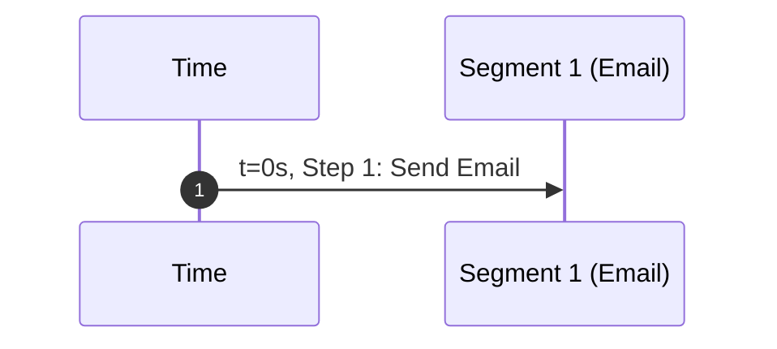
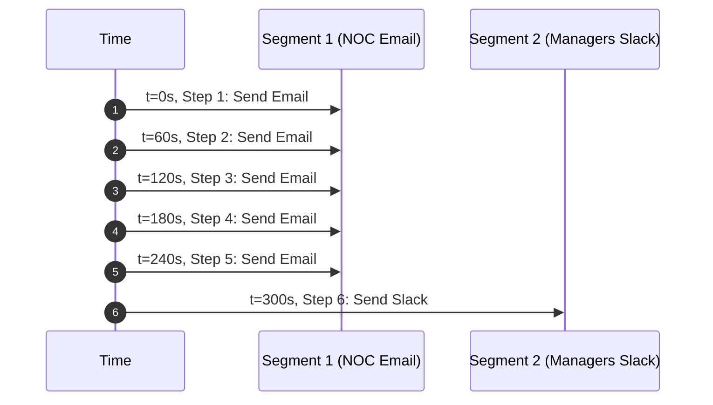
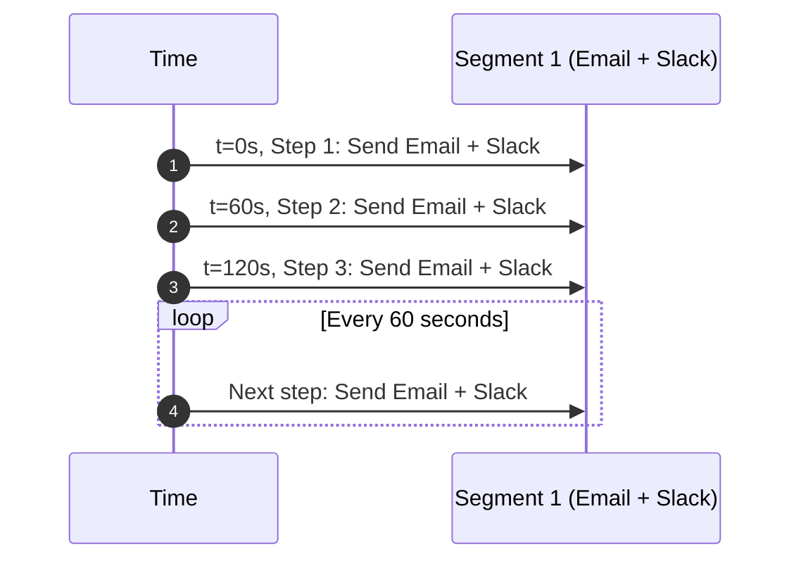

# Operations

Alert **Operations** let you reuse the same “who to notify and when” behavior across multiple Alert Rules.

Instead of configuring delays, repeats, and transport targets separately on every rule, you create an Operation once, then assign it to any rule.

It is not required to create an operation. Without one, an alert rule can still raise an alert, but it will not send notifications.

## Quick start

If you are new to alerting, start with this:

1. Create one operation with one segment.
2. Set **Steps from** to `1` and **Steps to** to `1`.
3. Set **Start** to `0` and **Step duration** to `60`.
4. Add one transport (for example, email).
5. Assign the operation to an alert rule.

This sends one notification immediately when the rule matches.

## What an Operation is

An Operation is a named set of one or more **segments**.

A segment defines a notification window and its targets. Each segment has:

- **Steps from**: the first step number this segment applies to
- **Steps to**: the last step number this segment applies to
  - Leave empty to continue indefinitely.
- **Start**: delay before this segment starts, in seconds
- **Step duration**: time between each step, in seconds

In practice, most people start with a single segment.

Example:

- Steps from: `1`
- Steps to: `1`
- Start: `0`
- Step duration: `60`

## Transports used by Operations

Each segment contains its own list of notification targets:

- **Transports** (Slack, email, Telegram, etc.)
- **Transport groups** (a reusable group of transports)

This means you can:

- Send to one set of transports early (first segment)
- Send to a wider set later (second segment)

## Assigning an operation to a rule

When creating or editing an Alert Rule, choose an **Operation**.

- If an operation is assigned, notifications follow the operation's segments and transports.
- If no operation is assigned, the rule can still raise alerts, but no notifications are sent.

## How operations work in the backend (high level)

At a high level, the backend treats an operation as a reusable notification plan.

- An Alert Rule stores `alert_operation_id`, which points to the operation it should use.
- An operation contains one or more segments.
- Each segment defines:
  - a step range (**Steps from** to **Steps to**)
  - timing (**Start** and **Step duration**)
  - notification targets (**transports** and/or **transport group** entries)

When an alert is active, notification steps move forward over time. At each step, the backend checks which segment matches that step and sends notifications to that segment's transports and transport groups.

If no operation is assigned to the rule, the alert can still be raised and tracked, but notifications are not sent.

### Simple lifecycle

1. A rule matches, so an alert is raised.
2. The backend reads the rule's `alert_operation_id`.
3. If an operation is linked, its segments are loaded.
4. As time passes, the alert moves through step numbers based on each segment's **Start** and **step duration**.
5. For each current step, the backend finds the segment whose step range includes that step.
6. The backend sends notifications to that segment's configured transports and transport groups.
7. This repeats until the alert is no longer active (for example, recovered or acknowledged).

### Why reuse operations

Operations are reusable by design: update one operation once, and all rules linked to it use the updated behavior.

### Safe updates (conceptual)

Changing an operation affects future notifications. Existing alert state may continue according to the current engine cycle before updated behavior is fully reflected.

## Examples

In the timeline charts below, the **Y-axis** shows time moving downward, and the **X-axis** shows segment lanes from left to right.

### Example 1: One immediate notification

| name | Steps from | Steps to | Start (s) | Step duration (s) | Transports / groups |
| --- | --- | --- | --- | --- | --- |
| Segment 1 | 1 | 1 | 0 | 60 | Email |

### Example 2: Escalate after initial notifications

Goal: send 5 notifications every 60 seconds to NOC email, then one notification to managers in Slack.

| name | Steps from | Steps to | Start (s) | Step duration (s) | Transports / groups |
| --- | --- | --- | --- | --- | --- |
| Segment 1 (NOC) | 1 | 5 | 0 | 60 | Email |
| Segment 2 (Managers) | 6 | 6 | 0 | 60 | Slack |

### Example 3: Continuous notifications until clear

| name | Steps from | Steps to | Start (s) | Step duration (s) | Transports / groups |
| --- | --- | --- | --- | --- | --- |
| Segment 1 | 1 | empty (continues) | 0 | 60 | Email and Slack |

This continues sending notifications until the alert is recovered or acknowledged.

## Troubleshooting

If a rule triggers but no notification is sent, check:

1. The rule has an operation assigned.
2. The operation has at least one segment.
3. Each segment has at least one transport or transport group.
4. The selected transports are configured and working.

## Managing Operations

Operations are intended to be reusable:

- Name an operation to describe the policy (for example, “Critical paging escalation”).
- Update segments/transports once to affect every rule that uses it.
