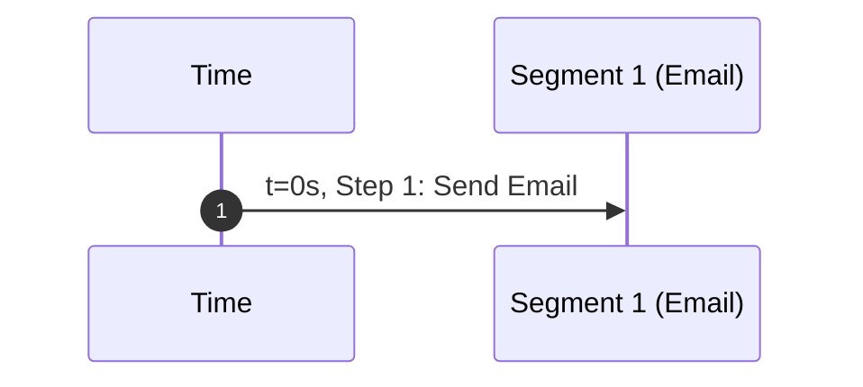
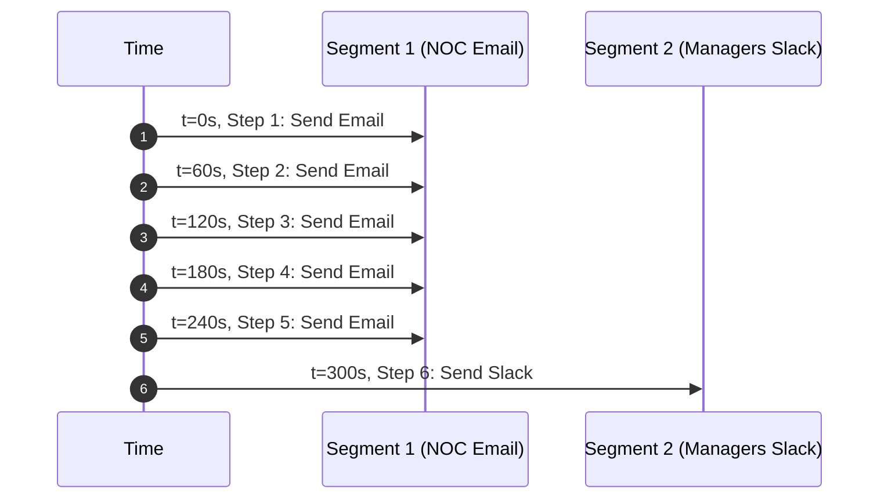
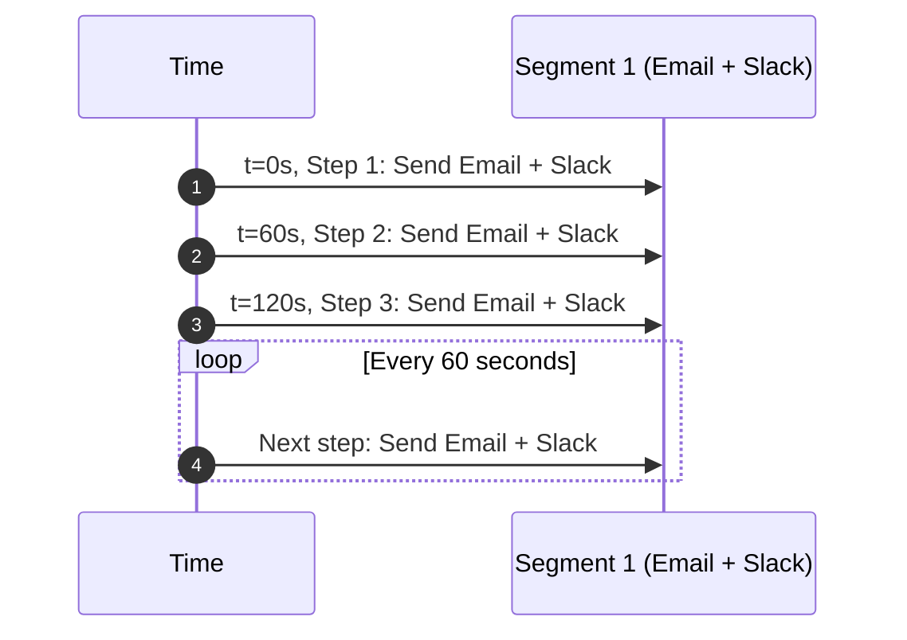

# Operations

An alert **operation** holds the recipients and the timing of a
notification. Many alert rules can use the same operation.

Without operations, you configure the delays, the repeats, and the
transport targets on each rule. With an operation, you configure this
behaviour one time. Then you assign the operation to any rule.

An operation is not necessary. An alert rule without an operation still
raises an alert. It sends no notification.

## Quick start

For your first alert, do these steps:

1. Create one operation with one segment.
2. Set **Steps from** to `1` and **Steps to** to `1`.
3. Set **Start** to `0` and **Step duration** to `60`.
4. Add one transport, for example email.
5. Assign the operation to an alert rule.

The rule then sends one notification immediately at a match.

## What an Operation is

An operation is a named set of one or more **segments**.

A segment defines a notification window and its targets. Each segment
has these fields:

- **Steps from**: the first step number of this segment.
- **Steps to**: the last step number of this segment.
  - An empty value continues without a limit.
- **Start**: the delay before the start of this segment, in seconds.
- **Step duration**: the time between two steps, in seconds.

Most users start with one segment.

Example:

- Steps from: `1`
- Steps to: `1`
- Start: `0`
- Step duration: `60`

## Transports used by Operations

Each segment holds its own list of notification targets:

- **Transports**, such as Slack, email, and Telegram.
- **Transport groups**, that is a reusable group of transports.

You can therefore:

- Send to one set of transports first, in the first segment.
- Send to a larger set later, in the second segment.

## Assigning an operation to a rule

At the creation or the edit of an alert rule, choose an **operation**.

- With an operation, the notifications follow the segments and the
  transports of that operation.
- Without an operation, the rule still raises alerts. LibreNMS sends no
  notification.

## How operations work in the backend (high level)

The backend treats an operation as a reusable notification plan.

- An alert rule stores `alert_operation_id`. This value points to its
  operation.
- An operation holds one or more segments.
- Each segment defines:
  - a step range, from **Steps from** to **Steps to**
  - the timing, that is **Start** and **Step duration**
  - the notification targets, that is the **transports**, the
    **transport group** entries, or both

While an alert is active, the notification steps move forward with
time. At each step, the backend finds the segment of that step. It then
sends notifications to the transports and the transport groups of that
segment.

Without an operation, LibreNMS still raises and tracks the alert. It
sends no notification.

### Simple lifecycle

1. A rule matches and raises an alert.
2. The backend reads the `alert_operation_id` of the rule.
3. If an operation is linked, the backend loads its segments.
4. With time, the alert moves through the step numbers. The **Start**
   value and the **Step duration** value of each segment control this
   movement.
5. At each current step, the backend finds the segment with that step
   in its step range.
6. The backend sends notifications to the transports and the transport
   groups of that segment.
7. This cycle repeats until the alert becomes inactive, for example
   after a recovery or an acknowledgement.

### Why reuse operations

Operations are reusable by design. One update to an operation changes
the behaviour of every rule with a link to it.

### Safe updates (conceptual)

A change to an operation applies to the future notifications. An
existing alert can continue with the old behaviour until the end of the
current engine cycle.

## Examples

In the timeline charts below, the **Y-axis** shows the time from top to
bottom. The **X-axis** shows the segment lanes from left to right.

### Example 1: One immediate notification

| name | Steps from | Steps to | Start (s) | Step duration (s) | Transports / groups |
| --- | --- | --- | --- | --- | --- |
| Segment 1 | 1 | 1 | 0 | 60 | Email |

```mermaid
sequenceDiagram
  autonumber
  participant T as Time
  participant S1 as Segment 1 (Email)
  T->>S1: t=0s, Step 1: Send Email
```

### Example 2: Escalate after initial notifications

Goal: send 5 notifications to the NOC email at an interval of 60 seconds. Then send one notification to the managers in Slack.

| name | Steps from | Steps to | Start (s) | Step duration (s) | Transports / groups |
| --- | --- | --- | --- | --- | --- |
| Segment 1 (NOC) | 1 | 5 | 0 | 60 | Email |
| Segment 2 (Managers) | 6 | 6 | 0 | 60 | Slack |

```mermaid
sequenceDiagram
  autonumber
  participant T as Time
  participant S1 as Segment 1 (NOC Email)
  participant S2 as Segment 2 (Managers Slack)
  T->>S1: t=0s, Step 1: Send Email
  T->>S1: t=60s, Step 2: Send Email
  T->>S1: t=120s, Step 3: Send Email
  T->>S1: t=180s, Step 4: Send Email
  T->>S1: t=240s, Step 5: Send Email
  T->>S2: t=300s, Step 6: Send Slack
```

### Example 3: Continuous notifications until clear

| name | Steps from | Steps to | Start (s) | Step duration (s) | Transports / groups |
| --- | --- | --- | --- | --- | --- |
| Segment 1 | 1 | empty, so it continues | 0 | 60 | Email and Slack |

```mermaid
sequenceDiagram
  autonumber
  participant T as Time
  participant S1 as Segment 1 (Email + Slack)
  T->>S1: t=0s, Step 1: Send Email + Slack
  T->>S1: t=60s, Step 2: Send Email + Slack
  T->>S1: t=120s, Step 3: Send Email + Slack
  loop Every 60 seconds
    T->>S1: Next step: Send Email + Slack
  end
```

The notifications continue until the alert recovers or until you
acknowledge it.

## Troubleshooting

If a rule triggers but sends no notification, make sure that:

1. The rule has an operation.
2. The operation has at least one segment.
3. Each segment has at least one transport or transport group.
4. The selected transports are configured and work correctly.

## Managing Operations

Operations are reusable:

- Give an operation a name that describes its policy. An example is
  "Critical paging escalation".
- One update to the segments or the transports changes every rule with
  that operation.
