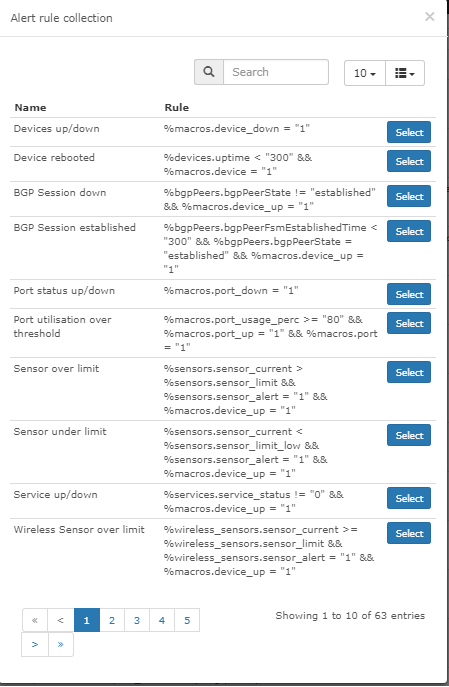

# Rules

A rule uses a logical language.

The web interface gives a simple method to create a rule.

[Macros](Macros.md) make more complex rules possible. Such rules can
hold mathematical calculations and MySQL queries.

## Syntax

A rule needs at least 3 elements: an __Entity__, a __Condition__, and a
__Value__. A rule can also hold braces and __Glues__.

An __Entity__ comes from a table and a field in the database. An
example is `ports.ifOperStatus`.

__Conditions__ can be any of:

- Equals `=`
- Not Equals `!=`
- In `IN`
- Not In `NOT IN`
- Begins with `LIKE ('...%')`
- Doesn't begin with `NOT LIKE ('...%')`
- Contains `LIKE ('%...%')`
- Doesn't Contain `NOT LIKE ('%...%')`
- Ends with `LIKE ('%...')`
- Doesn't end with `NOT LIKE ('%...')`
- Between `BETWEEN`
- Not Between `NOT BETWEEN`
- Is Empty `= ''`
- Is Not Empty `!= '''`
- Is Null `IS NULL`
- Is Not Null `IS NOT NULL`
- Greater `>`
- Greater or Equal `>=`
- Less `<`
- Less or Equal `<=`
- Regex `REGEXP`

A __Value__ is an entity or any data. A macro or another column name as
a value needs backticks around it. Examples are \`macros.past_60m\` and
\`processors.processor_perc_warn\`.

__Note__: Regex accepts MySQL regular expressions.

Arithmetic is also valid.

## Options

These are the other options for an alert rule:

- Rule name: the name of the rule.
- Severity: the importance of the rule.
- Invert match: it inverts the match. The rule then alerts on the items
  that do _not_ match.
- Mute alerts: it stops the alert through the alert transport. The
  alert still appears in the web interface.
- Recovery alerts: with this option off, LibreNMS sends no recovery
  notification.
- Acknowledgement alerts: with this option off, LibreNMS sends no
  acknowledgement notification.
- Operations: select the alert operation for this alert rule.
- Match devices, groups and location list: it applies this alert rule
  only to these devices.
- All devices except in list: it inverts the device selection of the
  Match option.
- Procedure URL: read [Procedure](Rules.md#procedure).
- Notes: your own notes about this rule. LibreNMS also sends this
  information to the alert notifications.

## Advanced

The Advanced tab holds more options for the alert rule:

- Override SQL: enable this option for your own query.
- Query: the query for the alert.

The example below is an average rule for all CPUs above 10%:

```sql
SELECT devices.*,AVG(processors.processor_usage) AS cpu_avg, processors.* FROM 
devices INNER JOIN processors ON devices.device_id 
= processors.device_id WHERE devices.device_id 
= ? AND devices.status = 1 AND devices.disabled = 
0 AND devices.ignore = 0 GROUP BY devices.device_id, 
devices.status, devices.disabled, devices.ignore 
HAVING AVG(processors.processor_usage) 
> 10;
```

!!! note
    The value 10 is the average CPU use. You can change this value.
    Copy the query into the Query box on the Advanced tab of the alert
    rule. Then enable Override SQL.

## Procedure

You can give a procedure URL at the creation of the rule. LibreNMS
accepts only an `http://` link. Any other link gives an error. The
"Open" button in the Alert widget then opens the procedure. The widget
configuration box shows and hides this button.

## Examples

These rules alert when:

- A device goes down: `devices.status != 1`
- A port changes: `ports.ifOperStatus != 'up'`
- The root directory becomes too full: `storage.storage_descr = '/' AND
  storage.storage_perc >= '75'`
- A storage becomes fuller than the warning level: `storage.storage_perc >= storage_perc_warn`
- The device is a server and the used storage is more than the warning
  level. The rule ignores the /boot partitions: `storage.storage_perc >
  storage.storage_perc_warn AND devices.type = "server" AND
  storage.storage_descr != "/boot"`
- A VMware LAG does not use "Source ip address hash" load balancing:
  `devices.os = "vmware" AND ports.ifType = "ieee8023adLag" AND
  ports.ifDescr REGEXP "Link Aggregation .*, load balancing algorithm:
  Source ip address hash"`
- The syslog holds an authentication failure in the last 5 minutes:
  `syslog.timestamp >= macros.past_5m AND syslog.msg REGEXP ".*authentication failure.*"`
- The memory use is high: `macros.device_up = 1 AND mempools.mempool_perc >=
 90 AND mempools.mempool_descr REGEXP "Virtual.*"`
- The CPU use of one core is high, not the total CPU use: `macros.device_up
  = 1 AND processors.processor_usage >= 90`
- The port use is high. The rule excludes the client descriptions and
  the softwareLoopback interface type: `macros.port_usage_perc >= 80 AND
  port.port_descr_type != "client" AND ports.ifType != "softwareLoopback"`
- A MAC address appears on your network: `ipv4_mac.mac_address = "2c233a756912"`
- The MTU test of a device fails: `devices.mtu_status != 1`

## Alert Rules Collection

You can also select an alert rule from the Alerts Collection. Users in
the community supply these alert rules. To add your own alert rules to
the collection, send them here: [Alert Rules
Collection](https://github.com/librenms/librenms/edit/master/resources/definitions/alert_rules.json)


