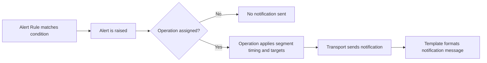

# Introduction

LibreNMS alerting is built from a few connected parts. This page shows what each part does and how they work together.

## Alerting chart

| Part | Purpose | Required | Linked guide |
| --- | --- | --- | --- |
| Alert Rules | Define when an alert should trigger | Yes | [Creating alert rules](Rules.md) |
| Alert Operations | Define who gets notified and when | No (but required for notifications) | [Creating alert operations](Operations.md) |
| Alert Transports | Define how notifications are delivered (email, Slack, etc.) | No (but required for notifications) | [Configuring alert transports](Transports.md) |
| Alert Templates | Define the notification message format | No (optional, recommended) | [Configuring alert templates](Templates.md) |

Flow:

`Rule matches` -> `Alert is raised` -> `Operation decides timing/targets` -> `Transport sends notification` -> `Template formats message`

If a rule has no operation, LibreNMS can still raise the alert, but no notification is sent.

## Recommended setup order

For most users, this order is easiest:

1. Create one or more operations (notification behavior)
2. Create alert rules (trigger conditions)
3. Assign an operation to each rule that should notify

[Creating alert operations](Operations.md)

Then you need an alert rule which will react to changes with your devices before raising an alert.

[Creating alert rules](Rules.md)

After that you also need to tell LibreNMS how to notify you when an
alert is raised, this is done using `Alert Transports`.

[Configuring alert transports](Transports.md)

The next step is not strictly required but most people find it
useful. Creating custom alert templates will help you get the benefit
out of the alert system in general. Whilst we include a default
template, it is limited in the data that you will receive in the alerts.

[Configuring alert templates](Templates.md)

## Managing alerts

When an alert has triggered you will see these in the Alerts ->
Notifications page within the Web UI.

This list has a couple of options available to it and we'll explain
what these are here.

### ACK

This column provides you visibility on the status of the alert:

 This alert is currently active and sending
alerts. Click this icon to acknowledge the alert.

 This alert is currently acknowledged
until the alert clears. Click this icon to un-acknowledge the alert.

 This alert is
currently acknowledged until the alert worsens, gets
better or changes, at which stage it will be automatically unacknowledged and
alerts will resume. Click this icon to un-acknowledge the alert.

### Notes

 This column will allow you access to the
acknowledge/unacknowledge notes for this alert.
