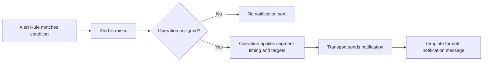

# Introduction

LibreNMS alerting has several connected parts. This page describes each part and the connections between them.

## Alerting chart

| Part | Purpose | Required | Linked guide |
| --- | --- | --- | --- |
| Alert Rules | They define the trigger condition of an alert | Yes | [Creating alert rules](Rules.md) |
| Alert Operations | They define the recipients and the time of a notification | Notifications need them | [Creating alert operations](Operations.md) |
| Alert Transports | They define the delivery method of a notification, such as email or Slack | Notifications need them | [Configuring alert transports](Transports.md) |
| Alert Templates | They define the format of the notification message | No. We recommend them | [Configuring alert templates](Templates.md) |

Flow:

`Rule matches` -> `Alert is raised` -> `Operation decides timing/targets` -> `Transport sends notification` -> `Template formats message`

```mermaid
flowchart LR
    A[Alert Rule matches condition] --> B[Alert is raised]
    B --> C{Operation assigned?}
    C -->|No| D[No notification sent]
    C -->|Yes| E[Operation applies segment timing and targets]
    E --> F[Transport sends notification]
    F --> G[Template formats notification message]
```

A rule without an operation still raises the alert. LibreNMS then sends
no notification.

## Recommended setup order

This order is the easiest one for most users:

1. Create one or more operations. An operation sets the notification behaviour.
2. Create the alert rules. A rule sets a trigger condition.
3. Assign an operation to each rule with a notification.

[Creating alert operations](Operations.md)

You then need an alert rule. The rule reacts to a change on your
devices and raises an alert.

[Creating alert rules](Rules.md)

You must also give LibreNMS a notification method for a raised alert.
`Alert Transports` give this method.

[Configuring alert transports](Transports.md)

The next step is not necessary, but most users find it useful. Your own
alert templates increase the value of the alert system. We supply a
default template, but it holds a small amount of data.

[Configuring alert templates](Templates.md)

## Managing alerts

A triggered alert appears on the Alerts -> Notifications page in the
web interface.

This list has some options. The sections below describe them.

### ACK

This column shows the status of the alert:

 This alert is active and sends alerts. Click
this icon to acknowledge the alert.

 This alert is acknowledged until it
clears. Click this icon to un-acknowledge the alert.

 This alert is
acknowledged until the fault becomes worse, becomes better, or changes.
LibreNMS then un-acknowledges the alert automatically and the alerts
continue. Click this icon to un-acknowledge the alert.

### Notes

 This column gives access to the
acknowledge notes and the un-acknowledge notes of this alert.
