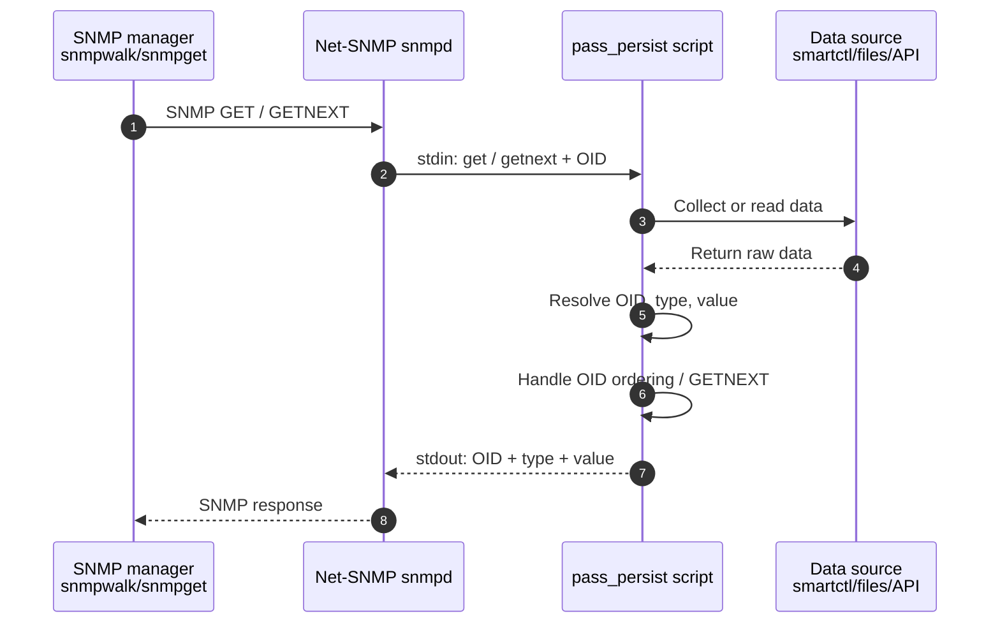
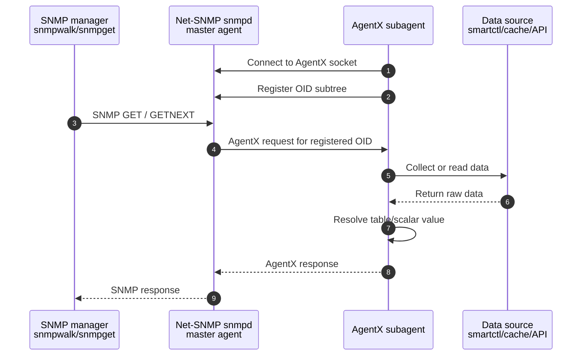

# Developing SNMP Extensions

This guide covers the monitored-host side of a snmp application: how the
agent exposes its data to `snmpd`, local configuration, and (for the legacy
model) cache files and refresh scheduling.

The LibreNMS-side application handler is covered in `02-Application-Developing.md` and `11-App-Based-Sensors.md`.

## Goal

A good extension should be predictable to install, safe to upgrade, and cheap for `snmpd` to serve.

## Choosing a transport

LibreNMS extensions can deliver data to the poller in two main ways. 
 
- Custom MIB served over `pass_persist` (simplest and prefered)
- Custom MIB served over  AgentX (most robust).
 
The JSON `extend` model remains supported for existing extensions and is considered legacy.

| | Custom MIB + `pass_persist` (preferred) | Custom MIB + AgentX (alternative) | JSON `extend` (legacy) |
| --- | --- | --- | --- |
| Wire format | Real SNMP OIDs you define in a MIB | Real SNMP OIDs you define in a MIB | A blob of JSON returned by one OID |
| Typing | Strong (INTEGER, Gauge64, enums, TruthValue) | Strong (INTEGER, Gauge64, enums, TruthValue) | Stringly-typed JSON |
| Discoverability | Self-describing; walkable; reusable by any SNMP manager | Self-describing; walkable; reusable by any SNMP manager | Opaque to anything but your handler |
| Partial polling | Poller can read only the tables it needs | Poller can read only the tables it needs | Whole payload returned every poll |
| Process model | `snmpd` spawns and keeps one persistent helper | Standalone daemon connects to `snmpd` over a socket | Heavy script must be cached to `/run` |
| Lifecycle | Tied to `snmpd`; restarts with it | Independent of `snmpd`; own user/privileges/restarts | Tied to the refresh timer/cron |
| Setup cost | Low | Higher (socket, daemon, registration) | Low |
| Best for | Structured multi-table data on one host (default) | Process isolation, privilege separation, fleets of subagents | Small/simple payloads, quick ports |

Both custom-MIB transports serve the *same* MIB and look identical to the
poller, they differ only in how the helper process talks to `snmpd`.

### Custom MIB + pass_persist

Define an enterprise MIB describing your objects and serve it from a
`pass_persist` agent. `snmpd` keeps the agent running and forwards requests for
your OID subtree to it, so the poller reads typed, walkable tables directly -
no cache file and no `extend` JSON.



LibreNMS ships these MIBs under
[`mibs/librenms/`](https://github.com/librenms/librenms/tree/master/mibs/librenms).
Use them as worked examples of the preferred style:

- `MDADM-MIB` - multi-table example (array/device metadata, health, and sync
  tables) consumed by the [Mdadm](../../Extensions/Applications/Mdadm.md) app.
- `XCP-NG-VMINFO-MIB` - VM inventory served via `pass_persist`, consumed by the
  [XCP-NG Virtual Machines](../../Extensions/Applications/XCP-NG%20Virtual%20Machines.md) app.

Register the agent with `snmpd` for your enterprise OID, for example:

```conf
pass_persist .1.3.6.1.4.1.60652.101 /usr/local/lib/snmpd/mdadm
```

`snmpd` speaks the simple line-based pass_persist protocol (`PING`, `get`,
`getnext`, `set`) to the helper on stdin/stdout; most language net-snmp bindings
provide a ready-made pass_persist loop. The helper replies with three lines per
value - OID, type, value - using the type tokens `integer`, `gauge`,
`counter`, `counter64`, `timeticks`, `ipaddress`, `objectid`, `string`, and
`opaque`.

??? example "request and respond"
      ```shell
      #printf 'PING\nget\n.1.3.6.1.4.1.60652.101.1.1.5\ngetnext\n.1.3.6.1.4.1.60652.101\n'     | sudo -u Debian-snmp /usr/local/lib/snmpd/mdadm
      PONG
      NONE
      .1.3.6.1.4.1.60652.101.1.1.1.0
      string
      2026-06-11T13:03:13.035789+00:00

      ``` 

??? warning "pass_persist cannot transport binary OCTET STRINGs (the hex trap)"
    The protocol is line-based ASCII and has **no hex/binary string token** - the
    only string type is `string`, whose value snmpd treats as ASCII text. So any
    MIB object that is a *binary* `OCTET STRING` does not round-trip: snmpd
    mangles the bytes or silently drops the varbind before it reaches the poller.
    This bites the common binary textual conventions:

    - `DateAndTime` (an 8/11-byte OCTET STRING - the 2-byte year is non-printable)
    - raw UUIDs, `MacAddress`, `PhysAddress`, and similar packed-byte types

    Represent these as text instead. Define the object as `DisplayString` and
    emit it via the `string` token: timestamps as ISO-8601
    (`2026-06-10T19:45:09+00:00`), UUIDs/MACs as their canonical hex-with-
    separators string, and 64-bit "none"/"max" sentinels as a decimal
    `counter64` (e.g. `18446744073709551615`). This is why `MDADM-MIB` uses
    `DisplayString` for every timestamp rather than `DateAndTime`.

    AgentX (below) does not have this limitation - a real subagent can serve
    binary OCTET STRINGs natively - so it is the better choice if your MIB must
    carry packed-byte objects.

### Custom MIB + AgentX

AgentX ([RFC 2741](https://www.rfc-editor.org/rfc/rfc2741)) serves the same
custom MIB, but the helper runs as an independent **subagent daemon** that
connects to the `snmpd` master over a socket and registers its OID subtree.
`snmpd` then routes requests for that subtree to the subagent. This is more
robust than `pass_persist` for long-lived or large tables: the subagent is not
forked per request, survives `snmpd` restarts (it reconnects), and can run under
its own user and privileges.

Examples of AgentX are `FRRouting` and `lldpd`.  



Enable the AgentX master in `snmpd.conf` and choose a socket:

```ini
master agentx
agentXSocket /var/agentx/master
# or a TCP socket, e.g. agentXSocket tcp:localhost:705
```

Restart `snmpd`, then run the subagent as a service so it reconnects on boot and
after a master restart:

```ini
[Unit]
Description=My snmpd AgentX subagent
After=snmpd.service
Wants=snmpd.service

[Service]
ExecStart=/usr/local/lib/snmpd/My_AgentX_program
Restart=on-failure
User=Debian-snmp
Group=Debian-snmp

[Install]
WantedBy=multi-user.target
```

Implement the subagent with an AgentX-capable binding, for example Python
(`pyagentx`, `python-netsnmpagent`) or Perl (`NetSNMP::agent`). The MIB and the
LibreNMS-side handler are identical to the pass_persist case - only the
host-side process model changes.

??? warning "AgentX table indexes must fit in 31 bits"
    OID sub-identifiers are unsigned 32-bit, but the AgentX APIs (and many
    table-index code paths in net-snmp and its language bindings) carry index
    values as a *signed* `Integer32`. An index with the top bit set
    (`>= 2^31 = 2147483648`) is then read back as a negative number, so the row
    sorts wrong, breaks `GETNEXT`/`snmpwalk` ordering, or is dropped entirely.

    If you derive synthetic table indexes - e.g. a 32-bit hash of a UUID or
    serial - cap them to 31 bits and avoid zero:

    ```text
    index = (hash & 0x7FFFFFFF) or 1   # range 1 .. 2147483647
    ```

    `pass_persist` is not affected (the helper emits OID strings directly and the
    full unsigned 32-bit range is fine), but masking to 31 bits everywhere means
    the same agent works unchanged under either transport. Treat the index as an
    opaque key regardless - expose a stable identifier (UUID, serial) as its own
    column so managers never depend on the synthetic index.

### pass_persist vs AgentX

Both serve a custom MIB, the difference is operational, and it cuts both ways. 
AgentX have extra dependency (a net-snmp C library / AgentX binding) more code, 
this gives process isolation and privilege separation.

| Topic | `pass_persist` | AgentX |
| --- | --- | --- |
| Best for | Single host, polled MIBs (incl. multi-table) | Isolation, privilege separation |
| Interface | Line protocol over stdin/stdout | AgentX protocol to the `snmpd` master |
| Dependencies | None (language stdlib) | net-snmp C library / AgentX binding |
| Setup cost | Low | Higher (socket, daemon, registration) |
| Language | Any | C/C++ (Net-SNMP), Python/Perl via bindings |
| Performance (one host) | Same | Same |
| Tables | Supported; you emit the OID order | Handled by the framework |
| `GETNEXT` / `snmpwalk` | You implement (and own) OID ordering | Framework handles ordering |
| Index width | Full unsigned 32-bit | Signed `Integer32` - cap at 31 bits |
| SET support | Awkward/limited | Proper transaction model |
| Traps/notifications | Not natural | Native |
| Failure isolation | A hung script stalls `snmpd`'s request | A crash only drops its own subtree |
| Runs as | `snmpd`'s user | Own daemon, own user |

**Default to `pass_persist`** for a single host exposing one MIB on a polling
interval - even a structured, multi-table one. 

When to use AgentX:

- **Process isolation and lifecycle.** The subagent is its own daemon on a
  socket; you can restart, redeploy, or crash it without touching `snmpd`. 
  With `pass_persist`, `snmpd` owns the process, so a slow or hung
  script stalls that exchange and can make `snmpd` time the pass out and return
  nothing.
- **Slow-collection blast radius.** Both designs run the mdadm
  collection inline, but `pass_persist` blocks inside `snmpd`'s request path,
  whereas AgentX blocks only the subagent's own answers - the master stays
  responsive for every other MIB.
- **Privilege separation.** The subagent can run as its own user (e.g. with the
  `sudo` rights it needs for `mdadm -E`) while `snmpd` stays unprivileged; a
  `pass_persist` helper runs as `snmpd`'s user.


#### Useful links

- [Net-SNMP AgentX overview](https://net-snmp.sourceforge.io/docs/README.agentx.html)
  - Net-SNMP ships a reasonably full AgentX implementation and supports the
  AgentX protocol operations from RFC 2741.
- [`snmp_agent_api` manpage](https://netsnmp.org/man/snmp_agent_api.html) - the
  C/C++ API for embedding an SNMP or AgentX agent into external software.
- [`netsnmpagent` (PyPI)](https://pypi.org/project/netsnmpagent/) - lets Python
  subagents connect to a local `snmpd` master over AgentX, usually through a
  Unix socket such as `/var/run/agentx/master`.
- [`pyagentx` (GitHub)](https://github.com/hosthvo/pyagentx) - a pure-Python
  AgentX client. 

### Custom MIB guidelines

These apply to both `pass_persist` and AgentX:

- Use your own enterprise OID or the LibreNMS enterprise OID (Needs more info on 
  how we reserver a number, or its first one to create pull request?), do not reuse another vendor's subtree.
- Split slow-changing identity/configuration into separate tables from
  frequently-polled health/status, so the poller can read each on its own
  interval. 
- Expose LastUpdate and hash of the tables so there is a option for client to gate updating 
  if there is no update. This is very useful for very large and multidimensional table, and you may need a table for LastUpdates and hashs.
- Expose a scalar version object (e.g. `mdadmVersion.0`) the poller can probe to
  detect the agent - custom-MIB agents have no `nsExtend` entry, so they are not
  found by the standard extend-discovery loop and must be probed directly.
- Use proper SNMP types and `TEXTUAL-CONVENTION` enums rather than encoding
  everything as strings.
- Cap synthetic table indexes at 31 bits (`hash & 0x7FFFFFFF`, never zero) so the
  MIB is portable to AgentX, which treats indexes as signed `Integer32` (see the
  warning above). Always expose a stable identifier as its own column too.
- Ship the MIB in `mibs/librenms/` so the poller (and any SNMP manager) can
  resolve the symbolic names.

---

## Host packaging & integration

These conventions apply to every transport. 

### Deliverables

When publishing an extension, provide:

| Deliverable | Recommended path | Purpose |
| --- | --- | --- |
| Executable | `/usr/local/lib/snmpd/<name>` | extension executables |
| Configuration | `/etc/snmp/extension/<name>.conf` | extension configuration |
| snmpd snippet | `/etc/snmp/snmpd.conf.d/<name>.conf` | snmpd include snippets |
| Runtime cache | `/run/snmp/extension/<name>...` | runtime cache files |
| User documentation | - | install, verify, troubleshoot |

Keep code, configuration, and runtime output in separate paths.

### Include directory

The recommended snippet file is:

```text
/etc/snmp/snmpd.conf.d/librenms.conf
```

The main `snmpd.conf` must include that directory, for example:

```conf
includeDir /etc/snmp/snmpd.conf.d
```

Your installer or documentation should verify this. Do not assume every
distribution enables include directories by default.

### Installing dependencies and directories

???+ example
    A skeleton installer is available here:
    [Github Torstein Eide](https://gist.github.com/Torstein-Eide/0e184236d84eb8466a15613249d62cab)

Debian/Ubuntu - `snmpd` commonly runs as `Debian-snmp`:

```bash
apt-get update
apt-get install -y snmpd snmp ca-certificates

install -d -m 0755 /usr/local/lib/snmpd
install -d -m 0755 /etc/snmp/extension
install -d -m 0755 /etc/snmp/snmpd.conf.d
```

RedHat-family - `snmpd` commonly runs as `snmp`:

```bash
dnf install -y net-snmp net-snmp-utils ca-certificates
systemctl enable --now snmpd

install -d -m 0755 /usr/local/lib/snmpd
install -d -m 0755 /etc/snmp/extension
install -d -m 0755 /etc/snmp/snmpd.conf.d
```

### Installer checklist

An installer should be:

- idempotent and safe to run multiple times
- explicit about paths
- careful not to overwrite unrelated `snmpd` config
- able to install dependencies or tell the user what is missing
- able to verify `includeDir`

---

## Legacy: JSON extend

The remainder of this guide documents the legacy JSON `extend` model. Prefer a
custom MIB (above) for new extensions; this model remains supported for existing
extensions.

In this model a heavy script runs on a timer and writes its JSON output to a
cache file. `snmpd` only `cat`s that file when the poller asks, keeping the SNMP
request path fast.

```text
systemd/cron refresh          snmpd extend            LibreNMS poller
--------------------          ------------            ---------------
run heavy script       --->   cat cache file   --->   read JSON payload
write /run cache              fast response           parse/process data
```

On top of the shared layout, this model adds a runtime cache directory. Use
`/run` so it does not survive reboot:

```text
/run/snmp/extension/           runtime JSON cache files
```

```bash
install -d -m 0755 /run/snmp/extension
```

### snmpd integration

Prefer cached output:

```conf
extend myext /bin/cat /run/snmp/extension/myext.json
```

Use direct execution only for very fast scripts:

```conf
extend myext /usr/local/lib/snmpd/myext --config /etc/snmp/extension/myext.conf
```

If the extension can take more than 250 ms, cache it. Slow extend scripts
increase SNMP timeout risk and make polling noisy.

### JSON output contract

Return JSON shaped like this:

```json
{
  "version": 1,
  "error": 0,
  "errorString": "success",
  "data": {}
}
```

| Key | Required | Meaning |
| --- | --- | --- |
| `version` | yes | Payload schema version |
| `error` | yes | `0` for success, non-zero for failure |
| `errorString` | yes | Human-readable result or error |
| `data` | yes | Extension-specific payload |

For large payloads, pipe the output through `lnms_return_optimizer` so LibreNMS
can decode the compressed result automatically.

### Cache refresh

A timer-based refresh is preferred on systemd hosts; use cron where systemd
timers are not available.

Example service:

```ini
[Unit]
Description=Refresh LibreNMS SNMP extension cache for %i

[Service]
Type=oneshot
ExecStart=/usr/local/lib/snmpd/%i --config /etc/snmp/extension/%i.conf --output /run/snmp/extension/%i.json
User=Debian-snmp
Group=Debian-snmp
```

Example timer:

```ini
[Unit]
Description=Refresh LibreNMS SNMP extension cache for %i every 5 minutes

[Timer]
OnBootSec=1min
OnUnitActiveSec=5min
AccuracySec=30s
Unit=librenms-snmp-extension@%i.service

[Install]
WantedBy=timers.target
```

Enable with:

```bash
systemctl daemon-reload
systemctl enable --now librenms-snmp-extension@myext.timer
```

#### cron fallback

Store this in `/etc/cron.d/librenms-snmp-extension-myext`:

```cron
PATH=/usr/local/bin:/usr/bin:/bin
*/5 * * * * Debian-snmp /usr/local/lib/snmpd/myext --config /etc/snmp/extension/myext.conf --output /run/snmp/extension/myext.json
```

### Verification

After installation, verify the cache exists:

```bash
ls -l /run/snmp/extension/myext.json
cat /run/snmp/extension/myext.json
```

Verify the SNMP extend output locally:

```bash
snmpwalk -v2c -c COMMUNITY localhost NET-SNMP-EXTEND-MIB::nsExtendOutputFull."myext"
```

Verify from the LibreNMS server:

```bash
snmpwalk -v2c -c COMMUNITY HOSTNAME NET-SNMP-EXTEND-MIB::nsExtendOutputFull."myext"
```

### Troubleshooting

| Symptom | Check |
| --- | --- |
| Extend entry missing | `snmpd.conf` includes `/etc/snmp/snmpd.conf.d` |
| Permission denied | cache file readable by `snmpd` user |
| Timeout | script is cached, not run directly by `snmpd` |
| Empty output | timer/cron wrote the cache successfully |
| LibreNMS parse error | JSON validates and version matches expected schema |

### Rules of thumb

- Cache heavy work; keep `snmpd` fast.
- Use stable JSON field names and include a schema `version`.
- Document how users verify both the cache file and the SNMP output.
