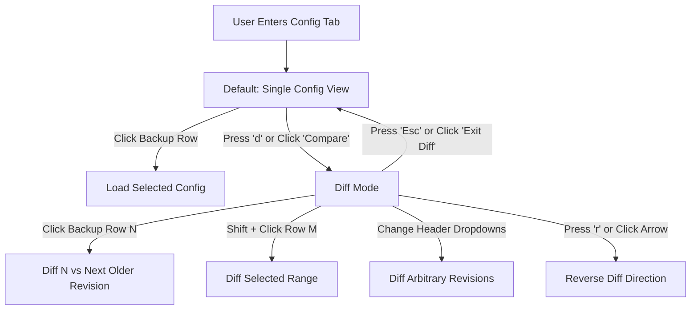

# LibreNMS Device Config Tab - UI/UX Design Specification

> **Document Status**: Approved / Reference Specification
> **Target Component**: Device Configuration Tab (`resources/views/device/tabs/config.blade.php`)
> **Tech Stack**: Laravel 12, Blade, Alpine.js v3, Tailwind CSS v4 (`tw:`), Prism.js Web Worker

---

## 1. Executive Summary & Design Vision

The **Device Configuration Tab** provides network engineers and system administrators with a fast, intuitive interface to inspect historical device configurations, track changes across revisions, and perform root-cause analysis when incidents occur.

### Primary Design Pillars

1. **Frictionless Investigation**: Zero-friction chronological navigation. Users can review configuration changes one revision at a time with a single click or keyboard navigation.
2. **Consistent, Uncluttered UI**: Clean two-pane layout with 32px uniform action heights, eliminating noisy per-row action buttons and drag-selection conflicts.
3. **Dual Interaction Paradigms**: Mouse, touch, and keyboard workflows provide equivalent access to core functionality, including row selection, dropdowns, range selection, and navigation shortcuts.
4. **Non-Blocking Performance**: Syntax highlighting is offloaded to a Web Worker, while previously rendered content is retained during asynchronous navigation to avoid layout shifts and blank states.

### Navigation Model

Backups are displayed in **newest-first chronological order**. Increasing the backup index moves further into the past.



---

## 2. Layout & Information Architecture

The interface follows an asymmetrical **Two-Pane Master-Detail** architecture.

```text
+--------------------------------------------------------------------------------------------------+
| DEVICE HEADER & SUB-NAV TABS                                                                     |
+------------------------------------+-------------------------------------------------------------+
| BACKUPS (Timeline Sidebar)         | CONFIGURATION / DIFF PANE                                   |
|                                    |                                                             |
| [ Backups (14) ]  [Compare] [↻] [?] | [ - Aug 29, 2026 19:15 ▼ ] ➔ [ + Aug 31, 2026 14:00 ▼ ]    |
| ══════════════════════════════════ | ═══════════════════════════════════════════════════════════ |
|                                    | ── Top Linear Activity Bar (during content load)            |
|  [●]  Aug 31, 2026 14:00 (Latest)  |                                                             |
|   |                                |  1  hostname core-switch-01                                 |
|  [+]  Aug 30, 2026 08:30            |  2  !                                                       |
|   |  (Compare)                     |  3 -interface GigabitEthernet0/1                            |
|  [-]  Aug 29, 2026 19:15            |  3 +interface GigabitEthernet0/1                            |
|      (Base)                         |  4 - description Uplink to Distribution (Old)               |
|  [○]  Aug 25, 2026 12:00            |  4 + description Uplink to Distribution 100G (New)          |
|   |                                |  5   ip address 10.0.0.1 255.255.255.252                    |
|  [○]  Aug 20, 2026 04:00            |                                                             |
|   |                                |                                                             |
| [ Load More Backups ]              |                                                             |
+------------------------------------+-------------------------------------------------------------+
```

The actual interface displays the full date and time for backup revisions. Examples in this document should preserve that convention.

### 2.1 Left Pane - Interactive Timeline Sidebar

**Component**: `tw:w-full tw:lg:w-md`

#### Panel Header

* Title: `Backups (total_count)`.
* An inline `fa-spinner` is displayed only during list-level operations (`loadingBackups`, `refreshing`).
* **Compare / Exit Diff**: Primary mode toggle button (`tw:h-8`).
* **Refresh**: Queues an on-demand configuration backup poll, subject to provider behavior.
* **Help**: Opens the interactive Help & Keyboard Shortcuts modal.

#### Timeline List

* Backups are sorted **newest first**.
* Each row represents one configuration revision.
* A continuous vertical rail visually connects the revisions.
* Rows support normal click and Shift-click selection.
* Scrolling uses native browser behavior and must support mouse wheels, trackpads, and touch gestures.
* A **Load More Backups** control appears when additional history is available.

#### Timeline Node States

| Node             | Meaning                                                        |
| ---------------- | -------------------------------------------------------------- |
| `●` Solid Blue   | Active configuration in Single mode                            |
| `+` Solid Green  | Compare / newer revision in Diff mode                          |
| `-` Solid Red    | Base / older revision in Diff mode                             |
| Highlighted Rail | Intermediate revisions included in the active comparison range |
| `○` Gray Ring    | Inactive historical backup                                     |

The Base and Compare endpoints should have a **subtle visual distinction beyond the connecting rail**, but the timeline should not add persistent textual labels or other prominent UI solely to communicate their roles. The existing `+` and `-` node markers provide the primary semantic distinction.

The node state represents the current selection state and must update immediately when the user changes selection, without waiting for configuration content to load.

---

### 2.2 Right Pane - Content & Diff Viewer

**Component**: `tw:flex-1`

#### Panel Header

**Single Mode**

```text
Configuration: [Full Date/Time]
```

An inline activity spinner is displayed while the selected configuration is loading.

**Diff Mode**

```text
[ - Base Date/Time ▼ ] [ ➔ ] [ + Compare Date/Time ▼ ]
```

The Base and Compare selectors allow arbitrary revisions to be compared.

The full date and time should be displayed in the controls. The `-` and `+` indicators visually correspond to the Base and Compare roles without requiring additional explanatory labels elsewhere in the interface.

#### Actions

* **Download**
  * Single configuration: `.txt`
  * Diff: `.diff`
  * Displays text label on larger viewports (`xl:`), condensing to compact icon button on smaller viewports.
* **Copy to Clipboard**
  * Displays temporary success feedback after a successful copy.
  * Displays text label on larger viewports (`xl:`), condensing to compact icon button on smaller viewports.

#### Loading & Activity Indication

* A slim linear activity bar spans the top of the content area while content is being fetched.
* Existing content remains mounted while a new request is pending.
* Existing content transitions to reduced opacity (`tw:opacity-60`) during the request.
* A centered loading indicator is used only during initial bootstrap when no content is available.

#### Viewer Body

**Configuration Viewer**

* Monospace font.
* Line numbers.
* Syntax highlighting.
* Dark-mode aware.

**Diff Viewer**

* Unified split-line presentation.
* Table header row displaying gutter column identifiers (`#`, `±`) and a gutter-aligned metadata summary:
  * Revisions span (e.g. `1 revision step` or `N revisions spanned`)
  * Additions (`+X additions`) and Removals (`-Y deletions`)
* Line gutter markers:
  * `+` added
  * `-` removed
  * ` ` unchanged
* Added and removed content uses the defined diff color tokens.

---

## 3. Interaction Models & User Workflows

### 3.1 Single Configuration Inspection Mode

**Mental Model**:

> "I want to inspect what the device configuration was at a particular point in time."

**Action**

Click backup row `N`.

**Behavior**

1. `selectedBackupId` immediately becomes the clicked backup.
2. The selected timeline node immediately changes to the active Single-mode state.
3. The right-pane header immediately reflects the selected backup's timestamp.
4. The currently rendered configuration remains mounted while the new configuration is fetched.
5. The existing content is displayed at reduced opacity during the request.
6. Once the request completes, the new configuration replaces the previous content.

No configuration request is made when the selected backup is already the currently resolved configuration. Clicking an already active backup row smoothly scrolls the page and viewer back to the top (`window.scrollTo({ top: 0, behavior: 'smooth' })`).

---

### 3.2 Step-Through Diff Mode

**Mental Model**:

> "I am investigating an outage and need to step through revisions to see what changed in each backup."

**Entering Diff Mode**

Click **Compare** or press `d` / `c`.

The interface enters Diff mode using the current backup selection as its starting point. If no backup is selected, the newest loaded backup is used.

**Normal Row Selection**

Clicking backup row `N` establishes a new selection:

```text
anchorIndex = N
focusIndex  = N
```

The default comparison is between revision `N` and the **next older revision**, `N + 1`.

If `N` is the oldest loaded revision and no older revision is available, a one-step diff cannot be created.

**Stepping**

Clicking another row normally selects that revision and establishes a new one-step diff. Clicking the already active diff step smoothly scrolls the page and viewer back to the top.

Keyboard navigation provides the same behavior:

* `j` / `Ctrl+↓` (`⌘+↓` on macOS) moves to the next older revision.
* `k` / `Ctrl+↑` (`⌘+↑` on macOS) moves to the next newer revision.

Normal navigation updates both the anchor and focus:

```text
anchorIndex = newIndex
focusIndex  = newIndex
```

---

### 3.3 Custom Multi-Version Comparison Ranges

**Mental Model**:

> "I need to compare two non-adjacent configurations, or expand and shrink an existing comparison range."

Range selection uses an **Anchor + Focus** model.

#### Selection State

* **Anchor (`anchorIndex`)**: The fixed point from which a range selection begins.
* **Focus (`focusIndex`)**: The moving endpoint of the selection.
* **Range**: The contiguous span between the anchor and focus:

```text
[min(anchorIndex, focusIndex), max(anchorIndex, focusIndex)]
```

The Base and Compare revisions are the two endpoints of the selected range.

#### Normal Click

A normal click establishes a new selection:

```text
anchorIndex = clickedIndex
focusIndex  = clickedIndex
```

In Diff mode, the resulting default comparison is the clicked revision against the next older revision.

#### Shift-Click

Shift-clicking row `M` preserves the current anchor and moves the focus:

```text
anchorIndex = existing anchor
focusIndex  = M
```

The resulting comparison covers the range between the two endpoints.

#### Keyboard Range Expansion

`Shift + j`, `Shift + k`, `Shift + ↓`, and `Shift + ↑` move the focus while keeping the anchor fixed.

```text
Shift + ↓ / Shift + j
    focusIndex += 1

Shift + ↑ / Shift + k
    focusIndex -= 1
```

The resulting range is always recalculated from the current anchor and focus.

The focus may equal the anchor as an intermediate selection state, but a revision must never be diffed against itself. If both endpoints identify the same revision, no diff request is issued.

#### Direction Crossing

The focus may move across the anchor. The range automatically changes to the contiguous span between the two endpoints while the anchor remains fixed.

For example:

```text
Anchor = 5
Focus  = 3
Range  = 3..5
```

Moving the focus downward:

```text
Anchor = 5
Focus  = 6
Range  = 5..6
```

The anchor does not change.

---

### 3.4 Header Dropdown Selection

The Base and Compare dropdowns provide direct selection of arbitrary revisions.

Dropdown selection is another interaction method for establishing the same canonical diff selection and must remain synchronized with the timeline.

Changing either endpoint:

1. Updates the corresponding selected revision.
2. Updates the highlighted timeline range.
3. Updates the Base/Compare header values.
4. Loads the resulting diff unless the selected pair is already resolved.

The timeline and header must never represent different comparison ranges.

When a range is established through dropdowns, `anchorIndex` and `focusIndex` are synchronized to the selected endpoints so subsequent Shift-click and Shift-keyboard interactions behave predictably.

---

### 3.5 Diff Direction Reversal

**Action**

Click the `[ ➔ ]` control or press `r`.

**Behavior**

The Base and Compare revisions are swapped.

The diff output is recalculated with the opposite direction:

```text
Base    A
Compare B
```

becomes:

```text
Base    B
Compare A
```

Added and removed lines therefore reverse.

The arrow rotates 180 degrees to communicate the new direction.

Reversing a diff does not change the selected timeline range.

The reverse control is intentionally compact. Because direction reversal is an infrequent interaction, it does not require prominent explanatory UI. It should have an accessible name and a tooltip describing its function.

---

### 3.6 Exiting Diff Mode

Press `Esc` or click **Exit Diff**.

The interface returns to Single Configuration mode.

The currently active configuration should remain selected and visible. Exiting Diff mode should not trigger an unnecessary configuration request if that configuration is already resolved.

---

### 3.7 No Configuration Changes

A valid comparison may contain no differences.

When Base and Compare configurations are identical, the viewer should display a concise empty-state message rather than an empty diff:

> **No configuration changes**
> These revisions contain identical configurations.

This is a successful comparison result and should not be presented as a loading, error, or unavailable state.

No special configuration semantics should be inferred from the contents of the configuration. The UI must not attempt to categorize changes into areas such as interfaces, BGP, SNMP, or system configuration because configuration formats and semantics vary by device and provider.

---

## 4. Keyboard Navigation System

Global keyboard shortcuts are active when focus is outside text-entry controls and other elements that consume keyboard input.

| Key                            | Action             | Behavior                                                                                                   |
| ------------------------------ | ------------------ | ---------------------------------------------------------------------------------------------------------- |
| `j` / `Ctrl+↓` (`⌘+↓` on macOS)| Older revision     | Move one revision older. In Single mode, select the revision. In Diff mode, establish a new one-step diff. |
| `k` / `Ctrl+↑` (`⌘+↑` on macOS)| Newer revision     | Move one revision newer. In Single mode, select the revision. In Diff mode, establish a new one-step diff. |
| `Shift+j` / `Shift+↓`          | Expand range older | Move `focusIndex` one revision older while preserving `anchorIndex`.                                       |
| `Shift+k` / `Shift+↑`          | Expand range newer | Move `focusIndex` one revision newer while preserving `anchorIndex`.                                       |
| `d` / `c`                      | Toggle Diff mode   | Enter or exit Diff mode.                                                                                   |
| `r`                            | Reverse Diff       | Swap Base and Compare revisions.                                                                           |
| `Esc`                          | Dismiss / Exit     | Close Help if open; otherwise exit Diff mode.                                                              |
| `?`                            | Help               | Open the keyboard shortcut and interaction help modal.                                                     |

> **Note**: Bare arrow keys (`↑` / `↓`) remain dedicated to native document/viewer scrolling.

### Keyboard State Transitions

Normal navigation:

```text
newIndex = currentIndex ± 1

anchorIndex = newIndex
focusIndex  = newIndex
```

Shift navigation:

```text
anchorIndex = unchanged
focusIndex  = currentIndex ± 1
```

The timeline automatically ensures the active row is visible when keyboard navigation changes the selection.

The Help modal dynamically displays the appropriate modifier keys for the user's platform and explicitly identifies the direction represented by `j` and `k`:

```text
j / Ctrl+↓ (or ⌘+↓)   Older
k / Ctrl+↑ (or ⌘+↑)   Newer
```

This directional guidance is provided in the Help UI rather than persistently displayed in the main interface.

### Input Focus

Shortcuts must not interfere with:

* text inputs
* textareas
* select controls
* content-editable elements
* other controls that are actively receiving keyboard input

---

## 5. Navigation Boundaries, Pagination & Deduplication

### History Boundaries

Navigation must never produce an invalid index.

Attempting to move beyond the newest available revision or oldest currently loaded revision is a no-op unless additional history is available.

No redundant network request should be generated by a boundary no-op.

### Pagination

When additional history is available, **Load More Backups** loads the next page of revisions.

Keyboard navigation at the end of the currently loaded history must not silently produce an invalid selection.

If automatic pagination is implemented, loading additional history must complete before advancing to the newly available revision.

Otherwise, reaching the end of the loaded history is treated as a no-op and the user can explicitly select **Load More Backups**.

### Request Deduplication

Requests are skipped when they would resolve content that is already current.

Examples:

* Selecting the already resolved configuration.
* Requesting the same Base/Compare pair currently displayed.
* Repeating a boundary navigation operation.
* Reversing a diff that has already been reversed to the requested direction.

---

## 6. UI Feedback & Loading State Architecture

The interface should maintain stable layout and clear activity feedback during asynchronous operations.

### 6.1 Panel-Scoped Loading Indicators

**Left Panel**

```html
<i class="fa fa-spinner tw:animate-spin"></i>
```

Displayed next to `Backups (total)` only during sidebar operations such as:

* initial backup loading
* pagination
* refresh

**Right Panel**

* Slim linear activity bar across the top of the viewer.
* Inline header spinner during configuration or diff requests.

### 6.2 Seamless Content Retention

When switching configurations or diffs:

```text
Existing content
    ↓
remains mounted
    ↓
opacity reduced
    ↓
request completes
    ↓
new content replaces existing content
```

Use:

```text
tw:opacity-60 tw:transition-opacity tw:duration-150
```

The viewer must not temporarily unmount its content merely because a new request is pending.

A centered spinner is reserved for the initial state when no content has yet been rendered.

### 6.3 Viewer Scroll Preservation

When stepping through adjacent revisions, preserve the viewer's scroll position where practical rather than automatically returning to the top after every navigation request.

This is particularly important for keyboard-driven investigation of a recurring area of a large configuration.

For a newly established, non-adjacent comparison, such as one created through arbitrary dropdown selections, resetting to the top is acceptable.

The implementation should favor preserving the user's context without allowing stale scroll positioning to become confusing.

### 6.4 Copy Feedback

After a successful copy:

```text
fa-copy
   ↓
fa-check
   ↓
restore after 2000ms
```

The success state uses:

```text
tw:text-green-400
```

Copy failures should leave the normal copy control available and provide appropriate failure feedback.

---

## 7. Visual Design System & Theming Tokens

### 7.1 Color Palette

| UI Element                       | Light Mode Token                                  | Dark Mode Token                                                                     |
| -------------------------------- | ------------------------------------------------- | ----------------------------------------------------------------------------------- |
| Timeline Default Rail            | `tw:bg-gray-300`                                  | `tw:dark:bg-dark-gray-100`                                                          |
| Timeline Active Rail Range       | `tw:bg-blue-500`                                  | `tw:dark:bg-blue-400`                                                               |
| Timeline Node (Single Selected)  | `tw:bg-blue-600`                                  | `tw:bg-blue-600`                                                                    |
| Timeline Node (Diff Base `-`)    | `tw:bg-red-600`                                   | `tw:bg-red-600`                                                                     |
| Timeline Node (Diff Compare `+`) | `tw:bg-emerald-600`                               | `tw:bg-emerald-600`                                                                 |
| Timeline Selected Row (Single)   | `tw:bg-gray-100`                                  | `tw:dark:bg-dark-gray-300`                                                          |
| Timeline Selected Range (Diff)   | `tw:bg-blue-50/70`                                | `tw:dark:bg-dark-gray-300`                                                          |
| Diff Line Removed (`-`)          | `tw:bg-red-100 tw:text-red-700`                   | `tw:dark:bg-red-900/40 tw:dark:text-red-400`                                        |
| Diff Line Added (`+`)            | `tw:bg-green-100 tw:text-green-700`               | `tw:dark:bg-green-900/40 tw:dark:text-green-400`                                    |
| Default Button (`.lnms-btn-default`)| `tw:bg-[#3a3f44] tw:text-white`                | `tw:dark:bg-dark-gray-400 tw:dark:border-dark-gray-100 tw:dark:text-dark-white-100` |
| Modal Key Tag (`<kbd>`)          | `tw:bg-white tw:text-gray-800 tw:border-gray-300` | `tw:dark:bg-dark-gray-300 tw:dark:text-dark-white-100 tw:dark:border-dark-gray-100` |

The Base and Compare colors should remain distinguishable through both color and their `-` / `+` markers.

### 7.2 Action Sizing

Interactive header controls use a consistent 32px height:

```text
tw:h-8
```

Touch targets must remain usable on smaller screens even when visual controls are compact.

### 7.3 Responsive Breakpoints

**Mobile (`< 1024px`)**

* Left and right panes stack vertically.
* Headers wrap as necessary.
* Interactive controls maintain minimum usable touch targets.
* Timeline scrolling remains native.

**Desktop (`≥ 1024px`)**

* Left timeline sidebar uses:

```text
tw:lg:sticky tw:lg:top-4
tw:lg:w-md
```

* The sidebar remains visible while the configuration viewer is scrolled.

---

## 8. Help & Keyboard Shortcuts UI

The Help modal should explain the interface in terms of **tasks and workflows**, not merely provide a list of key bindings.

### Navigate History

| Key                             | Action                 |
| ------------------------------- | ---------------------- |
| `j` / `Ctrl+↓` (`⌘+↓` on macOS) | Move to older revision |
| `k` / `Ctrl+↑` (`⌘+↑` on macOS) | Move to newer revision |

### Compare Revisions

| Key                   | Action                              |
| --------------------- | ----------------------------------- |
| `d` / `c`             | Enter or exit Diff mode             |
| `Shift + Click`       | Compare range of revisions          |
| `Shift+j` / `Shift+↓` | Extend range toward older revisions |
| `Shift+k` / `Shift+↑` | Extend range toward newer revisions |
| `r`                   | Reverse comparison direction        |

### General

| Key   | Action                       |
| ----- | ---------------------------- |
| `?`   | Open this help               |
| `Esc` | Close Help or exit Diff mode |

The Help modal should remain concise. It is intended as an interactive reference, not a full user manual.

---

## 9. Performance & Engineering Guidelines

### 9.1 Prism Web Worker

Syntax parsing and highlighting are performed in:

```text
resources/js/configHighlight.worker.js
```

`disablePrismWorker.js` is loaded before Prism evaluation to prevent conflicts with Prism's default JSON message handler.

The main UI thread should not perform expensive configuration syntax parsing.

### 9.2 State Decoupling

Selection intent and resolved content are deliberately separate.

```text
selectedBackupId
    = immediate user selection intent

selected
    = currently resolved configuration payload
```

When the user selects a new backup:

1. `selectedBackupId` changes immediately.
2. Timeline and header state update immediately.
3. `selected` remains unchanged while the request is pending.
4. The existing content remains rendered.
5. `selected` is replaced only when the request succeeds.

This prevents unnecessary unmounting and visual flashes during navigation.

### 9.3 Diff State

The implementation should maintain a single canonical representation of the currently requested comparison:

```text
baseBackupId
compareBackupId
```

`anchorIndex` and `focusIndex` represent the user's range-selection interaction state and must remain synchronized with the canonical comparison endpoints.

Derived UI state should be calculated rather than duplicated wherever practical.

Examples include:

```text
selectedRangeIndices
sortedDiff
diffRoleMap
```

### 9.4 Diff Metadata & Table Header Summary

Diff metadata is displayed within the top header row of the diff table itself:

```text
+------+---+------------------------------------------------------------------+
| #    | ± | 1 revision step · +14 additions, -3 deletions                    |
+------+---+------------------------------------------------------------------+
```

This communicates:
1. **Revisions Spanned**: Identifies whether the comparison is an adjacent step (`1 revision step`) or a multi-version range (`N revisions spanned`).
2. **Additions & Deletions**: Net change magnitude (`+X additions, -Y deletions`).

This placement keeps the main action toolbar uncluttered while anchoring the summary directly to the diff table.

### 9.5 Modal Architecture & Lifecycle

Modal dialogs use the centralized `<x-modal>` Blade component (`resources/views/components/modal.blade.php`), which provides:
* Backdrop blur and centered alignment.
* Keyboard escape window handler (`@keydown.escape.window="show = false"`).
* Click outside dismissal (`x-on:click.outside="show = false"`).
* Standard header with title and close button.

Event listeners and worker resources must be cleaned up when the component is destroyed.

### 9.6 Touch Interaction

Timeline interaction must use normal browser scrolling behavior.

Do not introduce custom pointer capture, drag-selection, or gesture handling that interferes with:

* vertical scrolling
* trackpad scrolling
* touch scrolling
* Shift-click selection
* normal row activation

---

## 10. Implementation Invariants

The following conditions must always hold:

1. Backups are ordered newest-first.
2. `index + 1` refers to the next older loaded backup.
3. Normal selection resets both anchor and focus to the selected row.
4. Shift-selection preserves the anchor and moves only the focus.
5. A revision is never diffed against itself.
6. Base and Compare selections remain synchronized with the highlighted timeline range.
7. Existing viewer content remains mounted during asynchronous content transitions.
8. Selection state updates immediately and does not wait for network requests.
9. Identical content requests are deduplicated.
10. Keyboard navigation cannot create an invalid index.
11. Keyboard shortcuts do not interfere with active form controls.
12. Reversing a diff changes direction without changing the selected revision range.
13. A comparison containing identical configurations displays an explicit no-changes state.
14. The UI does not infer or display semantic configuration categories that cannot be reliably determined.
15. Adjacent revision navigation should preserve viewer context, including scroll position, where practical.
16. Supplemental diff statistics must not introduce significant computation or visual clutter.

---

## 11. Summary

The Device Configuration Tab is designed around a simple operational workflow:

```text
Find a revision
      ↓
Inspect it
      ↓
Enter Diff mode
      ↓
Step through history
      ↓
Expand the comparison when necessary
      ↓
Reverse the direction when useful
      ↓
Identify the configuration change
```

The timeline is the primary navigation surface, while the right-hand viewer provides the detailed configuration or diff. Mouse, touch, and keyboard interactions operate on the same underlying selection model so that switching between interaction methods does not change the user's current context.

The design intentionally favors **clarity and information density without unnecessary controls**. Supplemental information such as diff statistics or range size should only be surfaced where it naturally fits the existing interface. The application should not attempt to interpret configuration semantics that vary across vendors and configuration formats.

The implementation should prioritize predictable state transitions, stable rendering during asynchronous operations, preserved investigation context, and minimal redundant network activity.
