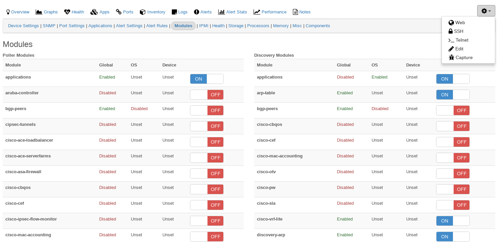
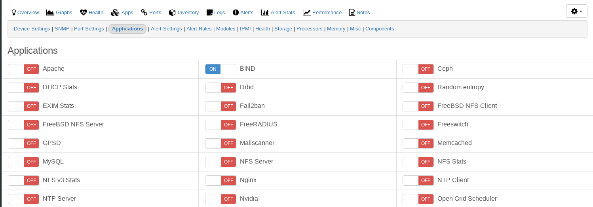

# Applications

Application support graphs the performance statistics of many
applications.

Each application supports one or more collection methods:

1. By direct connection to the application
2. snmpd extend
3. [The agent](Agent-Setup.md).

You can add application monitoring before or after the host.

With several collection methods, enable only one.

## SNMP Extend

With the `snmp extend` method, the application discovery module finds
your monitored applications automatically. It also works on a device
that is already in LibreNMS. This module is enabled by default on most
\*nix operating systems. On some systems, you must enable it manually.

### SUDO

With `SNMP extend`, the scripts run as the `snmpd` user. This user is
often unprivileged. Such a user needs `sudo`.

To find the need for `sudo`, first find the user of `snmpd`. Then run
the extend script as that user.

!!! example
    In this example, `snmpd` runs as `Debian-snmp` and the extend is for
    proxmox. These commands must run without an error:

    ```bash
    sudo -u Debian-snmp /usr/local/bin/proxmox
    ```

    If a command fails, use sudo with the extend command.
    For the example above, add this line to the sudoers file:

    ```bash
    Debian-snmp ALL = NOPASSWD: /usr/local/bin/proxmox
    ```

    Then add sudo to the extend command. For proxmox, the result is:

    ```bash
    extend proxmox /usr/bin/sudo /usr/local/bin/proxmox
    ```

### Restart snmpd

=== "Systemd"

    ```bash
    sudo systemctl restart snmpd
    ```

=== "Xinetd"

    ```bash
    sudo service snmpd restart
    ```


### JSON Return Optimization Using librenms_return_optimizer

`json_app_get` returns larger and more complex data from an extend. It
then processes that data. The return can become large. A large return
sometimes causes SNMP problems on a network.

`librenms_return_optimizer` corrects this problem. It takes the extend
output from a pipe, compresses it with gzip, and converts it to base64.
The base64 step is necessary, because net-snmp handles binary data
poorly. It converts most non-printable characters to `.`. The base64
step adds some overhead to the gzip data. The return is still about one
third of the original size for JSON items.

The change is simple. The portactivity example below:

```bash
extend portactivity /etc/snmp/extends/portactivity smtps,http,imap,imaps,postgresql,https,ldap,ldaps,nfsd,syslog-conn,ssh,matrix,gitea
```

Becomes this:

```bash
extend portactivity /usr/local/bin/lnms_return_optimizer -- /etc/snmp/extends/portactivity smtps,http,imap,imaps,postgresql,https,ldap,ldaps,nfsd,syslog-conn,ssh,matrix,gitea
```

This method needs `Perl`, `MIME::Base64`, and `Gzip::Faster`.

=== "FreeBSD"
```bash
pkg install p5-MIME-Base64 p5-Gzip-Faster wget
wget https://raw.githubusercontent.com/librenms/librenms-agent/master/utils/librenms_return_optimizer -O /usr/local/bin/librenms_return_optimizer
chmod +x /usr/local/bin/librenms_return_optimizer
```

=== "Debian/Ubuntu"
```bash
apt-get install zlib1g-dev cpanminus wget
cpanm Gzip::Faster
cpanm MIME::Base64
wget https://raw.githubusercontent.com/librenms/librenms-agent/master/utils/librenms_return_optimizer -O /usr/local/bin/librenms_return_optimizer
chmod +x /usr/local/bin/librenms_return_optimizer
```

=== "CentOS/RedHat"
```bash
yum install zlib-devel perl-CPAN wget
cpan Gzip::Faster
cpan MIME::Base64
wget https://raw.githubusercontent.com/librenms/librenms-agent/master/utils/librenms_return_optimizer -O /usr/local/bin/librenms_return_optimizer
chmod +x /usr/local/bin/librenms_return_optimizer
```

These applications are supported:

- backupninja
- certificate
- chronyd
- dhcp-stats
- docker
- fail2ban
- fbsd-nfs-client
- fbsd-nfs-server
- gpsd
- mailcow-postfix
- mdadm
- ntp-client
- ntp-server
- portactivity
- powerdns
- powermon
- puppet-agent
- pureftpd
- redis
- routinator
- seafile
- supervisord
- ups-apcups
- zfs

The following apps have extends that have native support for this,
if congiured to do so.

- suricata

## Enable the application discovery module

1. Edit the device for which you want to add this support
1. Click on the *Modules* tab and enable the `applications` module.
1. LibreNMS saves this change automatically. A green
   confirmation pop-up message.



After you enable the application module,
then also enable which applications you want to monitor, in the rare
case where LibreNMS does not automatically detect it.

**Note**: Only do this if an application was not auto-discovered by
LibreNMS during discovery and polling.

## Enable the application(s) to be discovered

1. Open the device with the new application module.
1. Click on the *Applications* tab and select the applications you
   want to monitor.
1. LibreNMS also saves this change automatically. A green
   confirmation pop-up message.




## Agent

The unix-agent does not have a discovery module, only a poller
module. That poller module is always disabled by default. It needs to
need a manual enable with the agent. LibreNMS
automatically enabled by the unix-agent poller module. It is better to
ensure that your application is enabled for monitoring. You can check
by following the steps under the `SNMP Extend` heading.
