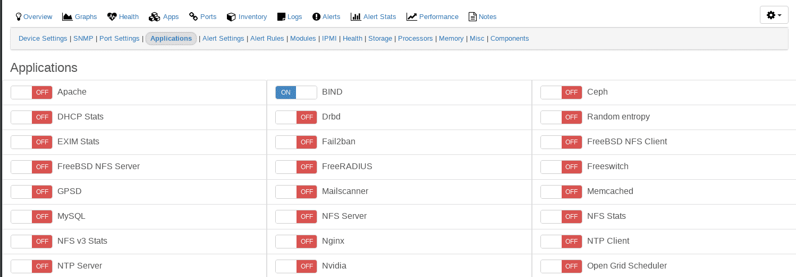

# Applications

You can use Application support to graph performance statistics of
many applications.

Different applications support a variety of ways to collect data:

1. By direct connection to the application
2. snmpd extend
3. [The agent](Agent-Setup.md).

The monitoring of applications could be added
before or after the hosts have been added to LibreNMS.

If multiple methods of collection are listed you only need to enable one.

## SNMP Extend

When using the `snmp extend` method, the application discovery module
will pick up which applications you have set up for monitoring
automatically, even if the device is already in LibreNMS. The
application discovery module is enabled by default for most \*nix
operating systems, but in some cases you will need to manually enable
the application discovery module.

### SUDO

One major thing to keep in mind when using `SNMP extend` is these run as the `snmpd` user that can be an unprivileged user. In these situations you need to use `sudo`.

To test if you need `sudo`, first check the user `snmpd` is running as.
Then test if you can run the extend script as that user without issue.

!!! example
    If `snmpd` is running as `Debian-snmp` and we want to run the extend for proxmox, we check that the following run without error:

    ```bash
    sudo -u Debian-snmp /usr/local/bin/proxmox
    ```

    If it doesn't work, then you will need to use sudo with the extend command.
    For the example above, that would mean adding the line below to the sudoers file:

    ```bash
    Debian-snmp ALL = NOPASSWD: /usr/local/bin/proxmox
    ```

    Finally we would need to add sudo to the extend command, which would look
    like that for proxmox:

    ```bash
    extend proxmox /usr/bin/sudo /usr/local/bin/proxmox
    ```

### Restart snmpd

=== "Systemd"

    ```bash
    sudo systemctl restart snmpd
    ```

=== "Xinetd"

    ```bash
    sudo service snmpd restart
    ```


### JSON Return Optimization Using librenms_return_optimizer

While the `json_app_get` does allow for more complex and larger data
to be easily returned by a extend and the data to then be worked
with, this can also sometimes result in large returns that
occasionally don't play nice with SNMP on some networks.

`librenms_return_optimizer` fixes this via taking the extend output
piped to it, gzipping it, and then converting it to base64. The
later is needed as net-snmp does not play that nice with binary data,
converting most of the non-printable characters to `.`. This does add
a bit of additional overhead to the gzipped data, but still tends to
be result in a return that is usually a third of the size for JSONs
items.

The change required is fairly simply. So for the portactivity example below...

```bash
extend portactivity /etc/snmp/extends/portactivity smtps,http,imap,imaps,postgresql,https,ldap,ldaps,nfsd,syslog-conn,ssh,matrix,gitea
```

Would become this...

```bash
extend portactivity /usr/local/bin/lnms_return_optimizer -- /etc/snmp/extends/portactivity smtps,http,imap,imaps,postgresql,https,ldap,ldaps,nfsd,syslog-conn,ssh,matrix,gitea
```

The requirements for this are `Perl`, `MIME::Base64`, and `Gzip::Faster`.

=== "FreeBSD"
```bash
pkg install p5-MIME-Base64 p5-Gzip-Faster wget
wget https://raw.githubusercontent.com/librenms/librenms-agent/master/utils/librenms_return_optimizer -O /usr/local/bin/librenms_return_optimizer
chmod +x /usr/local/bin/librenms_return_optimizer
```

=== "Debian/Ubuntu"
```bash
apt-get install zlib1g-dev cpanminus wget
cpanm Gzip::Faster
cpanm MIME::Base64
wget https://raw.githubusercontent.com/librenms/librenms-agent/master/utils/librenms_return_optimizer -O /usr/local/bin/librenms_return_optimizer
chmod +x /usr/local/bin/librenms_return_optimizer
```

=== "CentOS/RedHat"
```bash
yum install zlib-devel perl-CPAN wget
cpan Gzip::Faster
cpan MIME::Base64
wget https://raw.githubusercontent.com/librenms/librenms-agent/master/utils/librenms_return_optimizer -O /usr/local/bin/librenms_return_optimizer
chmod +x /usr/local/bin/librenms_return_optimizer
```

Currently supported applications as are below.

- backupninja
- certificate
- chronyd
- dhcp-stats
- docker
- fail2ban
- fbsd-nfs-client
- fbsd-nfs-server
- gpsd
- mailcow-postfix
- mdadm
- ntp-client
- ntp-server
- portactivity
- powerdns
- powermon
- puppet-agent
- pureftpd
- redis
- seafile
- supervisord
- ups-apcups
- zfs

The following apps have extends that have native support for this,
if congiured to do so.

- suricata

## Enable the application discovery module

1. Edit the device for which you want to add this support
1. Click on the *Modules* tab and enable the `applications` module.
1. This will be automatically saved, and you should get a green
   confirmation pop-up message.


After you have enabled the application module, it would be wise to
then also enable which applications you want to monitor, in the rare
case where LibreNMS does not automatically detect it.

**Note**: Only do this if an application was not auto-discovered by
LibreNMS during discovery and polling.

## Enable the application(s) to be discovered

1. Go to the device you have just enabled the application module for.
1. Click on the *Applications* tab and select the applications you
   want to monitor.
1. This will also be automatically saved, and you should get a green
   confirmation pop-up message.




## Agent

The unix-agent does not have a discovery module, only a poller
module. That poller module is always disabled by default. It needs to
be manually enabled if using the agent. Some applications will be
automatically enabled by the unix-agent poller module. It is better to
ensure that your application is enabled for monitoring. You can check
by following the steps under the `SNMP Extend` heading.
