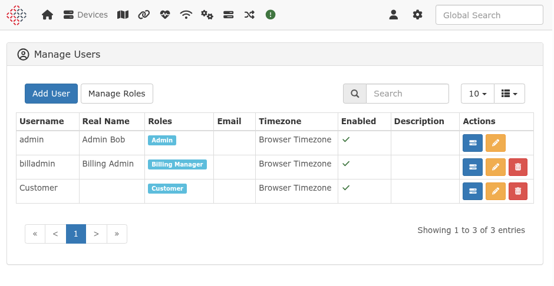
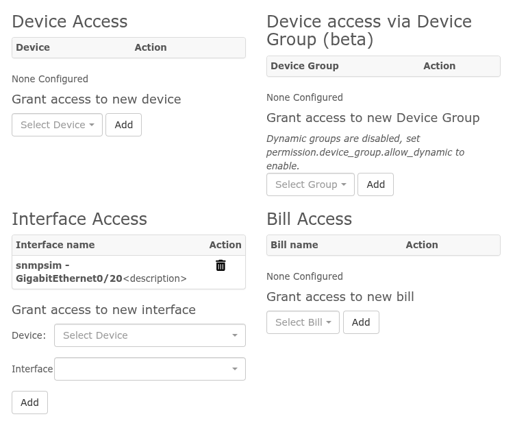

# Authorization

LibreNMS uses a role-based access control (RBAC) system. Permissions are grouped into roles, and roles are
assigned to users to define what they can see and do within the application.

### 1. Introduction to Authorization

Authorization determines what an authenticated user is allowed to do. In LibreNMS, this is handled through
a combination of functional permissions (via Roles) and resource-specific permissions (direct user assignments).

!!! warning
    Functional permissions are assigned to **Roles** and Roles are assigned to **Users**.
    **Individual functional permissions cannot be assigned directly to users.**

### 2. Roles

Roles are collections of permissions that define a user's level of access.

#### Built-in Roles:
*   `admin`: Full access to all features and resources (Global Read/Write).
*   `global-read`: Read-only access to all devices and data (Global Read). This role is assigned all `viewAny` permissions.
*   `user`: Limited access; requires specific resource permissions (devices, ports, bills) to see data.

#### Custom Roles:

Users can create custom roles to define specific sets of functional permissions.
These can be managed via the Web UI under **Settings (cog icon) -> Manage Users -> Roles**.

Custom roles allow for fine-tuned access. Unlike built-in roles, they can be configured with any combination of
functional permissions available in the system. For example, you can create a role that only allows viewing
event logs and nothing else.

### 3. Permissions

Functional permissions control access to specific parts of the application or actions.

#### Global Permissions:
These permissions define what a user can do at a high level. Examples include:
*   `device.create`: Permission to add new devices.
*   `alert.viewAny`: Permission to view the list of alerts.
*   `settings.update`: Permission to modify global settings.

#### Permission Groups:
Permissions are organized into groups such as `device`, `port`, `bill`, `alert`, `user`, and `settings`.

### 4. Resource-Specific Permissions (Granular Access)

LibreNMS provides granular, resource-specific access control for users who lack viewAny functional permissions.

#### The `viewAny` Permission and Fallback

Functional permissions like `device.viewAny`, `port.viewAny`, and `bill.viewAny` determine if a user can see
ALL resources of that type.

*   If a user **has** `device.viewAny`, they see all devices.
*   If a user **lacks** `device.viewAny`, the system falls back to **granular permissions**. They will
    only see devices specifically assigned to them (via direct assignment or a static device group).

Most other items in the system (sensors, services, health data, alerts for a specific device) do not have their
own separate granular permissions. Instead, access to these items **falls back to the device or port permissions**.
If you have access to a device, you generally have access to its sub-resources.

#### Interaction Between Functional and Resource Permissions

A common point of confusion is the interaction between functional permissions (e.g., `routing.viewAny`)
and resource-specific permissions (e.g., device access).

Even if a user is granted access to a specific device, they still require the corresponding **functional
permission** to access certain modules or menu items for that device.

**Example: Routing**
Even with access to Router-01, the Routing menu won't appear unless the user's role includes
`routing.viewAny` or `routing.view`.

This pattern applies to several other modules, including:
*   **Switching (VLANs):** Requires `vlan.viewAny`.
*   **Services:** Requires `service.view`.
*   **Health Data (Sensors):** While viewing basic health data typically falls back to device access,
    managing sensors (e.g., editing thresholds or labels) requires specific functional
    permissions such as `sensor.update` or `wireless-sensor.update`.

#### Device Permissions:
Access to individual devices is granted to users directly. When a user is granted access to a device,
they can see all data related to that device, including its ports, sensors, and services (provided they
also have the required functional permissions for those modules).

#### Port Permissions:

Access can be granted to individual ports. Note that if a user already has access to the parent device,
they will automatically have access to all its ports.

**Port-only Access:**
If a user is granted access only to specific ports, they will **not** see the parent device in the main
Devices list or in most global views. They will only see the ports they have access to in the Ports list
and in specific port-related views. This is useful for providing customers access to only their specific
interfaces without exposing the entire device configuration or other customers' ports.

#### Bill Permissions:
Visibility of billing data is restricted to specific users through bill-level permissions. If a user
lacks `bill.viewAny`, they will only see bills they have been explicitly granted access to.

#### Device Group Permissions:
Access can be granted to all devices within a specific **Static Device Group**.
!!! note
    Only **static** device groups can be used for permissions. Dynamic device groups do not support
    permission assignment.

### 5. Managing Authorization

#### Quick Reference: UI Paths

| Task | Web UI Path |
|---|---|
| Create/Edit Roles | **Settings (cog icon) -> Manage Users -> Roles (button)** |
| Assign Role to User | **Settings (cog icon) -> Manage Users -> Edit (pencil icon)** |
| Manage Resource Access | **Settings (cog icon) -> Manage Users -> Manage Access (tasks icon)** |

The **Manage Access** screen is the primary location for assigning specific Devices, Ports, Bills, and Static Groups to a user.

#### Command Line (CLI):
You can use the `./lnms` command-line tool for some user management tasks:
*   `./lnms user:add`: Create a new user and assign a role.

### 6. Common Scenarios & Examples

#### Scenario: NOC Operator
Goal: Allow monitoring of all devices and alerts, but prevent configuration changes.

1.  **Create Role:** Create a noc-operator role and assign the following permissions: `device.viewAny`,
    `port.viewAny`, `alert.viewAny`, `eventlog.viewAny`, and `device-log.viewAny`.
2.  **Assign Role:** Assign the `noc-operator` role to the user.
3.  **Resource Access:** Since they have `device.viewAny`, they automatically see all devices. No additional
    resource assignments are needed.

#### Scenario: Customer with Specific Access
Goal: Allow a customer to see only their devices and specific ports.

1.  **Assign Role:** Assign the built-in `user` role to the customer. (This role has no `viewAny` permissions).
2.  **Assign Devices:** Go to **Manage Access** for that user and add the specific devices they own.
3.  **Assign Ports:** Go to **Manage Access** for that user and add specific ports on other devices (e.g., their uplink port
    on a shared switch).
4.  **Result:** The customer will see their own devices in full, plus only the specific ports assigned to them from
    other devices.

#### Scenario: Billing Manager
Goal: Allow access to billing data and nothing else.

1.  **Create Role:** Create a `billing-manager` role and assign `bill.viewAny` and `bill.update`.
2.  **Assign Role:** Assign the `billing-manager` role to the user.
3.  **Resource Access:** Since they have `bill.viewAny`, they see all bills. If you want them to see only specific bills
    instead, omit `bill.viewAny` and assign `bill.view` to the role, then assign individual bills in **Manage Access**.

---
!!! warning
    The `admin` role bypasses all granular checks and has full access to the entire system. Assign this role only to trusted administrators.
