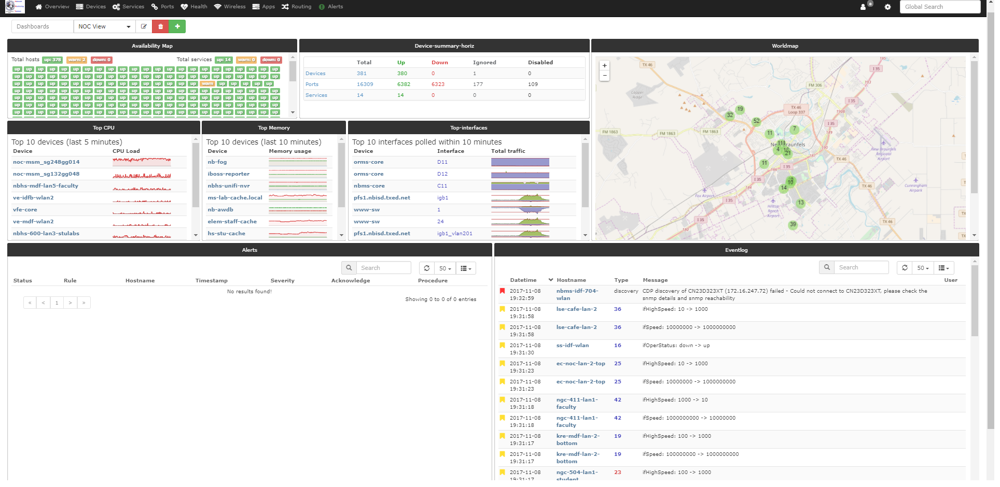
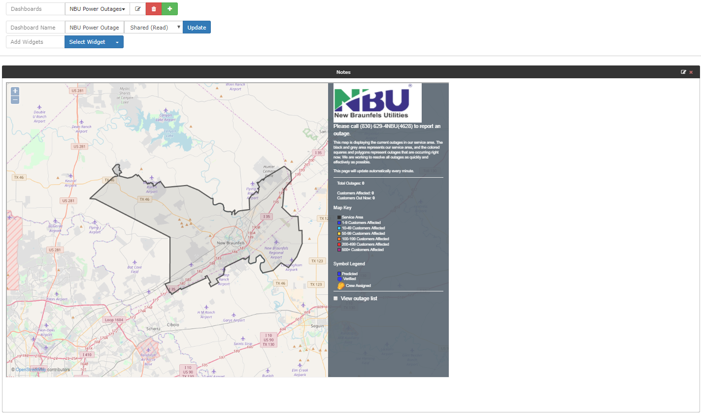
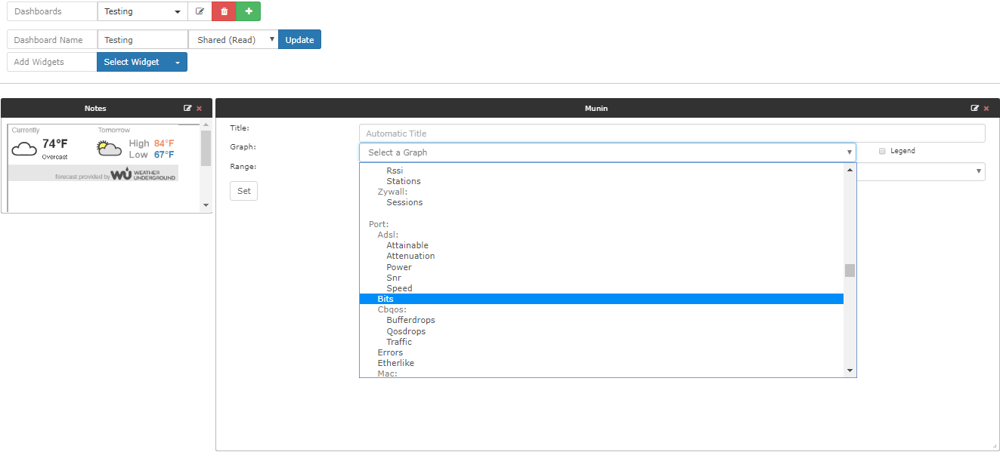
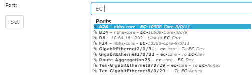

# Dashboards

Create customised dashboards in LibreNMS per user. You can share
dashboards with other users. You can also make a custom dashboard and
default it for all users in LibreNMS.

Example Dashboard


## Widgets

LibreNMS has a whole list of Widgets to select from.

- Alerts Widget: Displays all alert notifications.
- Availability Map: Displays all devices with colored tiles, green up,
  yellow for a warning, that is a device reboot in the last 24 hours, red
  for down. You can also list all services and ignored/disabled
  devices in this widget.
- Components Status: List all components Ok state, Warning state, Critical state.
- Device Summary horizontal: List device totals, up, down, ignored,
  disabled. Same for ports and services.
- Device Summary vertical: List device totals, up, down, ignored,
  disabled. Same for ports and services.
- Eventlog: Displays all events with your devices and LibreNMS.
- External Image: can be used to show external images on your
  dashboard. Or images from inside LibreNMS.
- Globe Map: it shows a map of the globe.
- Graph: Can be used to display graphs from devices.
- Graylog: Displays all Graylog's syslog entries.
- Notes: use for html tags, embed links and external web pages. Or
  or general notes.
- Server Stats: it shows gauges for the CPU, the memory, and the storage
  usage. Note the device type has to be listed as "Server".
- Syslog: Displays all syslog entries.
- Top Devices: By Traffic, or  Uptime, or Response time, or Poller
  Duration, or Processor load, or Memory Usage, or Storage Usage.
- Top Interfaces: it lists the top interfaces by traffic use.
- World Map: displays all your devices locations. From syslocation or
  from override sysLocation.

List of Widgets:

![List of Widgets][image of widgets]  
[image of widgets]: ../img/list-widgets.png "List of the widgets"

## Dashboard Permissions

- Private: Sets the dashboard to only the user that created the
  dashboard can view and edit.
- Shared Read: Sets the dashboard to allow other users to view the
  dashboard. They cannot change the dashboard.
- Shared Admin RW: Sets the dashboard to allow other users to view
  the dashboard, but allows Admins to makes changes.
- Shared: Allows all users to view the dashboard and make changes.

## Setting a global default dashboard

Step 1: Set the dashboard to either shared read or shared, depending
on what you want the users access to change.

Step 2: Then go to Settings -> WebUI settings -> Dashboard Settings
and set the global default dashboard.

## Setting embedded webpage

Using the Notes Widget.

```html
<iframe src="your_url" frameBorder="0" width="100%" height = "100%">
  <p>Your browser does not support iframes.</p>
</iframe>
```

Note: adjust the width, the height, and the size of your widget.

``` src="url" ``` needs to be URL to webpage you are linking to.
Some web pages do not support embedded HTML or an iframe.


## How to create ports graph

In the dashboard, you want to create an interface graph select the widget called

'Graph' then select "Port" -> "Bits"


Note: you can map the port by description or the alias or by port
id. You need this id for the map of the port to the graph.



## Dimension parameter replacement for Generic-image widget

When using the Generic-image widget you can provide the width and
height of the widget in your request. The image then fits the
dimensions of the Generic-image widget.
You can add `@AUTO_HEIGHT@` and `@AUTO_WIDTH@` to the Image URL as parameters.

Examples:

- <http://librenms.example.com/graph.php?id=333%2C444&type=multiport_bits_separate&legend=no&absolute=1&from=-14200&width=@AUTO_WIDTH@&height=@AUTO_HEIGHT@>
- <http://example.com/myimage.php?size=@AUTO_WIDTH@x@AUTO_HEIGHT@>


## Transceiver receive power

Add the **Transceivers** dashboard widget to display device, port, port description
(interface alias), and per-lane receive power in dBm. Port names open their port
page. The widget uses existing discovered transceivers and sensors; it does not
perform SNMP queries or change discovery or polling.

In the widget settings, enter an optional title, select an optional device group,
and select zero or more port groups. Ports may belong to any selected port group
and must also belong to the selected device group, if set. Empty selections mean
all ports accessible to the current user. Overlapping groups do not duplicate
rows. Down ports remain visible; deleted ports are excluded.

Columns Rx Power 0–3 are always available. Additional numbered lanes create
extra columns. Junos lane numbers are taken from the discovery sensor index;
explicit lane descriptions provide a fallback. One unnumbered receive sensor
uses column 0. Numbered lanes take precedence over a port-level aggregate.
Missing lanes show a dash; missing or ambiguous readings show N/A.

Readings use white text with green (OK), amber (warning), or red (critical)
backgrounds. Both low and high sensor limits are evaluated using LibreNMS's
sensor threshold status, with critical thresholds taking precedence. Gray means
unavailable data or no configured thresholds. This is the current sensor status,
not an alert rule or notification status. Hover over a reading for its sensor
description, last update, and limits. Refreshing the widget does not poll a device.

The sensor must be a receive-direction dBm sensor mapped to the port by ifIndex,
or by an explicit inventory association. Direction detection recognizes common
Rx/receive/input-power descriptions. Unrecognized labels or unmapped sensors
require discovery support; the widget does not guess associations by port name.

For AXOS PON receive sensors, the -60 dBm value generated by LibreNMS for zero
raw power is shown as N/A (zero reported). This special case is restricted to
AXOS PON Rx sensors. The AXOS definitions do not supply PON receive thresholds;
configure suitable sensor limits to enable status colors. Device discovery must
already supply the transceiver records: a port name alone does not establish that
an optic is present. Optical sensors without transceiver records do not appear.
