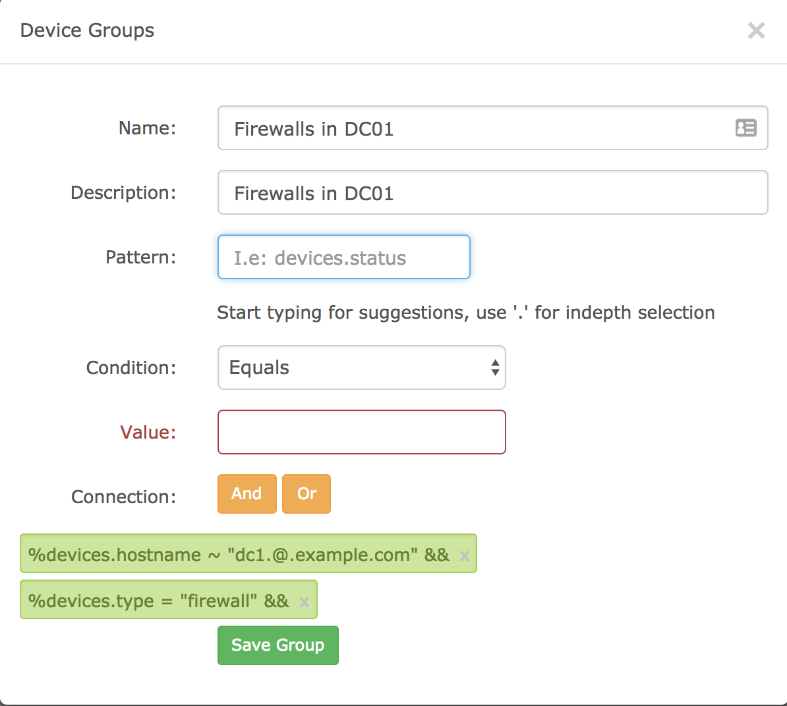

# Grouping Devices

LibreNMS groups your devices in the same way as the alerts. This
document describes how to start.

## Dynamic Groups

### Rule Editor

A dynamic group uses the MySQL structure of your data, in the same way
as the alerting system. QueryBuilder then generates the SQL queries of
your groups.

In MySQL, run `show tables` to see all the LibreNMS tables. Then run
`desc <tablename>` to see the structure of a table. These two names
give the format of the QueryBuilder interface:
__tablename.columnname__.

To see the data of the table, run `select * from <tablename> limit 5;`.
The output shows the data of your dynamic group.

This common example groups the devices by hostname. The hostname format
is `dcX.[devicetype].example.com`.

To group them by the device type `rtr`, add a rule for the routers:
`devices.hostname` `endswith` `rtr.example.com`. This rule matches
dcX.`rtr.example.com`.

To group them by data centre, use the rule `devices.hostname` regex
`dc1\..*\.example\.com`. Escape each period in the regex. This rule
matches `dc1.rtr.example.com`.

## Static Groups

A static group holds specific devices. You can also convert a dynamic
group to a static group. Select `static` as the type. Then select the
devices of the group.

The group is now available at Devices -> All Devices in the top
navigation. You can also map your device groups to an alert rule. Use
the `Match devices, groups and locations list` section of that rule.