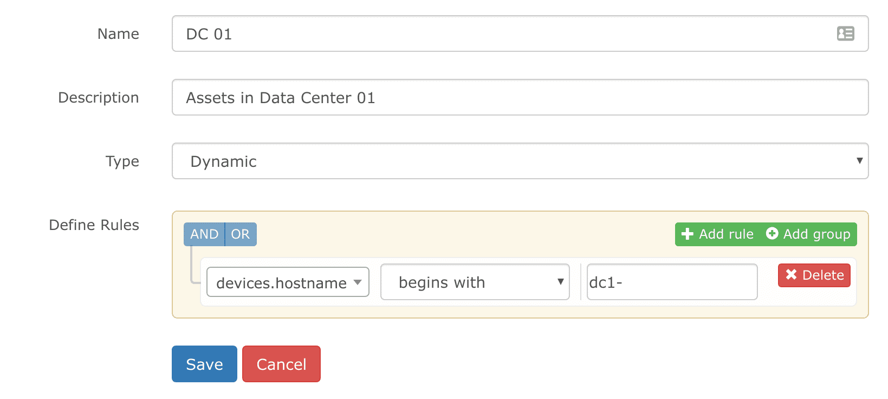

# Grouping Devices

LibreNMS supports grouping your devices together in much the same way
as you can configure alerts. This document will hopefully help you get
started.

## Dynamic Groups

### Rule Editor

Just like our alerting system, dynamic groups are based on the MySQL
structure your data is in and uses QueryBuilder to generate SQL
queries to build your groups.

You can browse around inside MySQL using `show tables` to view all
of the tables within LibreNMS and then run `desc <tablename>` to
be able to see the table structure. Both of these then form the
basic format for the QueryBuilder interface such as __tablename.columnname__.

To see the data within the table, you can then run
`select * from <tablename> limit 5;`. This way, you can get an idea
of what data will be returned for your dynamic group.

As a working example and a common question, let's assume you want to
group devices by hostname. If your hostname format is
dcX.[devicetype].example.com.

If you want to group them by the device type of `rtr`, you would add
a rule for routers of `devices.hostname` `endswith` `rtr.example.com`.
This would match dcX.`rtr.example.com`

If you want to group them by DC, you could use the rule
`devices.hostname` regex `dc1\..*\.example\.com` (Don't forget to
escape periods in the regex). This would match `dc1.rtr.example.com`.

## Static Groups

You can create static groups (and convert dynamic groups to static) to
put specific devices in a group. Just select static as the type and
select the devices you want in the group.

You can now select this group from the Devices -> All Devices link in
the navigation at the top. You can also use map your device groups to
an alert rule in the section `Match devices, groups and locations list`
against any alert rule.