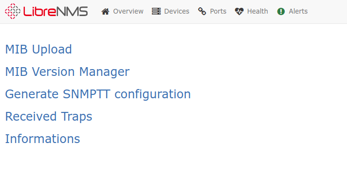
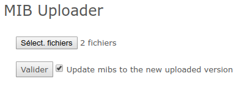
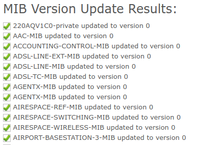
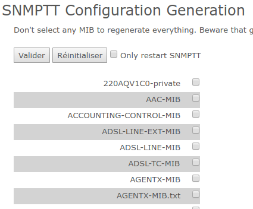
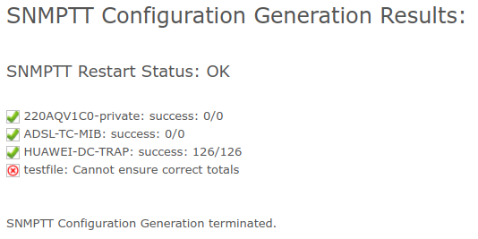
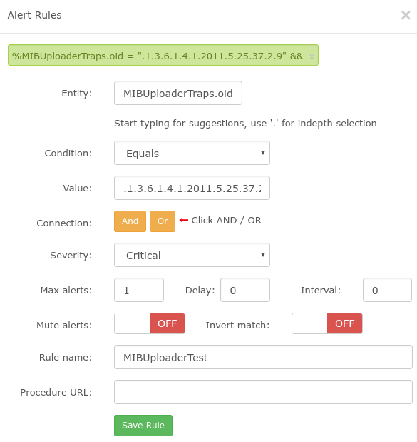

# SNMP Trap Manager

SNMP Trap Manager is a plugin which adds SNMP Trap functionality into LibreNMS through SNMPTT

## Description

 * LibreNMS SNMPTT plugin
 * Add trap handler `genericTrap.inc.php`
 * Add `snmptrap.php` minor changes

## Setup

Mandatory configuration lines are available into specific configuration files, that you can found into `misc/` directory. Please see these files to configure correctly this plugin.

    1. LibreNMS installed. At the moment it is compatible and validated with `DB Schema #118`
    2. Install : `snmptrapd` and `snmptt`, see your distribution for the good packages.
    3. Configure `snmptrapd.conf`, `snmptt.ini` and `snmp.conf`. See embedded files for the configuration lines to check/add
    4. Start and enable the `snmptt` daemon. Check that it is correctly launched and fix all startup problem before continuing
    5. Start and enable the `snmptrapd` daemon
    6. Go to `Admin Menu`, `SNMP Trap Manager` menu index page to init the database. Actually this step is not made during a trap reception for performance optimization
    10. Creating the `/opt/librenms/ssh` directory and fill the `/opt/librenms/ssh/config` file from `misc/ssh` directory and configure SSH commands into configuration. The SSH keys creation is mandatory ( ssh-keygen -t rsa -f /opt/librenms/ssh/id_rsa ).

Note from `snmp.conf` : it is not possible to modify thi file, you can use the environment variable `MIBDIRS` before all PHP/snmptt script launch.

From the `snmptt_restart` command, you have to configure `sudo`, like in this sample, to allow `systemctl restart snmptt` command without password retrieving ( See the `sudoers` file ).

Creating directories and files configured for the plugin, on the `frontend` side but also on the `pollers` side :

```
mkdir -p /opt/librenms/snmptrapmanager/mibs/
mkdir -p /opt/librenms/snmptrapmanager/snmpttmibs/
touch /opt/librenms/snmptrapmanager/snmptt.conf
chown -R apache:librenms /opt/librenms/snmptrapmanager ( apache on redhat like distrib)
chown -R nginx:librenms /opt/librenms/snmptrapmanager ( nginx on redhat like distrib)
chown -R www-data:librenms /opt/librenms/snmptrapmanager ( on debian like distrib)
```

Using `snmptrap.mibup.php` to catch snmp traps. It's a copy of `snmptrap.php`, but with the include of  `genericTrap.inc.php`.

If MIBS are missing, the convert process does not generate the traps configuration from these missing MIBS.

This plugin will check SQL tables existency which are required to plugin well behaviour, and create it if necessary. There is nothing to do for this part.

## Setup multi-poller and remote poller

On the LibreNMS `frontend` side :

 * Install `net-snmp-utils`( redhat like distrib ) or `libnet-snmp-perl` ( on debian like distrib ) and `snmptt` packages to get `snmptranslate` and `snmpttconvertmib` executable file.
 * Follow the classic installation process, but without configuring `snmptt.ini` which will not be used.

On the LibreNMS `poller` side :

 * Follow all classic install process.

## Behaviour

 * `snmptrapd`, will call `snmptthandler` after each received TRAP
 * `snmptthandler` get these TRAP to the `snmptt` daemon
 * `snmptt` compute the received TRAP if it is recognize from the configuration files. See the `snmptt.conf` sample
 * If `snmptt` found the OID of the TRAP inside the configuration,  `EXEC ...` bloc is executed if present
 * If the received TRAP is not catched from the core LibreNMS includes, `genericTrap.inc.php` will be called and will execute each functions from `MIBUploader` to register the TRAP
 * To generate an alert from a TRAP, you have to define a rule that will use this TRAP
 * One rules à defined ( LibreNMS Rules), you have to call the polling
 * You can now launch  `alerts.php`

There is a small latency ( ~ 1 second ) between the TRAP sent event and the `snmptt` computing process. his behaviour remains more efficient than running `snmptt` for each received TRAP.

## Link between TRAP and LibreNMS device

The link between an SNMP TRAP and a LibreNMS device is made from the `hostname`, or `sysName` field from the `devices` table, or with the IPV4 adresses.

Beware of the sent value from the devices SNMP agent.

If you want to change this behaviour, you have to edit the  `snmptrap.mibup.php` file.

## Usage

Here is the `MIBUploader`  menu:



### MIB Upload

To generate the SNMPTT configuration, but particularly for the MIBs versioning, it is required to upload these MIBs.

The upload from many fies is supported.



    1. Select files from the `Select. fichiers` button
    2. Clic on  `Valider`

The `Uptate mibs to the new uploaded version` checkbox, allow you to update the current MIB release if it is an updated release file from an existing uploaded MIB. This is the default behaviour ( checked by default in the form ).

Warning : A MIB detection is made from the MIB filename : if filenames are different, a new MIB will be created.

### MIB Version Manager

Each time a MIB is uploaded, if the MIB filename is detected as already inside the database, a content file comparison is made ( from SHA2 checksum ).

If content is different – even if only one character differs – a new release will be created.

When ou will generate SNMPTT configuration, the current release is used to select the MIB content to convert.

If you want to use an old release from the MIB, you have to use the `Version Manager` from MIBUploader.

Note : it is not possible that several people generate the same SNMPTT configuration at the same time. This is done by a database field. See `Informations` menu.


    1. Into the MIB select menu, you can select the desired release. You can also remove a MIB through this menu.
    2. Clic on `Valider` to refresh the current release to use.

The `Réinitialiser` button will simply clean the form and not update anything.

The `Update all MIBS to the latest available version` checkbox, allow you to choose the most recent release of the MIB from all registered MIBs. This ignore the current selection.

Note : the `Valider` and `Réinitialiser` buttons, are present in the top and the bottom of the page. It is more easy like this and result will be the same when you clic on theses.



Here is the result of an update. it is a massive update from may MIBs, made with the checkbox.

### Generate SNMPTT configuration

One MIBs are downloaded and/or the good release chosen, you can generate SNMPTT configuration.



By default, if nothing is selected, *all MIBs are converted*.

If you select only some MIBs, *only the selected MIBs will be converted*. This will remove the configuration from the other MIBs.

The `Only restart SNMPTT` checkbox, allow you to restart the SNMPTT daemon without re-generating the configuration.



Once the form is submitted, here is a possible result :

 * SNMPTT was restarted with success : `SNMPTT Restart Status: OK`. Check well this status, because without  SNMPTT daemon, TRAP can't be received.
 * Three MIBs are converted, but with only two with no TRAP : `0/0`
 * A converted MIB with 126 TRAPS found from 126 available TRAPS : `126/126`
 * A mostly invalid MIB

This status is given by the output of the `snmpttconvertmib` command.

If `snmpttconvertmib` has not converted all available TRAPS from a MIB, the result will display a red cross icon.

### Received Traps

A simple TRAP list from received ones, with the updated date of the TRAP.

This is not an history : if you avec configured an expiration date from the registered TRAPS through the plugin, they will not be displayed.


### Informations

The `Informatios` menu, display the module state :

 * SNMPTT State : is the module generating configuration at the moment ? `idle` : does nothing
 * MIB Count : number of downloaded MIB
 * DB Schema : internal value used to know the database schema version from the plugin

## Rules and Alerts

The LibreNMS rule creation is made from the classical menu.



Here, `oid` column is used. Numeric `OID` of the TRAP is stored.

You can also look at the `last_update` column which contant a MySQL`DATE`.

The link between a device is made with the standard LibreNMS behaviour, with the `device_id` column.

Finally, to retrieve an alert, polling process must be started.
