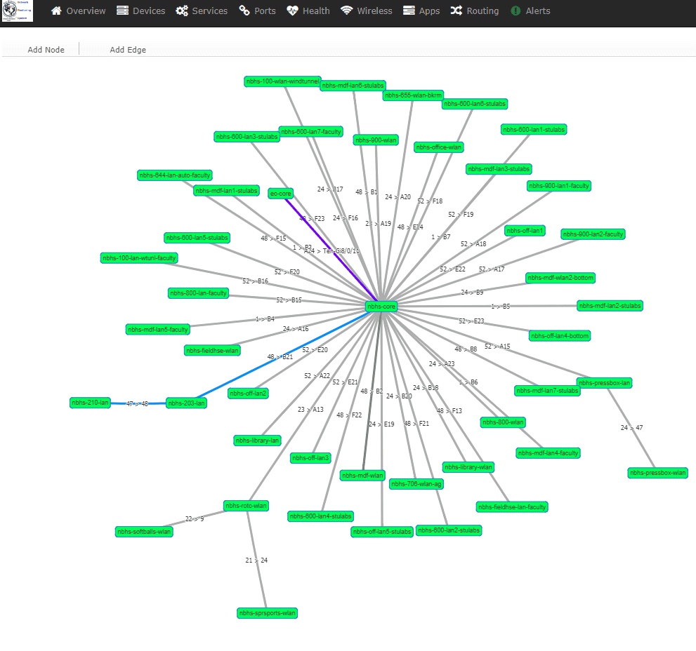

# Vis JS Configuration

The [Network Maps](Network-Map.md) and [Dependency Maps](Dependency-Map.md) have configuration options for
the vis.js library, which affects the way the maps are rendered as well
as the way that users can interact with the maps. This configuration can
be adjusted by following the instructions below.

[This link](https://visjs.github.io/vis-network/docs/network/) will
show you all the options and explain what they do.

The commands to run to use the defaults is as follows:

```bash
lnms config:set network_map_vis_options '{
  layout:{
      randomSeed:2
  },
  "edges": {
    arrows: {
          to: {enabled: true, scaleFactor:0.5},
    },
    "smooth": {
        enabled: false
    },
    font: {
        size: 14,
        color: "red",
        face: "sans",
        background: "white",
        strokeWidth:3,
        align: "middle",
        strokeWidth: 2
    }
  },
  "physics": {
     "barnesHut": {
      "gravitationalConstant": -2000,
      "centralGravity": 0.3,
      "springLength": 200,
      "springConstant": 0.04,
      "damping": 0.09,
      "avoidOverlap": 1
    },
     "forceAtlas2Based": {
      "gravitationalConstant": -50,
      "centralGravity": 0.01,
      "springLength": 200,
      "springConstant": 0.08,
      "damping": 0.4,
      "avoidOverlap": 1
    },
     "repulsion": {
      "centralGravity": 0.2,
      "springLength": 250,
      "springConstant": 0.2,
      "nodeDistance": 200,
      "damping": 0.07
    },
     "hierarchicalRepulsion": {
      "nodeDistance": 300,
      "centralGravity": 0.2,
      "springLength": 300,
      "springConstant": 0.2,
      "damping": 0.07
    },
  "maxVelocity": 50,
  "minVelocity": 0.4,
  "solver": "hierarchicalRepulsion",
  "stabilization": {
    "enabled": true,
    "iterations": 1000,
    "updateInterval": 100,
    "onlyDynamicEdges": false,
    "fit": true
  },
  "timestep": 0.4,
 }
}'
```

An example to override the device dependency map to use a hierarchical layout is below.
Note that you can choose to enter the JSON config on one line if you want.

```bash
lnms config:set network_map_devicedependency_vis_options '{ layout:{ hierarchical: { enabled: true, direction: "LR", sortMethod: "directed", nodeSpacing: 50, treeSpacing: 50, levelSeparation: 300 } }, "edges": { arrows: { to: { enabled: true, scaleFactor:0.5 }, }, "smooth": { enabled: false }, font: { size: 14, color: "red", face: "sans", background: "white", strokeWidth:3, align: "middle", strokeWidth: 2 } }, "physics": {"enabled": false } }'
```

### Configurator Output

You may also access the dynamic configuration interface [example
here](https://visjs.github.io/vis-network/examples/network/other/configuration.html)
from within LibreNMS by adding the following to config.php

Once you've achieved your desired map appearance, click the generate
options button at the bottom to be given the necessary parameters to
set in the lnms command. Note that the configurator will output the config
with `const options` you will need to strip this out.

```bash
lnms config:set network_map_vis_options '{
  "nodes": {
    "color": {
      "background": "rgba(20,252,18,1)"
    },
    "font": {
      "face": "tahoma"
    },
    "physics": false
  },
  "edges": {
    "smooth": {
      "forceDirection": "none"
    }
  },
  "interaction": {
    "hover": true,
    "multiselect": true,
    "navigationButtons": true
  },
  "manipulation": {
    "enabled": true
  },
  "physics": {
    "barnesHut": {
      "avoidOverlap": 0.11
    },
    "minVelocity": 0.75
  }
}'
```


