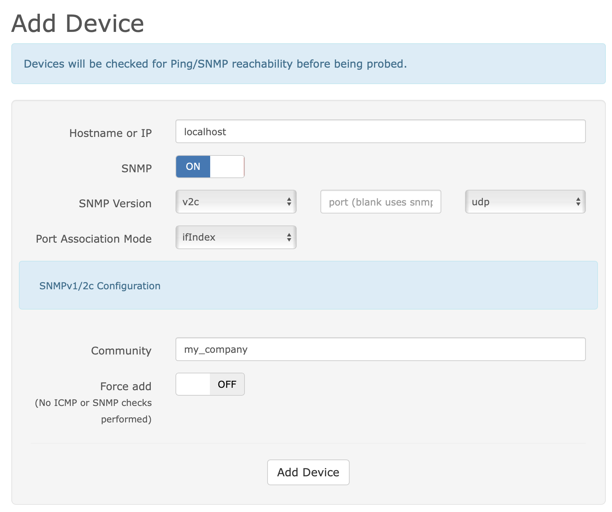
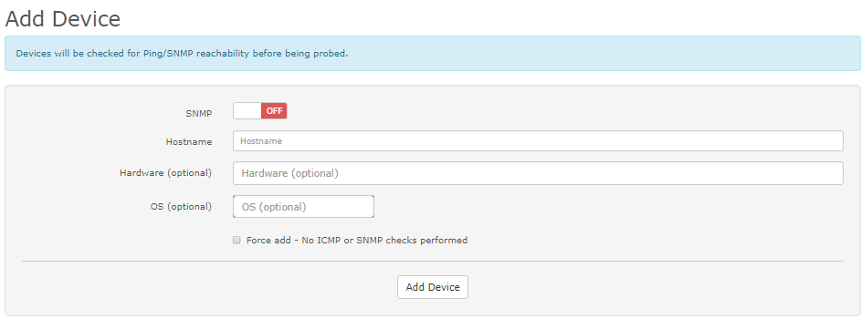

# Adding Device

You have two options for adding a new device into LibreNMS. You can
add a device via the [WebUI](Adding-a-Device.md#via-webui) or by using the [CLI](Adding-a-Device.md#via-cli).

## Via WebUI

Using the web interface, go to Devices in the menu and click Add Device.
Enter the details required for the device that you want to add and then
click z≈x≈xz`'Add Host'. As an example, if your device is configured to
use the community `my_company` using snmp `v2c` then you would enter the
following as per the screenshot:



SNMP Port defaults to 161.

By default, the Hostname will be used for polling data. If you want
to poll data via a specific IP-Address (e.g. Management IP), set the 
Hostname as the IP-Address and after the device is added, you can edit
the device and set the display name to original Hostname.


## Via CLI

Using the command line via ssh as the `librenms` user, you can add a
new device by changing to the directory of your LibreNMS install and
typing (be sure to put the correct details).

```bash
./lnms device:add --v2c -c yourSNMPcommunity yourhostname
```

You can use `./lnms device:add --help` for a list of available options and defaults.

As an example, if your device has the name `mydevice.example.com` and is
configured to use the community `my_company` using snmp `v2c` then you
would enter:

```bash
./lnms device:add --v2c -c my_company mydevice.example.com
```

!!! note
    Please note that if the community contains special characters such
    as `$` then you will need to wrap it in `'`. I.e: `'Pa$$w0rd'`.

## Ping Only Device

You can add ping only devices into LibreNMS through the WebUI or CLI. When
adding the device switch the SNMP button to "off". The device will be
added into LibreNMS as a Ping Only Device and will show ICMP Response Graph.

- Hostname: IP address or DNS name.
- Hardware: Optional you can type in whatever you like.
- OS: Optional this will add the Device's OS Icon.

Via CLI this is done with:

```bash
./lnms device:add --ping-only yourhostname
```



A How-to video can be found here: [How to add ping only devices](https://youtu.be/cjuByubg-uk)

## Automatic Discovery and API

If you would like to add devices automatically then you will probably
want to read the [Auto-discovery Setup](../Extensions/Auto-Discovery.md) guide.

You may also want to add devices programmatically, if so, take a look
at our [API documentation](../API/index.md)
