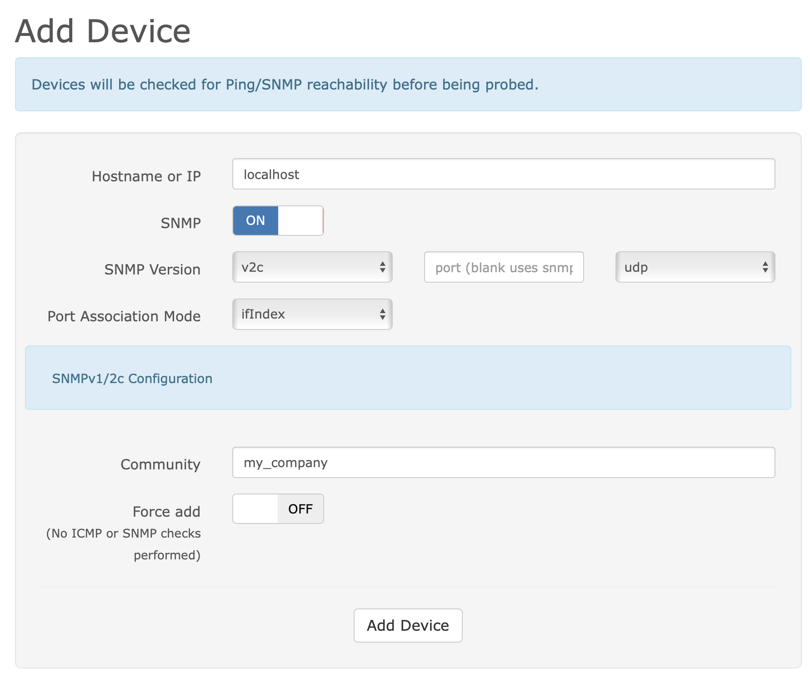
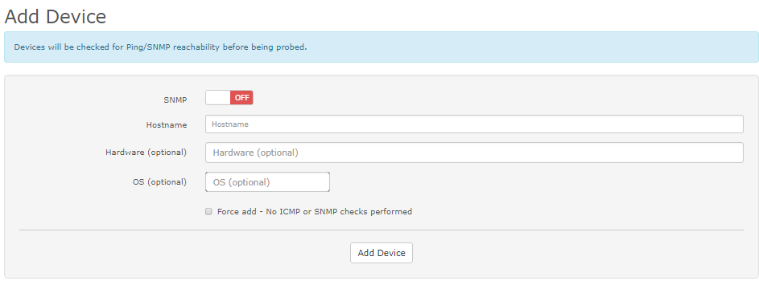

# Adding Device

There are two ways to add a new device to LibreNMS. You can use the
[web interface](Adding-a-Device.md#via-webui) or the
[command line](Adding-a-Device.md#via-cli).

## Via WebUI

In the web interface, go to Devices in the menu and click Add Device.
Enter the details of the device. Then click `Add Host`. The screenshot
below shows a device with the community `my_company` and SNMP `v2c`:



The default SNMP port is 161.

By default, LibreNMS polls the data through the hostname. To poll the
data through a specific IP address, such as a management IP address,
set the hostname to that IP address. After you add the device, you can
edit the device and set the display name to the original hostname.


## Via CLI

Connect with ssh as the `librenms` user. Then change to the directory
of your LibreNMS install and run this command with your own details:

```bash
./lnms device:add --v2c -c yourSNMPcommunity yourhostname
```

For a list of the available options and the defaults, run
`./lnms device:add --help`.

For a device with the name `mydevice.example.com`, the community
`my_company`, and SNMP `v2c`, run this command:

```bash
./lnms device:add --v2c -c my_company mydevice.example.com
```

!!! note
    A community with a special character such as `$` needs single
    quotation marks around it. An example is `'Pa$$w0rd'`.

## Ping Only Device

You can add a ping only device through the web interface or the command
line. In the web interface, set the SNMP button to "off". LibreNMS adds
the device as a ping only device and shows an ICMP response graph.

- Hostname: the IP address or the DNS name.
- Hardware: optional. You can enter any text.
- OS: optional. This field sets the OS icon of the device.

On the command line, use this command:

```bash
./lnms device:add --ping-only yourhostname
```



A video is available: [How to add ping only devices](https://youtu.be/cjuByubg-uk)

## Automatic Discovery and API

To add devices automatically, read the [Auto-discovery
Setup](../Extensions/Auto-Discovery.md) guide.

To add devices from your own program, read the [API
documentation](../API/index.md).
