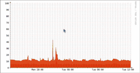

source: Support/Configuration.md
path: blob/master/doc/

LibreNMS configuration is a set of key values.

The config is stored in two places:
Database: This applies to all pollers and can be set with either `lnms config:set` or in the Web UI. Database config takes precedence over config.php.
config.php: This applies to the local poller only.  Configs set here will be disabled in the Web UI to prevent unexpected behaviour.

The LibreNMS uses dot notation for config items:

| Database | config.php |
| -------- | ---------- |
| `snmp.community` | `$config['snmp']['community']` |
| `snmp.community.+` | `$config['snmp']['community'][]` |
| `snmp.v3.0.authalgo` | `$config['snmp']['v3'][0]['authalgo']` |

> The documentation has not been updated to reflect using `lnms config:set` to
> set config items, but it will work for all settings.  Not all settings have
> been defined in LibreNMS, but they can still be set with the `--ignore-checks`
> option.  Without that option input is checked for correctness, that does not
> mean it is not possible to set bad values.  Please report missing settings.

# CLI
`lnms config:get` will fetch the current config settings (composite of database, config.php, and defaults).  
`lnms config:set` will set the config setting in the database.  Calling `lnms config:set` on a setting with no value will reset it to the default value.

If you set up bash completion, you can use tab completion to find config settings.

## Examples

```bash
lnms config:get snmp.community
  array (
    0 => 'public',
  )

lnms config:set snmp.community.+ testing

lnms config:get snmp.community
  array (
    0 => 'public',
    1 => 'testing',
  )

lnms config:set snmp.community.0 private

lnms config:get snmp.community
  array (
    0 => 'private',
    1 => 'testing',
  )

lnms config:set snmp.community test
  Invalid format

lnms config:set snmp.community '["test", "othercommunity"]'

lnms config:get snmp.community
  array (
    0 => 'test',
    1 => 'othercommunity',
  )

lnms config:set snmp.community

  Reset snmp.community to the default? (yes/no) [no]:
  > yes


lnms config:get snmp.community --json
  ["public"]
```


# Directories

```php
$config['temp_dir'] = "/tmp";
```

The temporary directory is where images and other temporary files are
created on your filesystem.

```php
$config['log_dir'] = "/opt/librenms/logs";
```

Log files created by LibreNMS will be stored within this directory.

# Database config

Set these variables either in .env or in the environment.

```dotenv
DB_HOST=127.0.0.1
DB_DATABASE=librenms
DB_USERNAME=DBUSER
DB_PASSWORD="DBPASS"
```

Use non-standard port:

```dotenv
DB_PORT=3306
```

Use a unix socket:

```dotenv
DB_SOCKET=/run/mysqld/mysqld.sock
```

# Core

## PHP Settings

You can change the memory limits for php within `config.php`. The
value is in Megabytes and should just be an int value:

`$config['php_memory_limit'] = 128;`

## Programs

A lot of these are self explanatory so no further information may be
provided. Any extensions that have dedicated  documentation page will
be linked to rather than having the config provided.

### RRDTool

> You can configure these options within the WebUI now, please avoid
> setting these options within config.php
>
> Settings -> External Settings -> RRDTool Setup

```php
$config['rrdtool'] = "/usr/bin/rrdtool";
```

Please see [1 Minute polling](1-Minute-Polling.md) for information on
configuring your install to record data more frequently.

### fping

```php
$config['fping']                     = "/usr/bin/fping";
$config['fping6']                    = "fping6";
$config['fping_options']['timeout']  = 500;
$config['fping_options']['count']    = 3;
$config['fping_options']['interval'] = 500;
```

`fping` configuration options:

* `timeout` (`fping` parameter `-t`): Amount of time that fping waits
  for a response to its first request (in milliseconds). **See note
  below**
* `count` (`fping` parameter `-c`): Number of request packets to send
  to each target.
* `interval` (`fping` parameter `-p`): Time in milliseconds that fping
  waits between successive packets to an individual target.

> NOTE: Setting a higher timeout value than the interval value can
> lead to slowing down poller. Example:
>
> timeout: 3000
>
> count: 3
>
> interval: 500
>
> In this example, interval will be overwritten by the timeout value
> of 3000 which is 3 seconds. As we send three icmp packets (count:
> 3), each one is delayed by 3 seconds which will result in fping
> taking > 6 seconds to return results.

You can disable the fping / icmp check that is done for a device to be
determined to be up on a global or per device basis. **We don't advise
disabling the fping / icmp check unless you know the impact, at worst
if you have a large number of devices down then it's possible that the
poller would no longer complete in 5 minutes due to waiting for snmp
to timeout.**

Globally disable fping / icmp check:

```php
$config['icmp_check'] = false;
```

If you would like to do this on a per device basis then you can do so
under Device -> Edit -> Misc -> Disable ICMP Test? On

### traceroute

LibreNMS uses traceroute / traceroute6 to record debug information
when a device is down due to icmp AND you have
`$config['debug']['run_trace'] = true;` set.

```php
$config['traceroute']  = '/usr/bin/traceroute';
$config['traceroute6'] = '/usr/bin/traceroute6';
```

### SNMP

```php
$config['snmpwalk']         = "/usr/bin/snmpwalk";
$config['snmpget']          = "/usr/bin/snmpget";
$config['snmpbulkwalk']     = "/usr/bin/snmpbulkwalk";
```

SNMP program locations.

```php
$config['whois']            = "/usr/bin/whois";
$config['ping']             = "/bin/ping";
$config['mtr']              = "/usr/bin/mtr";
$config['nmap']             = "/usr/bin/nmap";
$config['nagios_plugins']   = "/usr/lib/nagios/plugins";
$config['ipmitool']         = "/usr/bin/ipmitool";
$config['virsh']            = "/usr/bin/virsh";
$config['dot']              = "/usr/bin/dot";
$config['unflatten']        = "/usr/bin/unflatten";
$config['neato']            = "/usr/bin/neato";
$config['sfdp']             = "/usr/bin/sfdp";
```

# Authentication

Generic Authentication settings.

```php
$config['password']['min_length'] = 8;  // password minimum length for auth that allows user creation
```

# Proxy support

For alerting and the callback functionality, we support the use of a
http proxy setting. These can be any one of the following:

```php
$config['callback_proxy'] = 'proxy.domain.com';
$config['http_proxy']     = 'proxy.domain.com';
```

We can also make use of one of these environment variables which can be set in `/etc/environment`:

```bash
http_proxy=proxy.domain.com
https_proxy=proxy.domain.com
```

# RRDCached

Please refer to [RRDCached](../Extensions/RRDCached.md)

# WebUI Settings

```php
$config['base_url'] = "http://demo.librenms.org";
```

LibreNMS will attempt to detect the URL you are using but you can override that here.

```php
$config['site_style']       = "light";
```

Currently we have a number of styles which can be set which will alter
the navigation bar look. dark, light and mono with light being the default.

```php
$config['webui']['custom_css'][]       = "css/custom/styles.css";
```

You can override a large number of visual elements by creating your
own css stylesheet and referencing it here, place any custom css files
into  `html/css/custom` so they will be ignored by auto updates. You
can specify as many css files as you like, the order they are within
your config will be the order they are loaded in the browser.

```php
$config['title_image'] = "images/custom/yourlogo.png";
```

You can override the default logo with yours, place any custom images
files into `html/images/custom` so they will be ignored by auto updates.

```php
$config['page_refresh']     = "300";
```

Set how often pages are refreshed in seconds. The default is every 5
minutes. Some pages don't refresh at all by design.

```php
$config['front_page']       = "default";
```

You can create your own front page by adding a blade file in `resources/views/overview/custom/`
and setting `front_page` to it's name.
For example, if you create `resources/views/overview/custom/foobar.blade.php`, set `front_page` to `foobar`.

```php
// This option exists in the web UI, edit it under Global Settings -> webui
$config['webui']['default_dashboard_id'] = 0;
```

Allows the specification of a global default dashboard page for any user who
has not set one in their user preferences.  Should be set to dashboard_id of an
existing dashboard that is shared or shared(read).  Otherwise, the system will
automatically create each user an empty dashboard called `Default` on their
first login.

```php
$config['login_message']    = "Unauthorised access or use shall render the user liable to criminal and/or civil prosecution.";
```

This is the default message on the login page displayed to users.

```php
$config['public_status']    = false;
```

If this is set to true then an overview will be shown on the login page of devices and the status.

```php
$config['show_locations']          = 1;  # Enable Locations on menu
$config['show_locations_dropdown'] = 1;  # Enable Locations dropdown on menu
$config['show_services']           = 0;  # Enable Services on menu
$config['int_customers']           = 1;  # Enable Customer Port Parsing
$config['summary_errors']          = 0;  # Show Errored ports in summary boxes on the dashboard
$config['customers_descr']         = 'cust';  # The description to look for in ifDescr. Can be an array as well array('cust','cid');
$config['transit_descr']           = 'transit';  # Add custom transit descriptions (can be an array)
$config['peering_descr']           = 'peering';  # Add custom peering descriptions (can be an array)
$config['core_descr']              = 'core';  # Add custom core descriptions (can be an array)
$config['custom_descr']            = '';  # Add custom interface descriptions (can be an array)
$config['int_transit']             = 1;  # Enable Transit Types
$config['int_peering']             = 1;  # Enable Peering Types
$config['int_core']                = 1;  # Enable Core Port Types
$config['int_l2tp']                = 0;  # Enable L2TP Port Types
```

Enable / disable certain menus from being shown in the WebUI.

You are able to adjust the number and time frames of the quick select
time options for graphs and the mini graphs shown per row.

Quick select:

```php
$config['graphs']['mini']['normal'] = array(
    'day' => '24 Hours',
    'week' => 'One Week',
    'month' => 'One Month',
    'year' => 'One Year',
);
$config['graphs']['mini']['widescreen'] = array(
    'sixhour' => '6 Hours',
    'day' => '24 Hours',
    'twoday' => '48 Hours',
    'week' => 'One Week',
    'twoweek' => 'Two Weeks',
    'month' => 'One Month',
    'twomonth' => 'Two Months',
    'year' => 'One Year',
    'twoyear' => 'Two Years',
);
```

Mini graphs:

```php
$config['graphs']['row']['normal'] = array(
    'sixhour' => '6 Hours',
    'day' => '24 Hours',
    'twoday' => '48 Hours',
    'week' => 'One Week',
    'twoweek' => 'Two Weeks',
    'month' => 'One Month',
    'twomonth' => 'Two Months',
    'year' => 'One Year',
    'twoyear' => 'Two Years',
);
```

```php
$config['web_mouseover']      = true;
```

You can disable the mouseover popover for mini graphs by setting this to false.

```php
$config['enable_lazy_load'] = true;
```

You can disable image lazy loading by setting this to false.

```php
$config['show_overview_tab'] = true;
```

Enable or disable the overview tab for a device.

```php
$config['overview_show_sysDescr'] = true;
```

Enable or disable the sysDescr output for a device.

```php
$config['force_ip_to_sysname'] = false;
```

When using IP addresses as a hostname you can instead represent the
devices on the WebUI by its SNMP sysName resulting in an easier to
read overview of your network. This would apply on networks where you
don't have DNS records for most of your devices.

```php
$config['force_hostname_to_sysname'] = false;
```

When using a dynamic DNS hostname or one that does not resolve, this
option would allow you to make use of the SNMP sysName instead as the
preferred reference to the device.

```php
$config['device_traffic_iftype'][] = '/loopback/';
```

Interface types that aren't graphed in the WebUI. The default array
contains more items, please see misc/config_definitions.json for the full list.

```php
$config['enable_clear_discovery'] = 1;
```

Administrators are able to clear the last discovered time of a device
which will force a full discovery run within the configured 5 minute cron window.

```php
$config['enable_footer'] = 1;
```

Disable the footer of the WebUI by setting `enable_footer` to 0.

You can enable the old style network map (only available for
individual devices with links discovered via xDP) by setting:

```php
$config['gui']['network-map']['style'] = 'old';
```

```php
$config['percentile_value'] = X;
```

Show the `X`th percentile in the graph instead of the default 95th percentile.

```php
$config['shorthost_target_length'] = X;
```

The target maximum hostname length when applying the shorthost() function.
You can increase this if you want to try and fit more of the hostname in graph titles.
The default value is 12 However, this can possibly break graph
generation if this is very long.

You can enable dynamic graphs within the WebUI under Global Settings
-> Webui Settings -> Graph Settings.

Graphs will be movable/scalable without reloading the page:


## Stacked Graphs

You can enable stacked graphs instead of the default inverted
graphs. Enabling them is possible via webui Global Settings -> Webui
Settings -> Graph settings -> Use stacked graphs

## Add host settings

The following setting controls how hosts are added.  If a host is
added as an ip address it is checked to ensure the ip is not already
present. If the ip is present the host is not added. If host is added
by hostname this check is not performed.  If the setting is true
hostnames are resolved and the check is also performed.  This helps
prevents accidental duplicate hosts.

```php
$config['addhost_alwayscheckip']   = false; # true - check for duplicate ips even when adding host by name.
                                            # false- only check when adding host by ip.
```

By default we allow hosts to be added with duplicate sysName's, you
can disable this with the following config:

```php
$config['allow_duplicate_sysName'] = false;
```

# Global poller and discovery modules

Generally, it is a better to set these [per
OS](../Developing/os/Settings.md#poller-and-discovery-modules) or
device.

```php
$config['discovery_modules']['arp-table'] = true;
$config['poller_modules']['bgp-peers']    = false;
```

# SNMP Settings

Default SNMP options including retry and timeout settings and also
default version and port.

```php
$config['snmp']['timeout'] = 1;                         # timeout in seconds
$config['snmp']['retries'] = 5;                         # how many times to retry the query
$config['snmp']['transports'] = ['udp', 'udp6', 'tcp', 'tcp6'];    # Transports to use
$config['snmp']['version'] = ['v2c', 'v3', 'v1'];       # Default versions to use
$config['snmp']['port'] = 161;                          # Default port
$config['snmp']['exec_timeout'] = 1200;                 # execution time limit in seconds
```

> NOTE: `timeout` is the time to wait for an answer and `exec_timeout`
> is the max time to run a query.

The default v1/v2c snmp community to use, you can expand this array
with `[1]`, `[2]`, `[3]`, etc.

```php
$config['snmp']['community'][0] = "public";
```
>NOTE: This list of SNMP communities is used for auto discovery, and as a default set for any manually added device.

The default v3 snmp details to use, you can expand this array with
`[1]`, `[2]`, `[3]`, etc.

```php
$config['snmp']['v3'][0]['authlevel'] = "noAuthNoPriv";  # noAuthNoPriv | authNoPriv | authPriv
$config['snmp']['v3'][0]['authname'] = "root";           # User Name (required even for noAuthNoPriv)
$config['snmp']['v3'][0]['authpass'] = "";               # Auth Passphrase
$config['snmp']['v3'][0]['authalgo'] = "MD5";            # MD5 | SHA
$config['snmp']['v3'][0]['cryptopass'] = "";             # Privacy (Encryption) Passphrase
$config['snmp']['v3'][0]['cryptoalgo'] = "AES";          # AES | DES
```

# Auto discovery settings

Please refer to [Auto-Discovery](../Extensions/Auto-Discovery.md)

# Email configuration

> You can configure these options within the WebUI now, please avoid
> setting these options within config.php

```php
$config['email_backend']              = 'mail';
$config['email_from']                 = NULL;
$config['email_user']                 = $config['project_id'];
$config['email_sendmail_path']        = '/usr/sbin/sendmail';
$config['email_smtp_host']            = 'localhost';
$config['email_smtp_port']            = 25;
$config['email_smtp_timeout']         = 10;
$config['email_smtp_secure']          = NULL;
$config['email_smtp_auth']            = false;
$config['email_smtp_username']        = NULL;
$config['email_smtp_password']        = NULL;
```

What type of mail transport to use for delivering emails. Valid
options for `email_backend` are mail, sendmail or smtp. The varying
options after that are to support the different transports.

# Alerting

Please refer to [Alerting](../Alerting/index.md)

# Billing

Please refer to [Billing](../Extensions/Billing-Module.md)

# Global module support

```php
$config['enable_bgp']                   = 1; # Enable BGP session collection and display
$config['enable_syslog']                = 0; # Enable Syslog
$config['enable_inventory']             = 1; # Enable Inventory
$config['enable_pseudowires']           = 1; # Enable Pseudowires
$config['enable_vrfs']                  = 1; # Enable VRFs
$config['enable_sla']                   = 0; # Enable Cisco SLA collection and display
```

# Port extensions

Please refer to [Port-Description-Parser](../Extensions/Port-Description-Parser.md)

```php
$config['enable_ports_etherlike']       = 0;
$config['enable_ports_junoseatmvp']     = 0;
$config['enable_ports_adsl']            = 1;
$config['enable_ports_poe']             = 0;
```

Enable / disable additional port statistics.

# External integration

## Rancid

```php
$config['rancid_configs'][]             = '/var/lib/rancid/network/configs/';
$config['rancid_repo_type']             = 'svn';
$config['rancid_ignorecomments']        = 0;
```

Rancid configuration, `rancid_configs` is an array containing all of
the locations of your rancid files. Setting `rancid_ignorecomments`
will disable showing lines that start with #

## Oxidized

Please refer to [Oxidized](../Extensions/Oxidized.md)

## CollectD

```php
$config['collectd_dir']                 = '/var/lib/collectd/rrd';
```

Specify the location of the collectd rrd files. Note that the location
in config.php should be consistent with the location set in
/etc/collectd.conf and etc/collectd.d/rrdtool.conf

```php
<Plugin rrdtool>
        DataDir "/var/lib/collectd/rrd"
        CreateFilesAsync false
        CacheTimeout 120
        CacheFlush   900
        WritesPerSecond 50
</Plugin>
```

/etc/collectd.conf

```php
LoadPlugin rrdtool
<Plugin rrdtool>
       DataDir "/var/lib/collectd/rrd"
       CacheTimeout 120
       CacheFlush   900
</Plugin>
```

/etc/collectd.d/rrdtool.conf

```php
$config['collectd_sock']                 = 'unix:///var/run/collectd.sock';
```

Specify the location of the collectd unix socket. Using a socket
allows the collectd graphs to be flushed to disk before being
drawn. Be sure that your web server has permissions to write to this socket.

## Smokeping

Please refer to [Smokeping](../Extensions/Smokeping.md)

## NFSen

Please refer to [NFSen](../Extensions/NFSen.md)

## Location mapping

If you just want to set GPS coordinates on a location, you should
visit Devices > Geo Locations > All Locations and edit the coordinates
there.

Exact Matching:

```php
$config['location_map']['Under the Sink'] = "Under The Sink, The Office, London, UK";
```

Regex Matching:

```php
$config['location_map_regex']['/Sink/'] = "Under The Sink, The Office, London, UK";
```

Regex Match Substitution:

```php
$config['location_map_regex_sub']['/Sink/'] = "Under The Sink, The Office, London, UK [lat, long]";
```

If you have an SNMP SysLocation of "Rack10,Rm-314,Sink", Regex Match
Substition yields "Rack10,Rm-314,Under The Sink, The Office, London,
UK [lat, long]". This allows you to keep the SysLocation string short
and keeps Rack/Room/Building information intact after the substitution.

The above are examples, these will rewrite device snmp locations so
you don't need to configure full location within snmp.

# Interfaces to be ignored

Interfaces can be automatically ignored during discovery by modifying
bad_if\* entries in a default array, unsetting a default array and
customizing it, or creating an OS specific array. The preferred method
for ignoring interfaces is to use an OS specific array. The default
arrays can be found in misc/config_definitions.json. OS specific
definitions (includes/definitions/\_specific_os_.yaml) can contain
bad_if\* arrays, but should only be modified via pull-request as
manipulation of the definition files will block updating:

Examples:

**Add entries to default arrays**
```php
$config['bad_if'][] = "voip-null";
$config['bad_iftype'][] = "voiceEncap";
$config['bad_if_regexp'][] = '/^lo[0-9].*/';    // loopback
```

**Unset and customize a default array**
```php
unset($config['bad_if']);
$config['bad_if'][] = "voip-null";
$config['bad_if'][] = "voiceEncap";
$config['bad_if'][] = "voiceFXO";
...
```

**Create an OS specific array**
```php
$config['os']['iosxe']['bad_iftype'][] = "macSecControlledIF";
$config['os']['iosxe']['bad_iftype'][] = "macSecUncontrolledIF";
```

**Various bad_if\* selection options available**

`bad_if` is matched against the ifDescr value.

`bad_iftype` is matched against the ifType value.

`bad_if_regexp` is matched against the ifDescr value as a regular expression.

`bad_ifname_regexp` is matched against the ifName value as a regular expression.

`bad_ifalias_regexp` is matched against the ifAlias value as a regular expression.

# Interfaces that shouldn't be ignored

Examples:

```php
$config['good_if'][] = 'FastEthernet';
$config['os']['ios']['good_if'][] = 'FastEthernet';
```

`good_if` is matched against ifDescr value. This can be a bad_if value
as well which would stop that port from being ignored. i.e. if bad_if
and good_if both contained FastEthernet then ports with this value in
the ifDescr will be valid.

# Interfaces to be rewritten

```php
$config['rewrite_if']['cpu'] = 'Management Interface';
$config['rewrite_if_regexp']['/cpu /'] = 'Management ';
```

Entries defined in `rewrite_if` are being replaced completely.
Entries defined in `rewrite_if_regexp` only replace the match.
Matches are compared case-insensitive.

# Entity sensors to be ignored

Some devices register bogus sensors as they are returned via SNMP but
either don't exist or just don't return data. This allows you to
ignore those based on the descr field in the database. You can either
ignore globally or on a per os basis.

```php
$config['bad_entity_sensor_regex'][] = '/Physical id [0-9]+/';
$config['os']['cisco']['bad_entity_sensor_regex'] = '/Physical id [0-9]+/';
```

# Entity sensors limit values

Vendors may give some limit values (or thresholds) for the discovered
sensors. By default, when no such value is given, both high and low
limit values are guessed, based on the value measured during the initial discovery.

When it is preferred to have no high and/or low limit values at all if
these are not provided by the vendor, the guess method can be disabled:

```php
$config['sensors']['guess_limits'] = false;
```

# Ignoring Health Sensors

It is possible to filter some sensors from the configuration:

* Ignore all temperature sensors

```php
$config['disabled_sensors']['current'] = true;
```

* Filter all sensors matching regexp ```'/PEM Iout/'```.

```php
$config['disabled_sensors_regex'][] = '/PEM Iout/';
```

* Filter all 'current' sensors for Operating System 'vrp'.

```php
$config['os']['vrp']['disabled_sensors']['current'] = true;
```

* Filter all sensors matching regexp ```'/PEM Iout/'``` for Operating System iosxe.

```php
$config['os']['iosxe']['disabled_sensors_regex'][] = '/PEM Iout/';
```

# Storage configuration

Mounted storage / mount points to ignore in discovery and polling.

```php
$config['ignore_mount_removable']  = 1;
$config['ignore_mount_network']    = 1;
$config['ignore_mount_optical']    = 1;

$config['ignore_mount'][] = "/kern";
$config['ignore_mount'][] = "/mnt/cdrom";
$config['ignore_mount'][] = "/proc";
$config['ignore_mount'][] = "/dev";

$config['ignore_mount_string'][] = "packages";
$config['ignore_mount_string'][] = "devfs";
$config['ignore_mount_string'][] = "procfs";
$config['ignore_mount_string'][] = "UMA";
$config['ignore_mount_string'][] = "MALLOC";

$config['ignore_mount_regexp'][] = "/on: \/packages/";
$config['ignore_mount_regexp'][] = "/on: \/dev/";
$config['ignore_mount_regexp'][] = "/on: \/proc/";
$config['ignore_mount_regexp'][] = "/on: \/junos^/";
$config['ignore_mount_regexp'][] = "/on: \/junos\/dev/";
$config['ignore_mount_regexp'][] = "/on: \/jail\/dev/";
$config['ignore_mount_regexp'][] = "/^(dev|proc)fs/";
$config['ignore_mount_regexp'][] = "/^\/dev\/md0/";
$config['ignore_mount_regexp'][] = "/^\/var\/dhcpd\/dev,/";
$config['ignore_mount_regexp'][] = "/UMA/";
```

Custom storage warning percentage

```php
$config['storage_perc_warn'] = 60;
$config['os']['linux']['storage_perc_warn'] = 60;
```

# IRC Bot

Please refer to [IRC Bot](../Extensions/IRC-Bot.md)

# Authentication

Please refer to [Authentication](../Extensions/Authentication.md)

# Cleanup options

These options rely on daily.sh running from cron as per the installation instructions.

```php
$config['syslog_purge']                                   = 30;
$config['eventlog_purge']                                 = 30;
$config['authlog_purge']                                  = 30;
$config['device_perf_purge']                              = 7;
$config['alert_log_purge']                                = 365;
$config['port_fdb_purge']                                 = 10;
$config['rrd_purge']                                      = 90;// Not set by default
```

These options will ensure data within LibreNMS over X days old is
automatically purged. You can alter these individually. values are in days.

> NOTE: Please be aware that `$config['rrd_purge']` is _NOT_ set by
> default. This option will remove any old data within  the rrd
> directory automatically - only enable this if you are comfortable
> with that happening.

# Syslog options

Please refer to [Syslog](../Extensions/Syslog.md)

# Virtualization

```php
$config['enable_libvirt'] = 1;
$config['libvirt_protocols']    = array("qemu+ssh","xen+ssh");
$config['libvirt_username'] = 'root';
```

Enable this to switch on support for libvirt along with `libvirt_protocols`
to indicate how you connect to libvirt.  You also need to:

1. Generate a non-password-protected ssh key for use by LibreNMS, as the
    user which runs polling & discovery (usually `librenms`).
1. On each VM host you wish to monitor:
   1. Configure public key authentication from your LibreNMS server/poller by
      adding the librenms public key to `~root/.ssh/authorized_keys`.
   1. (xen+ssh only) Enable libvirtd to gather data from xend by setting
      `(xend-unix-server yes)` in `/etc/xen/xend-config.sxp` and
      restarting xend and libvirtd.

To test your setup, run `virsh -c qemu+ssh://vmhost/system list` or
`virsh -c xen+ssh://vmhost list` as your librenms polling user.

# BGP Support

```php
$config['astext']['65332'] = "Cymru FullBogon Feed";
```

You can use this array to rewrite the description of ASes that you have discovered.

# Auto updates

Please refer to [Updating](../General/Updating.md)

# IPMI

Setup the types of IPMI protocols to test a host for and in what
order. Don't forget to install ipmitool on the monitoring host.

```php
$config['ipmi']['type'] = array();
$config['ipmi']['type'][] = "lanplus";
$config['ipmi']['type'][] = "lan";
$config['ipmi']['type'][] = "imb";
$config['ipmi']['type'][] = "open";
```

# Distributed poller settings

Please refer to [Distributed Poller](../Extensions/Distributed-Poller.md)

# API Settings

# CORS Support

<https://developer.mozilla.org/en-US/docs/Web/HTTP/Access_control_CORS>

CORS support for the API is disabled by default. Below you will find
the standard options, all of which you can configure.

```php
$config['api']['cors']['enabled'] = false;
$config['api']['cors']['origin'] = ['*'];
$config['api']['cors']['maxage'] = '86400';
$config['api']['cors']['allowmethods'] = ['POST', 'GET', 'PUT', 'DELETE', 'PATCH'];
$config['api']['cors']['allowheaders'] = ['Origin', 'X-Requested-With', 'Content-Type', 'Accept', 'X-Auth-Token'];
$config['api']['cors']['exposeheaders'] = ['Cache-Control', 'Content-Language', 'Content-Type', 'Expires', 'Last-Modified', 'Pragma'];
$config['api']['cors']['allowcredentials'] = false;
```
