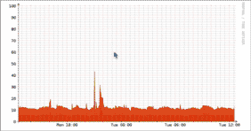

# Configuration Docs

## Configuration location

LibreNMS keeps the configuration in one of two places:

- Database: this configuration applies to all pollers. Set it with
`lnms config:set <setting> <value>` or in the web interface. The
database configuration has preference over `config.php`. It is the
preferred option.

- `config.php`: this configuration applies only to the local poller. A
setting here becomes read-only in the web interface. This behaviour
prevents an unexpected result.

## Configuration format

In the database, LibreNMS uses dot notation for the configuration
items. In `config.php`, LibreNMS uses a PHP array under `$config`. The
example below shows some SNMP configuration in both formats:

=== "Database"
    `snmp.community`

    `snmp.community.+`

    `snmp.v3.0.authalgo`

=== "config.php"
    `$config['snmp']['community']`

    `$config['snmp']['community'][]`

    `$config['snmp']['v3'][0]['authalgo']`

## CLI
`lnms config:get <setting>` returns the current configuration settings.
These settings combine the database, `config.php`, and the defaults.  
`lnms config:set <setting> <value>` sets the configuration setting in the database.
`lnms config:set <setting>` without a value asks you to reset the
setting to its default.

Parameters are:
```
    <setting>   dot notation of config item
                trailing .+ instructs to append <value> to existing value

    <value>     JSON formatted config value
                string, number, true and false are all valid JSON value
```

With bash completion, you can use the tab key to find configuration settings.

!!! note
    Some documentation still shows `config.php` instead of
    `lnms config:set`. The `lnms config:set` command works and is the
    preferred option.

    LibreNMS does not define all configuration settings. You can set an
    undefined setting with the `--ignore-checks` option. Without this
    option, LibreNMS validates the input. With `--ignore-checks`, take
    care with bad values.

    Please report a missing setting.

### Getting a list of all current values

For a complete list of the current values, run `lnms config:get --dump`.
For a more readable output, use the `jq` package:
`lnms config:get --dump | jq`.

Example output:

```bash
lnms config:get --dump | jq 
{
  "install_dir": "/opt/librenms",
  "active_directory": {
    "users_purge": 0
  },
  "addhost_alwayscheckip": false,
  "alert": {
    "ack_until_clear": false,
    "admins": true,
    "default_copy": true,
    "default_if_none": false,
    "default_mail": false,
    "default_only": true,
    "disable": false,
    "fixed-contacts": true,
    "globals": true,
    "syscontact": true,
    "transports": {
      "mail": 5
    },
    "tolerance_window": 5,
    "users": false,
    ...
```

### Examples

These are some examples:

```bash
lnms config:get snmp.community
  [
      "public"
  ]

lnms config:set snmp.community.+ testing

lnms config:get snmp.community
  [
      "public",
      "testing"
  ]


lnms config:set snmp.community.0 private

lnms config:get snmp.community
  [
      "private",
      "testing"
  ]

lnms config:set snmp.community test
  Invalid format

lnms config:set snmp.community '["test", "othercommunity"]'

lnms config:get snmp.community
  [
      "test",
      "othercommunity"
  ]

lnms config:set snmp.community

  Reset snmp.community to the default? (yes/no) [no]:
  > yes


lnms config:get snmp.community
  [
      "public"
  ]
```

Use `| jq -c` to put a multi-line configuration item on a single line. This format helps with the set commands. For example:

```bash
lnms config:get snmp.community | jq -c
["public","testing"]
```

To keep a multi-line item in the format of `lnms config:get`, use this format. It is easier to read:
```bash
lnms config:set snmp.community \
'
[
    "public",
    "testing"
]
'
```

## Pre-load configuration

This feature is mainly for docker images and other automation.
At the first installation of LibreNMS with a new database, you can put
YAML key value files in `database/seeders/config`. These files fill the
configuration database.

Example snmp.yaml:

```yaml
snmp.community:
    - public
    - private
snmp.max_repeaters: 30
```

!!! danger
    The example above uses the correct flat notation. Do **NOT** create a
    block for `snmp` with the subkeys `community` and `max_repeaters`.
    Such a block overwrites the whole `snmp` block and leaves only those
    two subkeys. The configuration keys in your `seeders` file must match
    the keys in `resources/definitions/config_definitions.json`.

## Directories

```bash
lnms config:set temp_dir /tmp
```

LibreNMS creates images and other temporary files in the temporary
directory on your filesystem.

```bash
lnms config:set log_dir /opt/librenms/logs
```

LibreNMS keeps its log files in this directory.

## Database config

Set these variables in the `.env` file or in the environment. The
default location of the file is `/opt/librenms/.env`.

```dotenv
DB_HOST=127.0.0.1
DB_DATABASE=librenms
DB_USERNAME=DBUSER
DB_PASSWORD="DBPASS"
```

To use a non-standard port:

```dotenv
DB_PORT=3306
```

To use a unix socket:

```dotenv
DB_SOCKET=/run/mysqld/mysqld.sock
```

## Core

### PHP Settings

You can change the PHP memory limit in LibreNMS. The value is an
integer in megabytes:

`lnms config:set php_memory_limit 128`

### Programs

Most of these settings need no more information. An extension with its
own documentation page has a link instead of its configuration.

#### RRDTool

You can configure these options in the web interface:

!!! setting "external/binaries"
    ```bash
    lnms config:set rrdtool /usr/bin/rrdtool
    ```

To record data more often, read [1 Minute
polling](1-Minute-Polling.md).

#### fping

!!! setting "external/binaries"
    ```bash
    lnms config:set fping /usr/bin/fping
    lnms config:set fping6 fping6
    ```

!!! setting "poller/ping"
    ```bash
    lnms config:set fping_options.timeout 500
    lnms config:set fping_options.count 3
    lnms config:set fping_options.interval 500
    lnms config:set fping_options.tos 184
    ```

`fping` configuration options:

* `timeout` (the `fping` parameter `-t`): the time in milliseconds that
  fping waits for a response to its first request. **Read the note
  below.**
* `count` (the `fping` parameter `-c`): the number of request packets
  to send to each target.
* `interval` (the `fping` parameter `-p`): the time in milliseconds
  that fping waits between two packets to the same target.
* `tos` (the `fping` parameter `-O`): the type of service flag (TOS).
  The value is in decimal or hexadecimal (0xh) format. Use this flag to
  put the ping packets into a QOS queue in the network. The [TOS
  Wikipedia page](https://en.wikipedia.org/wiki/Type_of_service) holds
  the table of values.

!!! note
    A timeout value that is higher than the interval value makes the
    poller slower. For example:

    timeout: 3000

    count: 3

    interval: 500

    In this example, the timeout value of 3000 overwrites the interval.
    3000 milliseconds is 3 seconds. LibreNMS sends three ICMP packets
    (count: 3), and each packet has a delay of 3 seconds. fping
    therefore needs more than 6 seconds to return a result.

LibreNMS uses an fping ICMP check to decide whether a device is up. You
can disable this check globally or for one device. **Do not disable the
ICMP check without full knowledge of the result. With many devices
down, the poller waits for the SNMP timeouts. The poller can then take
more than 5 minutes.**

To disable the fping ICMP check globally:

!!! setting "poller/ping"
    ```bash
    lnms config:set icmp_check false
    ```

To disable the check for one device, go to
Device -> Edit -> Misc -> Disable ICMP Test and set it to On.

#### SNMP

These settings give the locations of the SNMP programs.

!!! setting "external/binaries"
    ```bash
    lnms config:set snmpwalk /usr/bin/snmpwalk
    lnms config:set snmpget /usr/bin/snmpget
    lnms config:set snmpbulkwalk /usr/bin/snmpbulkwalk
    lnms config:set snmpgetnext /usr/bin/snmpgetnext
    lnms config:set snmptranslate /usr/bin/snmptranslate
    ```

#### Misc binaries
!!! setting "external/binaries"
    ```bash
    lnms config:set whois /usr/bin/whois
    lnms config:set ping /bin/ping
    lnms config:set mtr /usr/bin/mtr
    lnms config:set nmap /usr/bin/nmap
    lnms config:set nagios_plugins /usr/lib/nagios/plugins
    lnms config:set ipmitool /usr/bin/ipmitool
    lnms config:set virsh /usr/bin/virsh
    ```

## Authentication

These are the generic authentication settings.

This setting gives the minimum password length. It applies to the
authentication methods that create users.

!!! setting "auth/general"
    ```bash
    lnms config:set password.min_length 8
    ```

## Proxy support

Alerting and the callback function support an HTTP proxy. Use one of
these settings:

!!! setting "system/proxy"
    ```bash
    lnms config:set callback_proxy proxy.domain.com
    lnms config:set http_proxy proxy.domain.com
    ```

LibreNMS also accepts these environment variables. You can set them in `/etc/environment`:

```bash
http_proxy=proxy.domain.com
https_proxy=proxy.domain.com
```

## RRDCached

Read [RRDCached](../Extensions/RRDCached.md).

## WebUI Settings

!!! setting "system/server"
    ```bash
    lnms config:set base_url http://demo.librenms.org
    ```

LibreNMS tries to detect your URL. This setting overrides the detected value.

!!! setting "webui/style"
    ```bash
    lnms config:set site_style light
    ```

Several styles change the look of the navigation bar. The styles are
`device`, `blue`, `dark`, `light`, and `mono`. The default style is
`light`.

Your own CSS stylesheet can override many visual elements. Put each
custom CSS file into `html/css/custom`. The automatic updates then
ignore these files. You can give any number of CSS files. The browser
loads them in the order of your configuration.

!!! setting "webui/style"
    ```bash
    lnms config:set webui.custom_css.+ css/custom/styles.css
    ```

You can replace the default logo with your own logo. Put each custom
image file into `html/images/custom`. The automatic updates then ignore
these files.

!!! setting "webui/style"
    ```bash
    lnms config:set title_image images/custom/yourlogo.png
    ```

This setting gives the page refresh interval in seconds. The default is
5 minutes. Some pages never refresh, by design.

!!! setting "webui/general"
    ```bash
    lnms config:set page_refresh 300
    ```

To create your own front page, add a blade file in
`resources/views/overview/custom/`. Then set `front_page` to the name
of the file. For example, for the file
`resources/views/overview/custom/foobar.blade.php`, set `front_page` to
`foobar`.

!!! setting "webui/front-page"
```bash
lnms config:set front_page default
```

This setting gives a global default dashboard page. It applies to each
user without a dashboard in their user preferences. Set it to the
`dashboard_id` of an existing dashboard with the state Shared, Shared
(read), or Shared (Admin RW). Without this setting, LibreNMS creates an
empty dashboard with the name `Default` for each user at their first
login.

!!! setting "webui/dashboard"
    ```bash
    lnms config:set webui.default_dashboard_id 0
    ```

This is the default message on the login page.

!!! setting "auth/general"
    ```bash
    lnms config:set login_message "Unauthorised access or use shall render the user liable to criminal and/or civil prosecution."
    ```

With the value true, the login page shows an overview of the devices and their status.

!!! setting "auth/general"
    ```bash
    lnms config:set public_status true
    ```

These settings enable and disable menus in the web interface.

!!! setting "webui/menu"
    ```bash
    lnms config:set show_locations true  # Enable Locations on menu
    lnms config:set show_locations_dropdown true  # Enable Locations dropdown on menu
    lnms config:set show_services false  # Disable Services on menu
    lnms config:set int_customers true  # Enable Customer Port Parsing
    lnms config:set int_transit true  # Enable Transit Types
    lnms config:set int_peering true  # Enable Peering Types
    lnms config:set int_core true  # Enable Core Port Types
    lnms config:set int_l2tp false  # Disable L2TP Port Types
    ```

!!! setting "webui/dashboard"
    ```bash
    lnms config:set summary_errors false  # Show Errored ports in summary boxes on the dashboard
    ```

!!! setting "webui/port-descr"
    ```bash
    lnms config:set customers_descr '["cust"]'  # The description to look for in ifDescr. Can have multiple '["cust","cid"]'
    lnms config:set transit_descr '["transit"]'  # Add custom transit descriptions (array)
    lnms config:set peering_descr '["peering"]'  # Add custom peering descriptions (array)
    lnms config:set core_descr '["core"]'  # Add custom core descriptions  (array)
    lnms config:set custom_descr '["This is Custom"]'  # Add custom interface descriptions (array)
    ```

You can change the number and the time frames of the quick select
options for graphs. You can also change the mini graphs in each row.

Quick select:

```bash
lnms config:set graphs.mini.normal '{
    "day": "24 Hours",
    "week": "One Week",
    "month": "One Month",
    "year": "One Year"
}'

lnms config:set graphs.mini.widescreen '{
    "sixhour": "6 Hours",
    "day": "24 Hours",
    "twoday": "48 Hours",
    "week": "One Week",
    "twoweek": "Two Weeks",
    "month": "One Month",
    "twomonth": "Two Months",
    "year": "One Year",
    "twoyear": "Two Years"
}'
```

Mini graphs:

```bash
lnms config:set graphs.row.normal '{
    "sixhour": "6 Hours",
    "day": "24 Hours",
    "twoday": "48 Hours",
    "week": "One Week",
    "twoweek": "Two Weeks",
    "month": "One Month",
    "twomonth": "Two Months",
    "year": "One Year",
    "twoyear": "Two Years"
}'
```

The value false disables the mouseover popover for the mini graphs.

!!! setting "webui/general"
    ```bash
    lnms config:set web_mouseover true
    ```

The value false disables the lazy load of images.

!!! setting "webui/general"
    ```bash
    lnms config:set enable_lazy_load true
    ```

This setting enables and disables the sysDescr output of a device.

!!! setting "webui/general"
    ```bash
    lnms config:set overview_show_sysDescr true
    ```

This template controls the default display of the device names. To
override this setting for one device, edit the device in the web
interface.

You can enter free text with one or more of these template
replacements:

| Template                    | Replacement                                                          |
|-----------------------------|----------------------------------------------------------------------|
| `{{ $hostname }}`           | The hostname or IP address of the device at the time you added it. This is the default. |
| `{{ $sysName_fallback }}`   | The hostname. If the hostname is an IP address, the sysName.         |
| `{{ $sysName }}`            | The SNMP sysName of the device. If the sysName is absent, the hostname or the IP address. |
| `{{ $ip }}`                 | The polled IP address of the device. It never shows a hostname.      |

For example, `{{ $sysName_fallback }} ({{ $ip }})` shows
`server (192.168.1.1)`.

!!! setting "webui/device"
    ```bash
    lnms config:set device_display_default '{{ $hostname }}'
    ```

This setting lists the interface types that the graphs in the web
interface do not show. The default array holds more items. For the full
list, read `resources/definitions/config_definitions.json`.

!!! setting "webui/graph"
    ```bash
    lnms config:set device_traffic_iftype.+ '/loopback/'
    ```

An administrator can clear the last discovery time of a device. This
action forces a full discovery run in the configured time window.

!!! setting "webui/device"
    ```bash
    lnms config:set enable_clear_discovery true
    ```

Show the `X`th percentile in the graph instead of the default 95th percentile.

!!! setting "webui/graph"
    ```bash
    lnms config:set percentile_value 90
    ```

This setting gives the target maximum hostname length for the
`shorthost()` function. Increase the value to show more of the hostname
in a graph title. The default value is 12. A very long value can break
the graph generation.

!!! setting "webui/graph"
    ```bash
    lnms config:set shorthost_target_length 15
    ```

Dynamic graphs let you zoom in, zoom out, and scroll through the
timeline of a graph.

!!! setting "webui/graph"
    ```bash
    lnms config:set webui.dynamic_graphs true
    ```

You can then move and scale a graph without a page reload:


## Availability Thresholds

These thresholds set the ok, warning, and error states on several
screens. One example is the 90 day availability widget of a device.

- **Green**: availability >= availablity.threshold_ok (default: 99.9%)
- **Orange**: availability >= availablity.threshold_warning (default: 95%)
- **Red**: availability < availablity.threshold_warning

!!! setting "webui/device"
    ```bash
    lnms config:set availablity.threshold_ok 99.99
    lnms config:set availablity.threshold_warning 95
    ```

## Stacked Graphs

You can enable stacked graphs in place of the default inverted graphs.

!!! setting "webui/graph"
    ```bash
    lnms config:set webui.graph_stacked true
    ```

## Add host settings

This setting controls how LibreNMS adds hosts. For a host with an IP
address, LibreNMS tests whether the IP address is already present. If
the IP address is present, LibreNMS does not add the host. For a host
with a hostname, LibreNMS does not do this test. With the value true,
LibreNMS resolves the hostname and does the test. This behaviour
prevents accidental duplicate hosts.

!!! setting "discovery/general"
    ```bash
    lnms config:set addhost_alwayscheckip false # true - check for duplicate ips even when adding host by name.
                                                # false- only check when adding host by ip.
    ```

By default, LibreNMS accepts hosts with a duplicate sysName. This
setting disables that behaviour:

!!! setting "discovery/general"
```bash
lnms config:set allow_duplicate_sysName false
```

## Global poller and discovery modules

These settings enable and disable the discovery modules and the poller
modules.

The settings have an order of precedence. A device setting overrides an
OS setting. An OS setting overrides a global setting. The order is
device, then OS, then global.

A setting at a more specific level therefore overrides a setting at a
less specific level.

Global:

!!! setting "discovery/discovery_modules"
    ```bash
    lnms config:set discovery_modules.arp-table false
    lnms config:set discovery_modules.entity-state true
    ```

!!! setting "poller/poller_modules"
    ```bash
    lnms config:set poller_modules.entity-state true
    ```

Per OS:

```bash
lnms config:set os.ios.discovery_modules.arp-table false
lnms config:set os.ios.discovery_modules.entity-state true

lnms config:set os.ios.poller_modules.entity-state true
```

## SNMP Settings

These are the default SNMP options. They hold the retry setting, the
timeout setting, the default version, and the default port.

!!! setting "poller/snmp"
    ```bash
    lnms config:set snmp.timeout 1                         # timeout in seconds
    lnms config:set snmp.retries 5                         # how many times to retry the query
    lnms config:set snmp.transports '["udp", "udp6", "tcp", "tcp6"]'    # Transports to use
    lnms config:set snmp.version '["v2c", "v3", "v1"]'       # Default versions to use
    lnms config:set snmp.port 161                          # Default port
    lnms config:set snmp.exec_timeout 1200                 # execution time limit in seconds
    ```

> NOTE: `timeout` is the time to wait for an answer. `exec_timeout` is
> the maximum time for a query.

This is the default SNMP community for v1 and v2c. You can add more
entries to this array with `[1]`, `[2]`, and `[3]`.

!!! setting "poller/snmp"
    ```bash
    lnms config:set snmp.community.0 public
    ```

!!! note
    Auto discovery uses this list of SNMP communities, when it is
    enabled. The list is also the default set for a manually added
    device.

These are the default SNMP v3 details. You can add more entries to this
array with `[1]`, `[2]`, and `[3]`.

!!! setting "poller/snmp"
    ```bash
    lnms config:set snmp.v3.0 '{
        authlevel: "noAuthNoPriv",
        authname: "root",
        authpass: "",
        authalgo: "MD5",
        cryptopass: "",
        cryptoalgo: "AES"
    }'
    ```

```
authlevel   noAuthNoPriv | authNoPriv | authPriv
authname    User Name (required even for noAuthNoPriv)
authpass    Auth Passphrase
authalgo    MD5 | SHA | SHA-224 | SHA-256 | SHA-384 | SHA-512
cryptopass  Privacy (Encryption) Passphrase
cryptoalgo  AES | AES-192 | AES-256 | AES-256-C | DES
```

## MTU Settings

LibreNMS can test for MTU problems. The test works only on devices with
pings enabled. The setting below enables the MTU check:

!!! setting "poller/mtu"
    ```bash
    lnms config:set mtu_options.bytes 1500
    ```

To disable the MTU test, set the packet size to null (the default).

The MTU check does not test whether the packets cross the network
without fragmentation. It tests two-way communication. The packets can
still need fragmentation at any point on the path.

## Auto discovery settings

Read [Auto-Discovery](../Extensions/Auto-Discovery.md).


## SSL Certificates

!!! note
    This feature is disabled by default.

LibreNMS can discover and monitor the SSL and TLS certificates of your
devices, for example HTTPS on port 443. You can then track the expiry
dates and get an alert before a certificate expires.

**Using the feature:** in the web interface, open Overview -> Tools ->
SSL Certificates. On this page you can see the discovered certificates,
add an entry with a host and a port, pause or enable the monitoring of
a certificate, and remove an entry. The alert rule **Expiring SSL
Certificates** alerts you 14 days before a certificate expires.

**Behaviour:**

- **Discovery:** the scheduled maintenance job `lnms maintenance:discover-ssl-certificates` runs each day. It connects to each active device on port 443 (HTTPS). If the device presents a certificate, LibreNMS stores or updates it. You can also run the discovery manually for all devices or for one device.
- **Refresh:** the scheduled job `lnms maintenance:refresh-ssl-certificates` runs each day. It reads the existing certificates again and updates the expiry date and the other details. You can refresh all enabled certificates, or one certificate by its ID.

**Configuration options:** set these options in the web interface or on the command line with `lnms config:set`.

| Option | Type | Default | Description |
|--------|------|---------|-------------|
| `ssl_certificates.auto_discover` | boolean | `false` | With the value `true`, the scheduled SSL discovery job runs each day. Set it to `false` to disable the automatic discovery, for example when you add all certificates manually. |
| `ssl_certificates.skip_hosts` | array (strings) | `[]` | A list of the hostnames and IP addresses to skip in the discovery and in the refresh. The match ignores the case. Use this list to exclude the hosts without SSL. Examples are a load balancer with a different certificate, and a host that blocks or rate-limits connections. |

!!! setting "system/ssl-certificates"
    ```bash
    # Enable automatic SSL discovery
    lnms config:set ssl_certificates.auto_discover true

    # Skip discovery and refresh for specific hosts (add one per line)
    lnms config:set ssl_certificates.skip_hosts.+ internal-lb.example.com
    lnms config:set ssl_certificates.skip_hosts.+ 192.168.1.1
    ```

To set the whole array at once:

!!! setting "system/ssl-certificates"
    ```bash
    lnms config:set ssl_certificates.skip_hosts '["host1.example.com", "host2.example.com"]'
    ```

## Email configuration

!!! setting "alerting/email"
    ```bash
    lnms config:set email_backend mail
    lnms config:set email_from librenms@yourdomain.local
    lnms config:set email_user `lnms config:get project_id`
    lnms config:set email_sendmail_path /usr/sbin/sendmail
    lnms config:set email_smtp_host localhost
    lnms config:set email_smtp_port 25
    lnms config:set email_smtp_timeout 10
    lnms config:set email_smtp_secure tls
    lnms config:set email_smtp_auth false
    lnms config:set email_smtp_username NULL
    lnms config:set email_smtp_password NULL
    ```

`email_backend` sets the mail transport for the delivery of emails. The
valid values are `mail`, `sendmail`, and `smtp`. The other options
support these different transports.

For security, a TLS connection to the SMTP server validates the
certificate. To disable this validation, use the option
`email_smtp_verifypeer`, which is true by default. You can also use
`email_smtp_allowselfsigned`, which is false by default.

!!! setting "alerting/email"
    ```bash
        lnms config:set email_smtp_verifypeer false
        lnms config:set email_smtp_allowselfsigned true
    ```

## Alerting

Read [Alerting](../Alerting/index.md).

## Billing

Read [Billing](../Extensions/Billing-Module.md).

## Global module support

!!! setting "webui/menu"
    ```bash
    lnms config:set enable_syslog false # Enable Syslog
    lnms config:set enable_inventory true # Enable Inventory
    lnms config:set enable_pseudowires true # Enable Pseudowires
    ```

```bash
lnms config:set enable_vrfs true # Enable VRFs
```

## Port extensions

Read [Port-Description-Parser](../Extensions/Interface-Description-Parsing.md).

These settings enable and disable the additional port statistics.

```bash
lnms config:set enable_ports_etherlike false
lnms config:set enable_ports_junoseatmvp false
lnms config:set enable_ports_poe false
```

## Port Group

LibreNMS puts each newly discovered port into the port group with this
port group ID. The value 0 means no port group.

!!! setting "discovery/ports"
    ```bash
    lnms config:set default_port_group 0
    ```

## External integration

### Rancid

`rancid_configs` is an array with the locations of your rancid files.
`rancid_ignorecomments` hides the lines that start with `#`.

!!! setting "external/rancid"
    ```bash
    lnms config:set rancid_configs.+ /var/lib/rancid/network/configs/
    lnms config:set rancid_repo_type svn
    lnms config:set rancid_ignorecomments false
    ```

A bare Git rancid repository must be in a directory with a name that
ends in `.git`. Add the path to the rancid files in Git to the end of
the repository path:

!!! setting "external/rancid"
    ```bash
    lnms config:set rancid_configs.+ /var/lib/rancid/git/rancid.git/configs/
    lnms config:set rancid_repo_type git-bare
    lnms config:set rancid_repo_url /rancid
    lnms config:set rancid_ignorecomments false
    ```

Set the parameter `rancid_repo_url` to the URL of GitWeb or of a
similar tool. This tool shows the content of the bare Git repository.

### Oxidized

Read [Oxidized](../Extensions/Oxidized.md).

### CollectD

This setting gives the location of the collectd rrd files. The location
in LibreNMS must match the location in `/etc/collectd.conf` and in
`/etc/collectd.d/rrdtool.conf`.

!!! setting "external/collectd"
    ```bash
    lnms config:set collectd_dir /var/lib/collectd/rrd
    ```

`/etc/collectd.conf`
```bash
<Plugin rrdtool>
        DataDir "/var/lib/collectd/rrd"
        CreateFilesAsync false
        CacheTimeout 120
        CacheFlush   900
        WritesPerSecond 50
</Plugin>
```

`/etc/collectd.d/rrdtool.conf`
```bash
LoadPlugin rrdtool
<Plugin rrdtool>
       DataDir "/var/lib/collectd/rrd"
       CacheTimeout 120
       CacheFlush   900
</Plugin>
```

This setting gives the location of the collectd unix socket. With a
socket, collectd writes the graph data to the disk before LibreNMS
draws the graph. Your web server needs write permission on this socket.

!!! setting "external/collectd"
    ```bash
    lnms config:set collectd_sock unix:///var/run/collectd.sock
    ```

### Smokeping

Read [Smokeping](../Extensions/Smokeping.md).

### NFSen

Read [NFSen](../Extensions/NFSen.md).

### Location parsing

LibreNMS can read the sysLocation information. It then maps the device
location from geocoordinates or from geocoding information.

- Info keywords
  - `[]` holds optional latitude and longitude information for manual geocoordinate positioning.
  - `()` holds optional information. A geocoding lookup ignores this information.


#### GeoCoordinates

If the sysLocation of the device holds `[lat, lng]`, LibreNMS uses
these values as the geocoordinates. Note the comma and the square
brackets.

Example:
```bash
name_that_can_not_be_looked_up [40.424521, -86.912755]
```

The latitude is then 40.424521 and the longitude is -86.912755.

#### GeoCoding

LibreNMS then looks up the sysLocation with a map engine. You must
configure an engine under `lnms config:get geoloc.engine`. The
information must be accurate, or the lookup returns no result. The
lookup ignores the information in parentheses. You can therefore add
details that break a lookup.

Example:
```bash
1100 Congress Ave, Austin, TX 78701 (3rd floor)
Geocoding lookup is:
1100 Congress Ave, Austin, TX 78701
```

#### Overrides

1. To override the sysLocation of a device, open "Device settings" for that device in the web interface.
2. To set the coordinates of a location, go to Device > Geo Locations > All Locations in the web interface.

### Location mapping

To set the GPS coordinates of a location, go to Devices > Geo Locations
> All Locations. Then edit the coordinates.

You can also replace the sysLocation value of one device or of many
devices.

For example, 100 devices have the sysLocation value `Under the Sink`.
This value is not the real address. A mapping overrides the sysLocation
value of all these devices. You do not need to edit each device.

Exact Matching:

`Under the Sink` becomes `Under The Sink, The Office, London, UK`.

!!! setting "webui/device"
    ```bash
    lnms config:set location_map '{"Under the Sink": "Under The Sink, The Office, London, UK"}'
    ```

Regex Matching:

`Not Under the Sink` becomes `Not Under The Sink, The Office, London, UK`.

!!! setting "webui/device"
    ```bash
    lnms config:set location_map_regex '{"/Sink/": "Not Under The Sink, The Office, London, UK"}'
    ```

Regex Match Substitution:

`Rack10,Rm-314,Sink` becomes `Rack10,Rm-314,Under The Sink, The Office, London, UK [lat, lng]`.

!!! setting "webui/device"
    ```bash
    lnms config:set location_map_regex_sub '{"/Sink/": "Under The Sink, The Office, London, UK [lat, long]"}'
    ```

These examples rewrite the SNMP location of a device. You therefore do
not need the full location in SNMP.

## Interfaces to be ignored

Discovery can ignore an interface automatically. There are three
methods. You can change a configuration option, you can unset a default
option and set your own value, or you can create an OS specific option.
The OS specific option is the preferred method. The default options are
in `resources/definitions/config_definitions.json`. The default OS
specific definitions are in
`resources/definitions/os_detection/\_specific_os_.yaml`. These files
can hold bad_if\* options. Change them only with a pull request,
because a local change to a definition file blocks the updates.

Examples:

#### Add entries to default option

!!! setting "discovery/ports"
    ```bash
    lnms config:set bad_if.+ voip-null
    lnms config:set bad_iftype.+ voiceEncap
    lnms config:set bad_if_regexp.+ '/^lo[0-9].*/'    # loopback
    ```

#### Override default bad_if values

!!! setting "discovery/ports"
    ```bash
    lnms config:set bad_if '["voip-null", "voiceEncap", "voiceFXO"]'
    ```

#### Create an OS specific array

!!! setting "discovery/ports"
    ```bash
    lnms config:set os.iosxe.bad_iftype.+ macSecControlledIF
    lnms config:set os.iosxe.bad_iftype.+ macSecUncontrolledIF
    ```

#### Various bad_if\* selection options available

`bad_if` matches the ifDescr value.

`bad_iftype` matches the ifType value.

`bad_if_regexp` matches the ifDescr value as a regular expression.

`bad_ifname_regexp` matches the ifName value as a regular expression.

`bad_ifalias_regexp` matches the ifAlias value as a regular expression.

## Interfaces that must not be ignored

You can also add a port to an allow list. LibreNMS then does not ignore
that port. You can configure `good_if` globally and for one OS, in the
same way as `bad_if`.

For example, `bad_if_regexp` ignores the `Ethernet` ports. You want the
`FastEthernet` ports but no other Ethernet ports. Add a `good_if`
option for `FastEthernet`:

!!! setting "discovery/ports"
    ```bash
    lnms config:set good_if.+ FastEthernet
    lnms config:set os.ios.good_if.+ FastEthernet
    ```

`good_if` matches the ifDescr value. A value in `good_if` can also be
in `bad_if`. LibreNMS then does not ignore that port. For example,
`bad_if` and `good_if` both hold `FastEthernet`. The ports with this
ifDescr value are then valid.

## Interfaces to be rewritten

These options rewrite an interface label automatically.

`rewrite_if` replaces the whole label. `rewrite_if_regexp` replaces
only the matched text. The match ignores the case.

!!! setting "discovery/ports"
    ```bash
    lnms config:set rewrite_if '{"cpu": "Management Interface"}'
    lnms config:set rewrite_if_regexp '{"/cpu /": "Management "}'
    ```

## VLANs to ignore

Some devices report VLANs that are not relevant or that the system
reserves. This setting ignores specific VLAN IDs for one OS.

For example, Cisco IOS reports these VLANs, and you want to ignore
them:

```text
VLAN 1002 (fddi-default)
VLAN 1003 (token-ring-default)
VLAN 1004 (fddinet-default)
VLAN 1005 (trnet-default)
```

!!! setting "discovery/vlans"
    ```bash
    lnms config:set os.ios.ignore_vlans '[1002, 1003, 1004, 1005]'
    ```

## Entity sensors to be ignored

Some devices return bad sensors over SNMP. These sensors do not exist
or return no data. This setting ignores such a sensor by its `descr`
field in the database. You can ignore a sensor globally or for one OS.
We recommend the OS method.

For example, some sensors have these descriptions:

```text
Physical id 1
Physical id 2
...
Physical id 4
```

!!! setting "discovery/sensors"
    ```bash
    lnms config:set bad_entity_sensor_regex.+ '/Physical id [0-9]+/'
    lnms config:set os.ios.bad_entity_sensor_regex '["/Physical id [0-9]+/"]'
    ```

## Entity sensors limit values

A vendor can supply limit values, also called thresholds, for the
discovered sensors. By default, LibreNMS estimates the high limit and
the low limit when the vendor gives no value or when LibreNMS has no
support for the limits. The estimate uses the value from the first
discovery.

To have no high limit and no low limit without a vendor value, disable
the estimate:

!!! settings "discovery/sensors"
    ```bash
    lnms config:set sensors.guess_limits false
    ```

## Ignoring Health Sensors

The configuration can filter out some sensors:

### Ignore all temperature sensors

!!! settings "discovery/sensors"
    ```bash
    lnms config:set disabled_sensors.temperature true
    ```

### Filter all sensors matching regexp ```'/PEM Iout/'```.

!!! settings "discovery/sensors"
    ```bash
    lnms config:set disabled_sensors_regex.+ '/PEM Iout/'
    ```

### Filter all 'current' sensors for Operating System 'vrp'.

```bash
lnms config:set os.vrp.disabled_sensors.current true
```

### Filter all sensors matching regexp ```'/PEM Iout/'``` for Operating System iosxe.

```bash
lnms config:set os.iosxe.disabled_sensors_regex '/PEM Iout/'
```

## Processor configuration

This setting gives your own warning percentage for a processor.
LibreNMS applies the value at the discovery of the processor
information.

!!! setting "discovery/processor"
    ```bash
    lnms config:set processor.default_perc_warn 75
    ```

## Storage configuration

These settings list the storage and the mount points to ignore in
discovery and in polling.

!!! setting "discovery/storage"
    ```bash
    lnms config:set ignore_mount_removable true
    lnms config:set ignore_mount_network true
    lnms config:set ignore_mount_optical true

    lnms config:set ignore_mount.+ /kern
    lnms config:set ignore_mount.+ /mnt/cdrom
    lnms config:set ignore_mount.+ /proc
    lnms config:set ignore_mount.+ /dev

    lnms config:set ignore_mount_string.+ packages
    lnms config:set ignore_mount_string.+ devfs
    lnms config:set ignore_mount_string.+ procfs
    lnms config:set ignore_mount_string.+ UMA
    lnms config:set ignore_mount_string.+ MALLOC

    lnms config:set ignore_mount_regexp.+ '/on: \/packages/'
    lnms config:set ignore_mount_regexp.+ '/on: \/dev/'
    lnms config:set ignore_mount_regexp.+ '/on: \/proc/'
    lnms config:set ignore_mount_regexp.+ '/on: \/junos^/'
    lnms config:set ignore_mount_regexp.+ '/on: \/junos\/dev/'
    lnms config:set ignore_mount_regexp.+ '/on: \/jail\/dev/'
    lnms config:set ignore_mount_regexp.+ '/^(dev|proc)fs/'
    lnms config:set ignore_mount_regexp.+ '/^\/dev\/md0/'
    lnms config:set ignore_mount_regexp.+ '/^\/var\/dhcpd\/dev,/'
    lnms config:set ignore_mount_regexp.+ '/UMA/'
    ```

This setting gives your own warning percentage for storage. LibreNMS
applies the value at the discovery of the storage information.

!!! setting "discovery/storage"
    ```bash
    lnms config:set storage_perc_warn 60
    ```

## Averaging Factor

LibreNMS keeps average values in the database for some metrics. These
averages make an alert on a change possible. For example, the ping time
can increase above the average. The average must move slowly after a
change in the recorded values, so that there is time for an alert. The
alerts must also stop when the new value becomes the normal value.

Change the configuration variable below when the average values change
too quickly or too slowly. A larger value, closer to 1, makes the
averages change faster. A smaller value, closer to 0, makes the
averages change slower.

```bash
lnms config:set device_stats_avg_factor 0.05
```

The device statistics use an exponential weighted moving average
function. This function updates the average without a store of many
values. For more information, read about this function.

## IRC Bot

Read [IRC Bot](../Extensions/IRC-Bot.md).

## Authentication

Read [Authentication](../Extensions/Authentication.md).

## Cleanup options

Read [Cleanup Options](../Support/Cleanup-options.md).

## Syslog options

Read [Syslog](../Extensions/Syslog.md).

## Virtualization

This setting enables libvirt support. `libvirt_protocols` gives the
connection method for libvirt. You must also do these steps:

1. Generate an ssh key without a password for LibreNMS. Use the user
    that runs the polling and the discovery, usually `librenms`.
2. On each VM host to monitor:
   1. Configure public key authentication from your LibreNMS server or
      poller. Add the librenms public key to
      `~root/.ssh/authorized_keys`.
   2. For xen+ssh only, let libvirtd collect data from xend. Set
      `(xend-unix-server yes)` in `/etc/xen/xend-config.sxp`. Then
      restart xend and libvirtd.

To test your setup, become the librenms polling user. Then run
`virsh -c qemu+ssh://vmhost/system list` or
`virsh -c xen+ssh://vmhost list`.

!!! setting "external/virtualization"
    ```bash
    lnms config:set enable_libvirt true
    lnms config:set libvirt_protocols '["qemu+ssh","xen+ssh"]'
    lnms config:set libvirt_username root
    ```

## BGP Support

This configuration option rewrites the description of a discovered AS.

!!! setting "discovery/general"
    ```bash
    lnms config:set astext.65332 "Cymru FullBogon Feed"
    ```

## Auto updates

Read [Updating](../General/Updating.md).

## IPMI

This setting gives the IPMI protocols to test on a host, and their
order. Also install ipmitool on the monitoring host.

!!! setting "discovery/ipmi"
    ```bash
    lnms config:set ipmi.type '["lanplus", "lan", "imb", "open"]'
    ```

## Distributed poller settings

Read [Distributed Poller](../Extensions/Distributed-Poller.md).

## API Settings

## CORS Support

<https://developer.mozilla.org/en-US/docs/Web/HTTP/Access_control_CORS>

By default, the API has no CORS support. The standard options are
below. You can configure each option.

!!! setting "api/cors"
    ```bash
    lnms config:set api.cors.enabled false
    lnms config:set api.cors.origin '["*"]'
    lnms config:set api.cors.maxage '86400'
    lnms config:set api.cors.allowmethods '["POST", "GET", "PUT", "DELETE", "PATCH"]'
    lnms config:set api.cors.allowheaders '["Origin", "X-Requested-With", "Content-Type", "Accept", "X-Auth-Token"]'
    lnms config:set api.cors.exposeheaders '["Cache-Control", "Content-Language", "Content-Type", "Expires", "Last-Modified", "Pragma"]'
    lnms config:set api.cors.allowmethods '["POST", "GET", "PUT", "DELETE", "PATCH"]'
    lnms config:set api.cors.allowheaders '["Origin", "X-Requested-With", "Content-Type", "Accept", "X-Auth-Token"]'
    lnms config:set api.cors.exposeheaders '["Cache-Control", "Content-Language", "Content-Type", "Expires", "Last-Modified", "Pragma"]'
    lnms config:set api.cors.allowcredentials false
    ```
