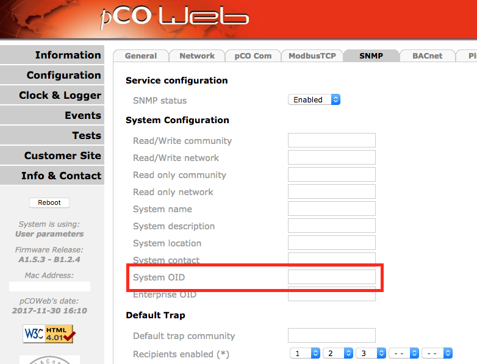

# Carel pCOweb Devices

The pCOWeb card connects the pCO system to networks with HVAC
protocols on the Ethernet physical standard, such as SNMP. The
implementation of the card comes from the final manufacturer of the
HVAC equipment, not from a Carel standard. HVAC means heating,
ventilation, and air conditioning. Each pCOweb card therefore has a
different configuration and needs a different MIB.

By default, LibreNMS discovers this card as pCOweb and not as the real
manufacturer. A solution for this problem exists. The solution is
independent of LibreNMS. You must first configure your pCOWeb card in
its admin interface.

## Accessing the pCOWeb card

Log on to the configuration page of the pCOWeb card. The pCOWeb
interface is not always at the IP address itself. It is often in a
subdirectory. If the configuration page does not open, try
`<ip address>/config`. The default username and password is
`admin/fadmin`. A modern browser asks for these credentials 2 or 3
times.

## Configuring the pCOweb card SNMP for LibreNMS

First configure your SNMP card in the admin interface. The SNMP tab in
the configuration menu holds a System OID field and an Enterprise OID
field. From these two values we defined a standard for all Carel
products in LibreNMS.

The base Carel OID is 1.3.6.1.4.1.9839. Add the Enterprise OID of the
final manufacturer to this OID. The [IANA enterprise numbers
list](https://www.iana.org/assignments/enterprise-numbers/enterprise-numbers)
holds all enterprise OIDs. This value gives specific support for the
device. LibreNMS uses the value to detect the HVAC device behind the
pCOWeb card.

Example for the Rittal IT Chiller that uses a pCOweb card:

1. Base Carel OID : **1.3.6.1.4.1.9839**
1. Rittal (the manufacturer) base enterprise OID : **2606**
1. Adding value to identify this device in LibreNMS : **1**
1. Complete System OID for a Rittal Chiller using a Carel pCOweb card: **1.3.6.1.4.1.9839.2606.1**
1. Use **9839** as Enterprise OID

The pCOWeb card presents itself as another device. It puts the
enterprise OID in the position of the vendor id in the OID.

The table below gives the values for the supported devices.

## Supported devices

LibreNMS supports the devices in this table. Configure your pCOweb card
with the System OID and the Enterprise OID from the table:

| Manufacturer  | Description   | System OID                    | Enterprise OID    |
|-------------- |-------------  |----------------------------   |----------------   |
| Rittal        | IT Chiller    | 1.3.6.1.4.1.9839.2606.1       | 9839              |
| Rittal        | LCP DX 3311   | 1.3.6.1.4.1.9839.2606.3311    | 9839.2606         |

## Unsupported devices
Build the correct System OID for your SNMP card. Then start a [new OS
implementation](../../Developing/Support-New-OS.md). Use this new OID
as the sysObjectID in the YAML definition file.
