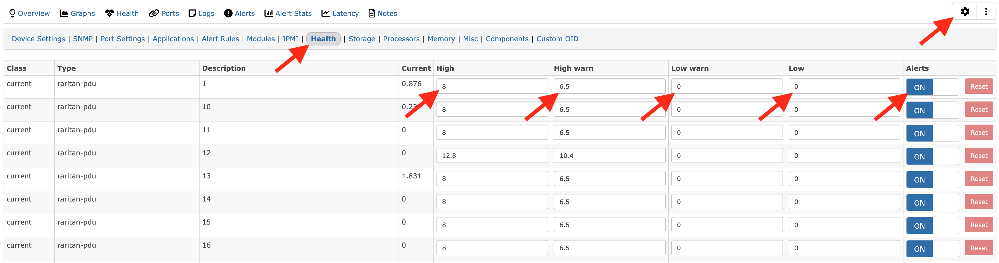
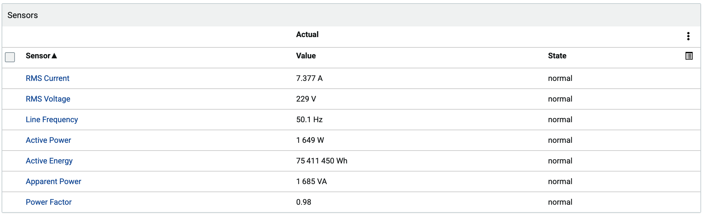
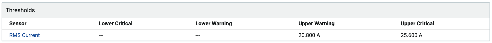
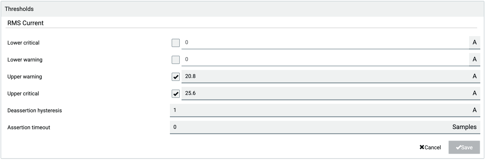

## Sensor Thresholds
The default settings for thresholds for a lot of sensors are not very well chosen - adding a Raritan device will cause a lot of threshold alarms unless you have configured these on the device.

If you don't care about threshold data, these can simply be turned off in the device settings - highlighted below. You can also set sensible thresholds yourself.

Unfortunately Raritan use a threshold of 0 to mean both 'the low value for this sensor is 0' and 'no threshold is configured' so it's impossible for us to filter out these bad values.

Alternatively (and this is the best course of action, you can configure the thresholds on the devices themselves, and LibreNMS will detect them automatically.

You can do this with in bulk with either the JSON-RPC API, or RedFish.
* https://pypi.org/project/raritan/4.3.0.51180/
* https://www.raritan.com/support/product/pdu-g2

For a small number of devices (or with sufficient patience) you can configure the thresholds on the device via the GUI - though the setting is buried.

The process for an outlet is identical to the process for an inlet

Hysteresis and deassert are advanced settings - you do not need to change these unless you know what you are doing.

For an inlet:
* click 'Inlets' on the left side
* click one of the sensor types as shown below

* click on the available thresholds for that sensor

* you can now edit the thresholds - note that the 'disabled' thresholds are set to zero, so you must enable and change these

For an outlet:
* click 'Outlets' on the left side
* select the outlet you wish to configure
* click one of the sensor types as shown below

* click on the available thresholds for that sensor

* you can now edit the thresholds - note that the 'disabled' thresholds are set to zero, so you must enable and change these

## Migrating RRD data from older revisions of LibreNMS
Older revisions of LibreNMS name the RRD files differently, as they did not use the modern YAML polling style. If you want to preserve the data, immediately before the upgrade you should rename the RRD files or use one of the RRD conversion utilities (_rrddump_/_rrdrestore_) to migrate the data.

The old and new patterns are below - while the obvious change is the inclusion of the OID used, the less obvious change is the index.

In the old naming, for inlets the index is just the PDU ID (normally 1, unless you are daisy chaining PDU's for management) followed by the outlet or inlet ID.
For outlets, the index is just the outlet ID.

In the new naming, the indexes are structured the same for both inlets and outlet - PDU ID, followed by outlet or inlet ID, followed by sensor type index.

The sensor type indexes can be found in the MIB, but are below for convenience.

### Old to New RRD Naming Examples

**Old** - the original RRD name 
**New** - the updated RRD name generated by YAML discovery

#### **Current (inlet)**
**Old** sensor-current-raritan-1.1.rrd 
**New** sensor-current-raritan-pdu-measurementsInletSensorValue.1.1.1.rrd

#### **Current (outlet)**
**Old** sensor-current-raritan-9.rrd 
**New** sensor-current-raritan-pdu-measurementsOutletSensorValue.1.9.1.rrd

#### **Power (inlet)**
**Old** sensor-power-raritan-1.1.rrd 
**New** sensor-power-raritan-pdu-measurementsInletSensorValue.1.1.5.rrd

#### **Power (outlet)**
**Old** sensor-power-raritan-7.rrd 
**New** sensor-power-raritan-pdu-measurementsOutletSensorValue.1.7.5.rrd

#### **Voltage (inlet)**
**Old** sensor-voltage-raritan-1.1.rrd 
**New** sensor-voltage-raritan-pdu-measurementsOutletSensorValue.1.9.4.rrd

#### **Temperature**
**Old** sensor-temperature-raritan-pdu-1.8.rrd 
**New** sensor-temperature-raritan-pdu-measurementsExternalSensorValue.1.8.rrd

#### **Frequency (inlet)**
**Old** sensor-frequency-raritan-1.1.rrd 
**New** sensor-frequency-raritan-pdu-measurementsInletSensorValue.1.1.23.rrd

## Known Sensor Types

'supported' means that support for polling that sensor type has been added to the YAML. Any of the below sensor types should be supportable by LibreNMS, however test data is not currently available for 

| Sensor Type                | Supported | Index |
|----------------------------|-----------|-------|
| rmsCurrent                 | **Yes**   | 1     |
| peakCurrent                | No        | 2     |
| unbalancedCurrent          | No        | 3     |
| rmsVoltage                 | **Yes**   | 4     |
| activePower                | **Yes**   | 5     |
| apparentPower              | No        | 6     |
| powerFactor                | **Yes**   | 7     |
| activeEnergy               | No        | 8     |
| apparentEnergy             | No        | 9     |
| temperature                | **Yes**   | 10    |
| humidity                   | **Yes**   | 11    |
| airFlow                    | No        | 12    |
| airPressure                | No        | 13    |
| onOff                      | **Yes**   | 14    |
| trip                       | No        | 15    |
| vibration                  | No        | 16    |
| waterDetection             | No        | 17    |
| smokeDetection             | No        | 18    |
| binary                     | No        | 19    |
| contact                    | No        | 20    |
| fanSpeed                   | No        | 21    |
| surgeProtectorStatus       | No        | 22    |
| frequency                  | **Yes**   | 23    |
| phaseAngle                 | No        | 24    |
| rmsVoltageLN               | No        | 25    |
| residualCurrent            | No        | 26    |
| rcmState                   | No        | 27    |
| absoluteHumidity           | No        | 28    |
| reactivePower              | No        | 29    |
| other                      | No        | 30    |
| none                       | No        | 31    |
| powerQuality               | No        | 32    |
| overloadStatus             | No        | 33    |
| overheatStatus             | No        | 34    |
| displacementPowerFactor    | No        | 35    |
| residualDcCurrent          | No        | 36    |
| fanStatus                  | No        | 37    |
| inletPhaseSyncAngle        | No        | 38    |
| inletPhaseSync             | No        | 39    |
| operatingState             | No        | 40    |
| activeInlet                | No        | 41    |
| illuminance                | No        | 42    |
| doorContact                | **Yes**   | 43    |
| tamperDetection            | No        | 44    |
| motionDetection            | No        | 45    |
| i1smpsStatus               | No        | 46    |
| i2smpsStatus               | No        | 47    |
| switchStatus               | No        | 48    |
| doorLockState              | **Yes**   | 49    |
| doorHandleLock             | **Yes**   | 50    |
| crestFactor                | No        | 51    |
| length                     | No        | 52    |
| distance                   | No        | 53    |
| activePowerDemand          | No        | 54    |
| residualAcCurrent          | No        | 55    |
| particleDensity            | No        | 56    |
| voltageThd                 | No        | 57    |
| currentThd                 | No        | 58    |
| inrushCurrent              | No        | 59    |
| unbalancedVoltage          | No        | 60    |
| unbalancedLineLineCurrent  | No        | 61    |
| unbalancedLineLineVoltage  | No        | 62    |
| dewPoint                   | No        | 63    |
| mass                       | No        | 64    |
| flux                       | No        | 65    |
| luminousIntensity          | No        | 66    |
| luminousEnergy             | No        | 67    |
| luminousFlux               | No        | 68    |
| luminousEmittance          | No        | 69    |
| electricalResistance       | No        | 70    |
| electricalImpedance        | No        | 71    |
| totalHarmonicDistortion    | No        | 72    |
| magneticFieldStrength      | No        | 73    |
| magneticFluxDensity        | No        | 74    |
| electricFieldStrength      | No        | 75    |
| selection                  | No        | 76    |
| rotationalSpeed            | No        | 77    |
| transferSwitchBypassState  | No        | 78    |
| batteryLevel               | No        | 79    |
| installFaultStatus         | No        | 80    |
| transferSwitchOutputStatus | No        | 81    |
