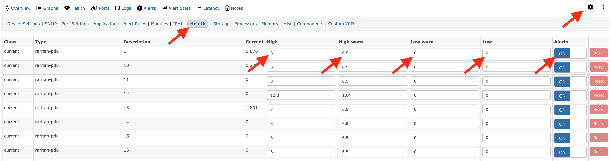
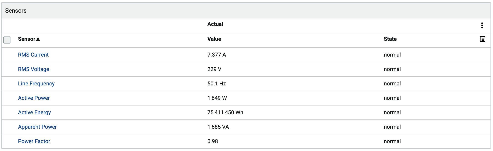
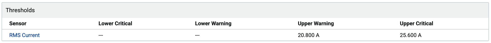
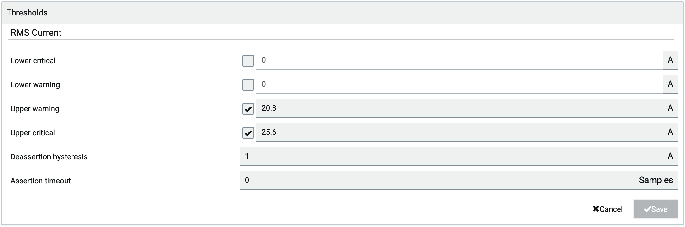

## Sensor Thresholds
The default thresholds of many sensors are poor. A new Raritan device
therefore causes many threshold alarms. To prevent these alarms,
configure the thresholds on the device.

If you do not need the threshold data, disable it in the device
settings. The image below shows this setting. You can also set your own
thresholds.

Raritan uses a threshold of 0 for two different conditions. It means
"the low value of this sensor is 0" and also "no threshold is
configured". We therefore cannot filter out these bad values.

The best method is a configuration of the thresholds on the devices.
LibreNMS then detects the thresholds automatically.

You can configure many devices at one time with the JSON-RPC API or
with RedFish.
* https://pypi.org/project/raritan/4.3.0.51180/
* https://www.raritan.com/support/product/pdu-g2

For a small number of devices, use the web interface of the device. The
setting is deep in the menu structure.

Hysteresis and deassert are advanced settings. Do not change them
without full knowledge of their function.

For an inlet:
* Click 'Inlets' on the left side.
* Click one of the sensor types below.

* Click the available thresholds of that sensor.

* Edit the thresholds. Each disabled threshold has the value zero. Enable and change these thresholds.

For an outlet:
* Click 'Outlets' on the left side.
* Select the outlet to configure.
* Click one of the sensor types below.

* Click the available thresholds of that sensor.

* Edit the thresholds. Each disabled threshold has the value zero. Enable and change these thresholds.

## Known Sensor Types

"Supported" means that the YAML file holds the polling support for that
sensor type. LibreNMS can support each sensor type below. For the other
types, we have no test data.

| Sensor Type                | Supported | Index |
|----------------------------|-----------|-------|
| rmsCurrent                 | **Yes**   | 1     |
| peakCurrent                | No        | 2     |
| unbalancedCurrent          | No        | 3     |
| rmsVoltage                 | **Yes**   | 4     |
| activePower                | **Yes**   | 5     |
| apparentPower              | No        | 6     |
| powerFactor                | **Yes**   | 7     |
| activeEnergy               | No        | 8     |
| apparentEnergy             | No        | 9     |
| temperature                | **Yes**   | 10    |
| humidity                   | **Yes**   | 11    |
| airFlow                    | No        | 12    |
| airPressure                | No        | 13    |
| onOff                      | **Yes**   | 14    |
| trip                       | No        | 15    |
| vibration                  | No        | 16    |
| waterDetection             | No        | 17    |
| smokeDetection             | No        | 18    |
| binary                     | No        | 19    |
| contact                    | No        | 20    |
| fanSpeed                   | No        | 21    |
| surgeProtectorStatus       | No        | 22    |
| frequency                  | **Yes**   | 23    |
| phaseAngle                 | No        | 24    |
| rmsVoltageLN               | No        | 25    |
| residualCurrent            | No        | 26    |
| rcmState                   | No        | 27    |
| absoluteHumidity           | No        | 28    |
| reactivePower              | No        | 29    |
| other                      | No        | 30    |
| none                       | No        | 31    |
| powerQuality               | No        | 32    |
| overloadStatus             | No        | 33    |
| overheatStatus             | No        | 34    |
| displacementPowerFactor    | No        | 35    |
| residualDcCurrent          | No        | 36    |
| fanStatus                  | No        | 37    |
| inletPhaseSyncAngle        | No        | 38    |
| inletPhaseSync             | No        | 39    |
| operatingState             | No        | 40    |
| activeInlet                | No        | 41    |
| illuminance                | No        | 42    |
| doorContact                | **Yes**   | 43    |
| tamperDetection            | No        | 44    |
| motionDetection            | No        | 45    |
| i1smpsStatus               | No        | 46    |
| i2smpsStatus               | No        | 47    |
| switchStatus               | No        | 48    |
| doorLockState              | **Yes**   | 49    |
| doorHandleLock             | **Yes**   | 50    |
| crestFactor                | No        | 51    |
| length                     | No        | 52    |
| distance                   | No        | 53    |
| activePowerDemand          | No        | 54    |
| residualAcCurrent          | No        | 55    |
| particleDensity            | No        | 56    |
| voltageThd                 | No        | 57    |
| currentThd                 | No        | 58    |
| inrushCurrent              | No        | 59    |
| unbalancedVoltage          | No        | 60    |
| unbalancedLineLineCurrent  | No        | 61    |
| unbalancedLineLineVoltage  | No        | 62    |
| dewPoint                   | No        | 63    |
| mass                       | No        | 64    |
| flux                       | No        | 65    |
| luminousIntensity          | No        | 66    |
| luminousEnergy             | No        | 67    |
| luminousFlux               | No        | 68    |
| luminousEmittance          | No        | 69    |
| electricalResistance       | No        | 70    |
| electricalImpedance        | No        | 71    |
| totalHarmonicDistortion    | No        | 72    |
| magneticFieldStrength      | No        | 73    |
| magneticFluxDensity        | No        | 74    |
| electricFieldStrength      | No        | 75    |
| selection                  | No        | 76    |
| rotationalSpeed            | No        | 77    |
| transferSwitchBypassState  | No        | 78    |
| batteryLevel               | No        | 79    |
| installFaultStatus         | No        | 80    |
| transferSwitchOutputStatus | No        | 81    |
