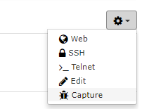
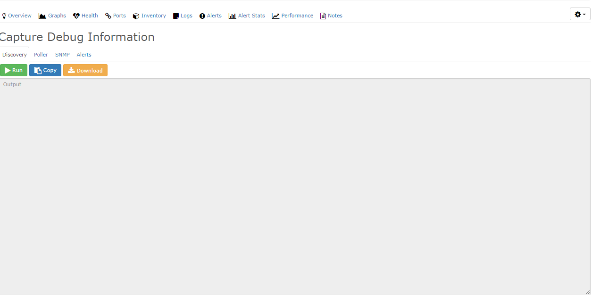

# Capture Debug Information

This feature runs Discovery, Poller, SNMP, and Alerts in debug mode.
The output helps you to troubleshoot a device. It also helps the
community to answer a request for help.

To use this feature, open the device in the web interface. Then click
the settings icon on the far right and select Capture.

## Discovery

Discovery runs and gives debug information.

## Poller

The poller runs and gives debug information.

## SNMP

LibreNMS does an SNMP bulk walk of the device and gives the result.

## Alerts

The Alerts capture is useful during the creation of an alert. It shows
whether your alert rule matches.

