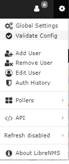
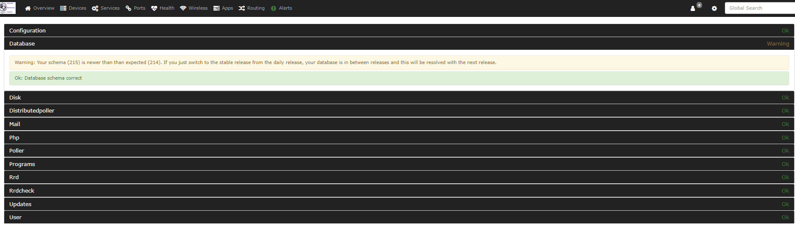

# Install validation

With a lot of configuration possibilities, it's not uncommon that
mistakes get made.

So, to try and help with some of the general issues people come across
we've put together a simple validation tool which at present will:

- Validate config.php from a php perspective including whitespace
  where it shouldn't be.
- Connection to your MySQL server to verify credentials.
- Checks if you are running the older alerting system.
- Checks your rrd directory setup if not running rrdcached.
- Checks disk space for where /opt/librenms is installed.
- Checks location to fping.
- Tests MySQL strict mode being enabled.
- Tests for files not owned by librenms user (if configured).
- And more added all the time.

Optionally you can also pass -m and a module name for that to be
tested. Current modules are:

- mail - This will validate your mail transport configuration.
- dist-poller - This will test your distributed poller configuration.
- rrdcheck - This will test your rrd files to see if they are
  unreadable or corrupted (source of broken graphs).

You can run validate.php as `librenms` by executing `./validate.php`
within your install directory.

The output will provide you either a clean bill of health or a list of
things you need to fix:

**OK** - This is a good thing, you can skip over these :)

**WARN** - You probably want to check this out.

**FAIL** - This is going to need your attention!

# Validate from the WebUI

You can validate your LibreNMS install from the WebUI, using the nav
bar and clicking on the little Gear Icon -> Validate Config.

It's worth running validate on both the WebUI and CLI as they test
for different things.

 

Then You should see the results of validate.

Below is just example of the results.

