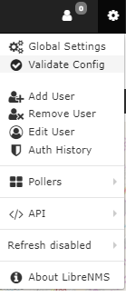
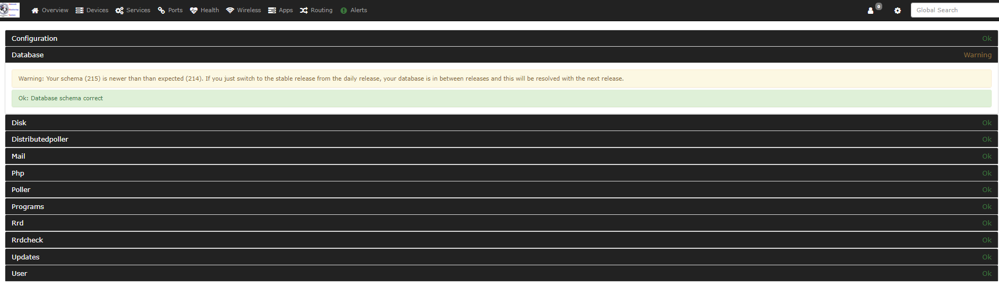

# Install validation

LibreNMS has many configuration options. A mistake in the configuration
is therefore common.

We supply a validation tool for the most common problems. The tool does
these tests:

- It validates `config.php` as PHP code. It also finds whitespace in
  the wrong place.
- It connects to your MySQL server to test the credentials.
- It tests whether you run the older alerting system.
- It tests your rrd directory when you do not run rrdcached.
- It tests the disk space for the location of `/opt/librenms`.
- It tests the location of fping.
- It tests whether MySQL strict mode is enabled.
- It finds files that the `librenms` user does not own, when you
  configure this user.
- We add more tests continuously.

You can also give the `-m` option and a module name. The tool then
tests that module. These modules are available:

- `mail` - it validates your mail transport configuration.
- `dist-poller` - it tests your distributed poller configuration.
- `rrdcheck` - it tests your rrd files for unreadable data or corrupt
  data. Such data is a cause of broken graphs.

To run the tool, become the `librenms` user. Then run `./validate.php`
in your install directory.

The output gives a clean result or a list of the problems to correct:

**OK** - no action is necessary.

**WARN** - examine this item.

**FAIL** - this item needs your attention.

# Validate from the WebUI

You can also validate your LibreNMS install from the web interface. In
the navigation bar, click the gear icon. Then select Validate Config.

Run the validation in both the web interface and the command line. The
two methods test different items.

 

The results then appear on the screen.

The image below shows an example of the results.

