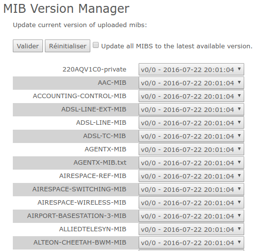
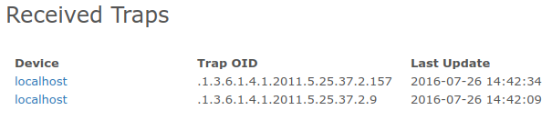

# MIBUploader

LibreNMS plugin to work with SNMPTT.

## Description

 * LibreNMS SNMPTT plugin
 * Add trap handler `genericTrap.inc.php`
 * Need `snmptrap.php` minor change to work

## Setup

Les lignes de configuration nécessaires sont disponibles dans les fichiers de conf respectifs, embarqués dans le dossier `src/etc/`. Veuillez observer ces fichiers pour pouvoir configurer correctement l’installation.

 1. LibreNMS installé. Actuellement compatible et testé avec `DB Schema #118`
 1. Installer : `snmptrapd` et `snmptt`, voir selon distribution pour les paquets
 1. Configurer `snmptrapd.conf`, `snmptt.ini` et `snmp.conf`. Voir les fichiers embarqués pour les lignes de conf à vérifier/ajouter
 1. Démarrer et activer le démon `snmptt`. Vérifier qu’il est correctement lancé et corriger tout problème de lancement avant de poursuivre
 1. Démarrer et activer le démon `snmptrapd`
 1. Copier les fichiers du dossier `librenms` dans le dossier d’installation de LibreNMS, en respectant l’arborescence.
 1. Ajouter au fichier `config.php` les instructions de conf. Voir `src/librenms/config.php`
 1. Activer le plugin via `Plugin Admin`
 1. Se rendre au moins sur la page d’index du plugin pour initialiser la base de donnée. En effet, cette étape n’est pas réalisée lors de la réception d’une trap, pour des raisons de performance.
 1. Peupler le fichier `ssh/config` du dossier `mibuploader` et configurer les commandes SSH dans la configuration. La copie de clefs SSH est nécessaire.

Au sujet de `snmp.conf` : s’il est impossible de modifier ce fichier, vous pouvez utiliser la variable d’environnement `MIBDIRS` avant de lancer tout script PHP/snmptt.

Selon la commande `snmptt_restart`, il faudra configurer sudo, comme c’est le cas ici, pour permettre l’exécution de la commande `systemctl restart snmptt` sans entrer de mot de passe. Voir le fichier `sudoers`.

Créer les répertoires et fichiers configurés pour le plugin, sur le `frontend` mais aussi sur les `pollers` :

```
mkdir -p /opt/librenms/mibuploader/mibs/
mkdir -p /opt/librenms/mibuploader/snmpttmibs/
touch /opt/librenms/mibuploader/snmptt.conf
chown -R apache:librenms /opt/librenms/mibuploader
```

Utiliser `snmptrap.mibup.php` pour la réception des traps. C’est une copie de `snmptrap.php`, mais avec la prise en charge de l’inclusion de `genericTrap.inc.php`.

S’il manque des MIBS, le processus de conversion ne va pas générer de configuration pour les traps dont la conversion sera impossible.

Le plugin va vérifier l’existence des tables SQL nécessaire au fonctionnement du plugin, et les créer si besoin. Il n’y a rien à faire de ce côté.

## Setup multi-poller et poller distant

Sur les LibreNMS `frontend` :

 * Installer `net-snmp-utils` et `snmptt` pour obtenir `snmptranslate` et `snmpttconvertmib`.
 * Suivre l’installation, mais sans configurer `snmptt.ini` qui ne sera pas utilisé.

Sur les LibreNMS `poller` :

 * Suivre toute la procédure d’installation.

## Fonctionnement

 * `snmptrapd`, à la réception d’une TRAP, va faire appel à `snmptthandler`
 * `snmptthandler` transmet la TRAP au démon `snmptt`
 * `snmptt` traite la TRAP s’il le peut en fonction des fichiers de configuration. Voir le fichier `snmptt.conf` embarqué pour exemple
 * Si `snmptt` a trouvé l’OID de la trap dans la conf, il exécute `EXEC ...` si présent
 * Si la trap n’est pas prise en charge directement par les includes LibreNMS, `genericTrap.inc.php` est appelé et fait appel aux fonctions de `MIBUploader` pour enregistrer la trap
 * Pour pouvoir générer une alerte depuis une trap, il faut définir une règle qui va les utiliser
 * Une fois les règles (Rules LibreNMS) définies, il faut lancer le polling
 * On peut ensuite lancer `alerts.php`

Il y a une petite latence entre le moment d’envoi de la trap et le traitement par snmptt, de l’ordre de la seconde. Ce fonctionnement reste plus performant que de lancer snmptt pour chaque trap.

## Lien trap -> device LibreNMS

Le lien entre une trap SNMP et un device LibreNMS se fait sur le champs `hostname`, ou `sysName`  de la table `devices`, ou bien encore via les adresses IPV4.

Attention à la valeur qui est envoyée par l’agent snmp des équipements.

S’il faut changer ce comportement, éditer le fichier `snmptrap.mibup.php`.

## Utilisation

Voici le menu de `MIBUploader` :


### Upload de MIB

Pour pouvoir générer la configuration SNMPTT, mais surtout versionner les MIBs, il est nécessaire des les uploader.

L’upload de plusieurs fichiers d’un coup est supporté.


 1. Sélectionner les fichiers via le bouton « Select. fichiers »
 1. Cliquer sur `Valider`

La case `Uptate mibs to the new uploaded version` vous permet de directement mettre à jour la version courante de la mib s’il s’agit de l’upload d’une nouvelle version d’une MIB. Cette case est cochée par défaut.

La détection d’une MIB se fait directement via le nom du fichier : si les fichiers sont différents, une nouvelle MIB sera créée. Faites bien attention à cela.

### Gestion des versions

À chaque fois qu’une MIB est uploadée, si le nom du fichier de MIB est détecté comme étant déjà présent en base, une comparaison sur le contenu est fait (via checksum SHA2).

Si les contenus ne sont pas identiques – au caractère près – alors une nouvelle version est créée.

Lorsqu’on va générer la configuration SNMPTT, la version courante est utilisée pour sélectionner le contenu de MIB à convertir.

Si vous souhaitez utiliser une ancienne version de MIB, il vous faut passer par le `Version Manager` de MIBUploader.

Note : il n’est pas possible que plusieurs personnes génèrent en même temps la configuration SNMPTT. Cela est fait via un champs en base de donnée. Voir le menu `Informations`.



 1. Dans les menus déroulant des MIB, sélectionner la version désirée. Vous pouvez aussi supprimer une MIB via ce menu.
 1. Cliquer sur `Valider` pour actualiser la version courante à utiliser.

Le bouton `Réinitialiser` va simplement remettre le formulaire à zéro sans rien mettre à jour.

La case à cocher `Update all MIBS to the latest available version.` vous permet de directement choisir la version la plus récente de MIB pour toutes les MIBs enregistrées. Cela ignore la sélection actuelle.

Note : les boutons `Valider` et `Réinitialiser` sont présents en haut et en base de la page. C’est une facilité de navigation, le résultat sera le même.


Voici le résultat une fois la mise à jour effectuée. Ici, c’était une MAJ de masse via la case à cocher.

### Génération de configuration SNMPTT

Une fois les MIBs téléchargées et/ou la version choisie, nous pouvons générer la configuration SNMPTT.


Par défaut, si rien n’est sélectionné, *toutes les MIBs sont converties*.

Si on ne sélectionne que certaines MIBs, *seulement les MIBs sélectionnées seront converties*. Cela entraîne la suppression de la configuration des autres MIBs.

La case à cocher `Only restart SNMPTT` vous permet de redémarrer le démon SNMPTT sans regénérer la configuration.


Une fois le formulaire soumis, voici un résultat possible :

 * SNMPTT a été redémarré avec succès : `SNMPTT Restart Status: OK`. Vérifiez bien ce status avant tout, car sans SNMPTT, pas de réception de trap.
 * Trois MIBs converties, dont deux sans aucune trap : `0/0`
 * Une MIB convertie avec 126 traps, sur un total de 126 traps disponibles : `126/126`
 * Une MIB manifestement invalide

Le status est directement donné par la sortie de la commande `snmpttconvertmib`.

Si `snmpttconvertmib` n’a pas pu convertir la totalité des traps disponibles dans une MIB, le résultat sera affiché avec une croix rouge.

### Traps reçues

Une liste simple des traps reçues, avec la date de MAJ de la trap.

Ceci n’est pas un historique : si vous avez configuré une expiration des traps enregistrées via le plugin, elles ne seront plus affichées.



### Informations

Le menu `Informatios` affiche des informations d’état du module :

 * SNMPTT State : le module est-il en train de générer de la configuration ? `idle` : ne fait rien
 * MIB Count : nombre de MIB téléchargées
 * DB Schema : valeur interne permettant de connaître la version du schéma de BDD du plugin

## Règles et Alertes

La création de règle (Rule) LibreNMS se fait via le circuit classique.


Ici, la colonne `oid` est utilisée. Elle stock l’OID numérique de la trap.

Vous pouvez également exploiter la colonne `last_update` qui contient une `DATE` MySQL.

Le lien avec un équipement se fait de façon standard LibreNMS, via la colonne `device_id`.

Enfin, pour récupérer une alerte, il faut que le processus de polling se lance.
